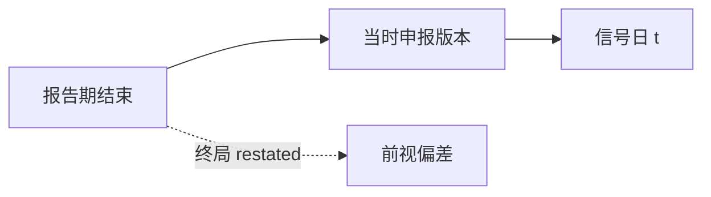

# Point-in-time 基本面

回测里用的不是「现在看到的财报」，而是「当时能看到的财报」；把修订后的数字按报告期回填，等于偷看答案。

<footer>—— 据 Kothari, Capital Markets Research in Accounting, 2001；Compustat Point-in-Time 文档整理</footer>

上一课[应计与现金流](/quant/accrual-vs-cash)给出了可排序的应计定义。定义对了仍不够：若字段按**最新重述版**回填到历史报告期，高应计、低账面的排序都带了事后才知道的信息。本课只补 point-in-time（PIT）语义。可用日期的日历细节——公告滞后几天、周末怎么处理——下一课再收紧。

## 问题

Compustat 一类库同时提供 as-reported 与 restated。市场在公告日只能看到当时申报的数字；后续更正、重分类、差错更正是后来才进入数据库的。用终局账面权益去算 2008 年 6 月的 HML，等于把 2009 年才披露的错报当成 2008 年可交易信息。缺口是时间戳：每个基本面字段需要「在信号日 $t$ 是否已存在」。

Fama–French 构造账面市值时，用 $t-1$ 年报的账面配 $t$ 年 6 月的市值，中间故意留出滞后，正是为了避开「报告期结束即可交易」的幻觉。PIT 把这层谨慎写成数据约束，而不是口头上的六个月规则。

### PIT 不是fiscal period的别名

报告期结束日告诉你数字**关于哪一段**；PIT 告诉你数字**何时进入信息集**。两者经常被一张「最新财报」宽表压成一列。宽表按 period_end 索引、值却是 restated，看起来整齐，回测全是前视。本课要的是记录级约束：$(value, period\_end, available\_date, restatement\_flag)$，信号只读 $available\_date \le t$ 的行。

同一报告期可有 10-K、修订 10-K/A、后续重述。PIT 取的是 $t$ 当日生效的那一版，不是后来合并进 vendor 主表的终局版。

## 方法

信号在交易日 $t$ 生成，只允许使用 $available\_date \le t$ 的基本面记录。若同一 period 有多次申报，按当时有效版本取。价值、盈利、应计、投资类因子全部共享这条过滤器；Fama–French 的「账面取自上年年报」是它的一个特例，不是另一套哲学。

实现上不要把 PIT 理解成「把所有字段滞后固定 $k$ 个月」。滞后规则是粗糙代理：年报通常滞后两三个月，季报更短，修订可在一年后。固定滞后会让一部分公司过早用上数字，另一部分过晚。正确做法是按公司、按期、按版本对齐可用日期。

## 机制

前视从两条缝钻进来。一条是重述：后来更正的利润、资产、股本，被写回历史期。一条是对齐错误：用 period_end 当交易日，或用 vendor 的「最后更新时间」当可用时间。PIT 库把每次申报存成快照，回测在 $t$ 做 as-of 查询。没有 PIT 库时，最低限度是用公告日或申报日截断，并丢掉明显的事后修订标记。

Kothari 把 look-ahead 列为资本市场会计研究的标准威胁。量化回测里它更直接：因子收益里有一块其实是「未来会计更正」的信息。

后课幸存者偏差是另一类样本问题：谁还在库里。PIT 解决的是**在库里的那些记录，你是否过早读到了终局值**。两件事常被混称为「数据质量」，机制不同，要分开修。

最低实现不必等到买一套完整 PIT 库。没有快照时，用 filedate/rdq 截断 as-reported 主表，丢掉明确的 restatement 标记，并禁止用 vendor 的「最终修订日」当可用日。对照实验很有用：同一因子在 restated 宽表与 as-of 规则下收益差多少，差就是前视的尺度。Fama–French 六月规则可以当作年频价值的对照，但不能拿它给日频应计或惊喜「洗白」。

## 边界

本课不规定各国法定申报期限，也不比较 EDGAR 与交易所公告的时差——那是[财报滞后与可用日期](/quant/filing-lag-available-date)的日历。不在此重写应计公式，也不构造 HML 的分位断点。后课默认：凡基本面信号，先声明 as-of 规则；未声明则视为用了 restated 主表，结果不可信。

后课把可用日期收成日历，把幸存者收成宇宙。本课只禁止 restated 回填。固定滞后仍可当对照，但日频信号必须记录级 as-of。Fama–French 六月规则是年频价值的粗 PIT，不是本课定义的替代。

## 小结

- 应计定义对了仍会前视；PIT 约束的是信息集，不是公式。
- 报告期结束日 ≠ 可交易日；可用日期才进入信号。
- 固定滞后是代理，按版本 as-of 才是 PIT。
- Fama–French 的账面滞后是同一思想的粗规则。
- 幸存者是下一类样本问题，不要与 PIT 捆成一句话。
- 出处：Kothari (2001)；Compustat Point-in-Time；Fama–French 因子构造说明。
