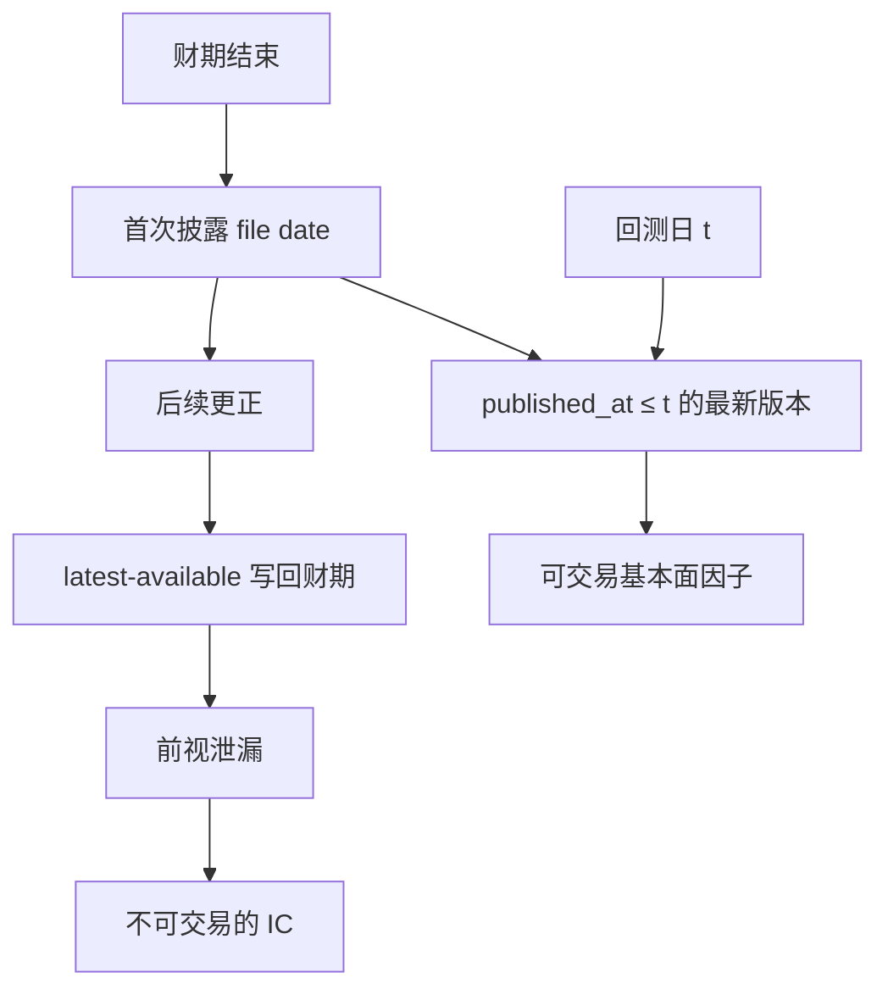

# 时点基本面

数据库里今天看到的那张报表，不必等于当年投资者读到的那张；更正、回填与发布时点会改写基本面因子的历史。

<footer>—— 对照 Ljungqvist, Malloy and Marston, Rewriting History, Journal of Finance, 2009</footer>

Point-in-time（PIT）基本面问的是：在日历日 $t$，市场已经公开的、当时版本的会计与估计数字是什么。标准研究库给出的往往是「最新可得」（latest available）：同一财季的净资产可能在两年后的更正里被改掉，分析师推荐可能被供应商事后改写，上市首日之前的模拟报表可能被回填。Ljungqvist、Malloy 与 Marston（2009）记录 I/B/E/S 推荐历史被改写；Fama–French 用滞后账面近似 PIT；Asness 与 Frazzini（2013）把「用最新已知账面」写成可交易 HML 的细节；Hou、Xue 与 Zhang 的异象复制强调会计数据的滞后与可投资性。本篇把 PIT 当成数据工程与资产定价共用的对象，而不是数据库营销名词。它是[前视偏差](/quant/look-ahead-bias)在基本面上的专用条款。

## 问题

一张「2022 年年报净资产」至少有三个时间：财期结束日、首次 file date、以及此后每次更正的 effective date。Latest-available 把最后一次更正写到财期结束日上，回测在 2023 年 1 月就会读到 2024 年才更正的数字。若更正与收益相关——监管调查、商誉减值、收入确认——泄漏不是随机噪声，而是把未来的负面基本面提前给了空头腿。PIT 库为每个字段保留版本链：查询 $(t, i)$ 返回「截至 $t$ 已发布的、对股票 $i$ 有效的最新版本」。

分析师侧同样。I/B/E/S 的共识若被事后改成与实际更接近的数字，盈利意外因子会被美化。Ljungqvist 等人显示推荐的历史记录与当年真实发布不一致。没有快照，你无法区分「当时的共识」与「后来被改过的共识」。卖方预测因子、修正因子、离散度因子全部建立在错误的信息集上。

### 发布日不是财期结束日

即便没有更正，用财期结束日对齐账面，仍会前视。美国 10-K 常在财期结束后 60 天量级报出，10-Q 更快；中国年报法定截止多在 4 月 30 日，一季报与年报挤在同一窗口会造成「四月密集披露」。Fama–French 把 $t-1$ 年账面统一放到 $t$ 年 6 月底，是用一个保守的、对所有公司相同的可交易时点，换取可复制。Asness–Frazzini 认为这过慢：市场在 6 月之前已经看到年报，HML 应在每次新账面到达时更新。两种都是 PIT 规则，差别是滞后长度与更新频率；「Compustat 默认合并表」两条都不是。

Worldscope、Compustat 工业年度文件、国内部分研究库的「最新报表」默认行为不同。同一因子在 A 库显著、B 库不显著，经常是 PIT 与更正政策不同，而不是市场不同。

## 方法

**版本化查询。** 真正的 PIT 表是 $(entity, field, asof, value, published_at)$。回测日 $t$ 取 $\mathrm{published\_at}\le t$ 的最大 as-of。财政期结束日只用于知道「这是哪一季」，不用于知道「何时可交易」。若只有 file date 没有更正链，至少用 file date 做滞后，并承认更正仍可能泄漏。

**统一滞后作为下界。** 没有 PIT 库时，对季度数据滞后至少一个法定披露窗口（例如季报后 2–3 个月、年报到次年 6 月），并丢掉上市前回填的模拟历史。Hou–Xue–Zhang 在复制中采用可投资样本与滞后会计，许多异象变弱——这应读成「可交易 PIT」过滤，而不是单纯的多重检验。

**估计与实际。** 盈利意外 $= $ 实际 EPS − 当时共识。实际 EPS 也必须用首次公布，不能用事后更正的 actual。共识必须用公告日前最后一个快照，不能用含公告后修正的月度文件。时区与交易时段：美股在盘前发布，A 股在非交易时段发布，PIT 的 $t$ 应是「该信息可进入委托」的第一个时点，通常是下一撮合日。

### 行业分类、股份与基本面要同一时点

账面市值比的分母是当时市值，分子是当时已知账面；股份数量要与当时股本一致，否则拆股后的 EPS 会和未调整市值错配。行业中性若用今天的 GICS 往回套，等于让过去的排序享受未来的行业地图（科技被拆分、能源被重划）。PIT 行业与 PIT 股本与 PIT 报表是一套，不能只修报表。指数成份同理，见[幸存者偏差](/quant/survivorship-bias)。

「用当时市值、用最新账面」是不对称泄漏：价格合法，分子非法，价值因子会被更正后的困境信息加强。两边都必须当时可知。

## 机制

会计更正不是均值回归噪声。它往往在诉讼、审计变更、业绩变脸之后到来，与后续收益同向。Latest-available 于是把一部分未来收益的信息写进「滞后」特征，价值与盈利因子的样本内 IC 被抬高。分析师改写同理：把当时过热的推荐事后改淡，动量与反转的归因会变。PIT 的经济学意义是：因子必须是可交易信息的函数，否则它测量的是数据库的修订过程，不是市场的风险补偿。

Arnott、Harvey、Kalesnik 与 Linnainmaa 等关于价值是否死亡的讨论，也依赖构造细节：用哪个账面、何时可知、相对价格的时机。细节不是装饰。Asness–Frazzini 证明，仅改 HML 的更新频率与价格时点，因子表现可以和 FF 原版差出一截。PIT 是这些细节的总约束：先写清信息集，再争论价值有没有衰减。

### 与价格 PIT 的差别

日收盘价的 PIT 相对简单：交易所当时的官方收盘（仍要注意事后修正的成交、迟报）。基本面 PIT 难在事件是稀疏的、版本是分支的、不同国家披露制度不同。不能把「我们用的是未复权价，所以基本面也没前视」当成论证。价格干净只保证分母；分子仍可泄漏。

## 边界与工程取舍

商业 PIT 库贵、覆盖年数短、早期更正链不完整。用统一滞后是可发表的近似，但应在能买到 PIT 的子样本上校准偏差方向：通常 latest-available 让基本面因子更好看。早期样本的 file date 质量差时，宁可缩短样本，不要用财期结束日冒充发布日。

不要把管理层指引、电话会纪要的 NLP 特征排除在 PIT 之外：文本时间戳同样会被修订与转载污染。也不要在 PIT 上做完因子后，用全样本分位数把历史重新切成「当时的贵贱」——分位断点若用了未来截面，又把前视从字段层面请回排序层面。

实盘投研若接的是供应商「今日全量覆盖」接口，而回测接的是 PIT，两边会系统性不一致。生产与研究必须同一查询函数，用 as-of 回放生产。

## 小结

- 时点基本面是截至 $t$ 已发布的字段版本；最新可得把更正提前，造成与收益相关的前视。
- Ljungqvist–Malloy–Marston 表明分析师历史会被改写；FF 滞后与 Asness–Frazzini 的 HML 细节是两种合法 PIT 规则。
- 复制异象时应把披露滞后当成可投资性过滤的一部分，而不是可选的数据洁癖。
- 行业、股本、成份与报表必须同一 as-of；只修一张表不够。
- 出处：Ljungqvist, Malloy and Marston, *Rewriting History*, Journal of Finance, 2009；Asness and Frazzini, *The Devil in HML’s Details*, Journal of Portfolio Management, 2013；Fama and French 对账面滞后的标准构造；Hou, Xue and Zhang, *Replicating Anomalies*, Review of Financial Studies, 2020。
