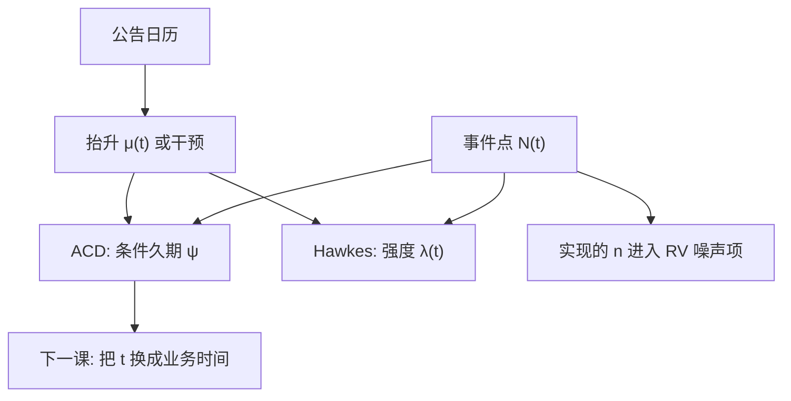

# 点过程与久期建模

把成交当成随机时刻上的点，建模的是强度或相邻等待时间；价格平方加总是另一条轴，两套时钟不要混在同一方程里假装同质。

<footer>—— Engle and Russell, Autoregressive Conditional Duration, Econometrica, 1998；强度一侧的 Hawkes 传统见 Hawkes, 1971</footer>

[跳跃与新闻](/quant/jumps-news) 把某些点标了值（跳幅度、意外）。其余大多数点只是「发生了成交」。Engle–Russell 的 ACD 对久期 $x_i=t_i-t_{i-1}$ 写条件均值；Hawkes 对强度 $\lambda(t)$ 写自激励。[ACD 自回归条件久期](/quant/acd-duration) 已展开 ACD(1,1) 的估计与诊断。本课在高频单元里补**缺口**：点过程与 RV/核的关系、新闻如何进入强度、以及久期模型不回答「下一笔什么价」。下一课把时钟从墙钟换成成交量/业务时间，点过程的 $t$ 本身被变形。

## 问题

日历网格 GARCH 在空档插入零收益，把「没成交」当成一次观测。点过程的样本是事件。问题是选强度还是久期：Hawkes 便于多元互激励与分支比；ACD 便于诊断标准化久期 $x_i/\psi_i$。两者在规则条件下可翻译，但估计与检验不同。对象还要声明：成交、报价修订、还是价格变动久期。混用则 $\psi$ 不可比。

新闻：在已知时刻让 $\lambda(t)$ 乘季节再乘公告抬升，或在 ACD 里加干预。这把上一课的日历变成强度的协变量，而不是把公告当一次回归的 $D_t$ 就算完——因为公告后一串短久期是过程，不是单点。

### 与 RV 的接口

给定路径，RV 是变换。点过程描述事件到达；到达越密，同样墙钟里 $n$ 越大，噪声项 $2n\sigma_\varepsilon^2$ 越大。繁忙时朴素 RV 更噪，这是内生采样。业务时间课用成交量变形减轻这种异质。本课先承认：$n$ 是点过程的实现，不是固定实验设计。

午休必须切断点过程，不能把上午最后一笔到下午第一笔当成一个 $x_i$。隔夜同理。这与季节课、刷新课同一会话边界。

## 方法

**ACD。** 见已有课：$\psi_i=\omega+\alpha x_{i-1}+\beta\psi_{i-1}$，指数或 Weibull 新息，诊断标准化久期的 ACF。本课强调：把宏观哑元、季节（日内钟）放进 $\psi$，再谈剩余自激励。否则 $\alpha+\beta$ 吸收 U 形。

**Hawkes。** $\lambda(t)=\mu+\int_0^t \phi(t-s)dN_s$，核 $\phi$ 指数时分支比 $\int\phi$。分支比近 1 则内生激发强，接近临界。新闻可写成 $\mu(t)$ 的抬升。估计用点过程似然；诊断用残余时间变换后的单位指数。

**标值。** 价格变化、方向、跳幅度是标。标值 Hawkes 让幅度影响后续强度。对象变重，须有足够事件。不要对稀疏跳过程估满核。

### 与微观结构模型

Kyle、Hasbrouck VAR 是离散时间交易与报价。点过程是连续时间到达。把 ACD 的 $\psi$ 当「下一笔等待」去切片执行，须再加方向与尺寸模型，否则只有时间没有路径。执行课（Obizhaeva–Wang 等）用强度当输入；本课只提供计量。

## 机制

短久期成串：条件强度高，像 GARCH 的波动聚集，但是在时间轴上。机制可以是信息到达、或算法切片、或自激励（一笔引来下一笔）。分支比不识别是信息还是羊群，只描述二阶到达结构。新闻抬 $\mu(t)$ 是可观测强度，自激励是内生；两者都使 RV 在该段更噪。

残余分析：时间变换 $\Lambda(t)=\int\lambda$ 后，事件应像单位泊松。过离散、簇拥说明核太短或缺季节。这与 ARMA 残差白噪声诊断平行，对象换成点。

把成交点过程估完，并不能修正价格噪声。$\varepsilon$ 仍在 $Y$ 上。点过程帮你理解 $n$ 与繁忙，IV 仍要用核/预平均/TSRV。

### 到业务时间的交接

墙钟上的季节与点过程纠缠：开盘 $\lambda$ 高。把时间轴按成交量重标，泊松更齐，ACD 的季节负担下降。Mandelbrot–Taylor、Ané–Geman、Clark 的从属过程是下一课：价格是业务时间上的较齐过程。本课的 $\lambda(t)$ 是墙钟强度，下一课把 $t$ 变形。

## 边界与工程取舍

高频多元 Hawkes 参数多、易近临界不稳定。隔夜、竞价、拍卖不是同一点过程，应切段。监管批次、集合竞价没有「等待成交」的同一含义。

工程：单资产用 ACD + 季节 + 公告干预；交互到达用低维 Hawkes。不要对全市场每对估 Hawkes。不要用久期预测替代价格预测。已有 ACD 专课，本课不重复系数公式。下一课：业务时间时钟。

## 小结

- 点过程对到达建模（ACD 久期或 Hawkes 强度），对象不是下一笔价格。
- 季节与新闻应进 $\mu(t)$ 或 $\psi$，否则自激励吸收闹钟。
- 繁忙提高 $n$，朴素 RV 更噪；点过程解释采样内生，不替代噪声修正。
- 会话边界必须切断；多元核易过拟合。
- 出处：Engle and Russell, *Econometrica*, 1998；Hawkes, *Biometrika*, 1971；新闻强度与高频发现接 Andersen 等；细节估计见已有 [ACD](/quant/acd-duration) 课。
