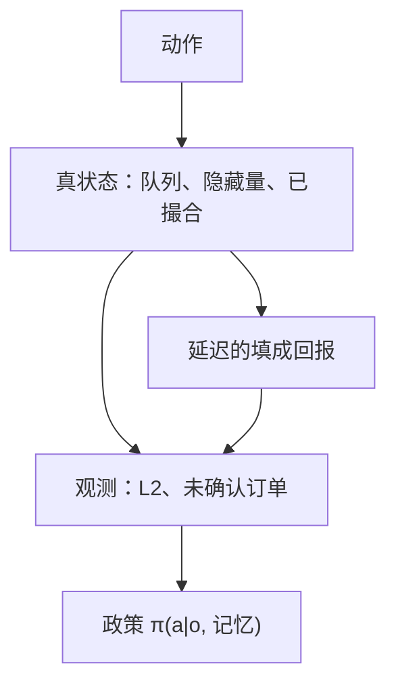

# 部分可观测与延迟成交

你看见的是聚合盘口与尚未确认的订单状态；真状态包括隐藏量、他人队列与已经撮合但回报未到的成交。决策在 POMDP 里，却常常被当成 MDP 来训练。

<footer>—— 据 Kaelbling, Littman and Cassandra 对 POMDP 的表述；对照限价簿上队列与隐藏流动性的不可观测性</footer>

[延迟奖励](/quant/delayed-reward-trading)对齐了奖励时钟。本课的缺口是观测：即使 $R$ 定义对了，策略看到的也不是马尔可夫状态。POMDP 把观测 $o$ 与状态 $s$ 分开；交易里 $o$ 是 L1/L2、自己的未确认订单，$s$ 还包括 L3、冰山、对手意图、以及在途成交。MDP 课已经宣布部分可观测；本课把它接到**延迟成交**：回报延迟使你在已经成交之后仍以为自己挂在队列里，动作会重复。后课模拟器冲击偏差会说明，连 $P(o'|s,a)$ 也常被校准错。

## 问题

挂出限价后，真状态含队列位置。没有 L3 时观测不到。成交与否往往在回报到达才进入 $o$，而撮合可能已经发生。于是出现：本地状态「在簿」，真状态「已成交或已撤」。再发一笔，变成超卖。风控若用本地状态，闸门也晚一拍。缺口是把订单状态机的「未确认」当成观测的一部分，并把策略动作空间定义在状态机上，而不是定义在「我想买的连续仓位」上。

隐藏流动性使可见深度不是 $s$ 的充分统计。填成概率依赖不可见量，历史同一可见深度对应完全不同的真深度。把可见深度塞进 MDP 的 $s$，是压缩失真。

### 信念状态与工程近似

POMDP 的充分统计是信念 $b(s)$。实务无法对全市场意图求贝叶斯。工程近似：显式把「未确认订单、最近缺口标志、本所 vs NBBO 分叉」放进观测；对队列用上下界而不是点估计，见模拟器偏差课；对填成用概率而不是假设立即完全成交。这些仍是 POMDP 的粗糙滤波，但比假装马尔可夫诚实。

A 股集合竞价末段不可撤，观测是累积的虚拟价，真状态是全部隐藏的意向。此时动作空间几乎空了，还在用连续 RL 输出撤单，是非法动作。状态机应先切协议。

## 方法

观测向量必须含订单状态机：各订单的本地态（已发、已报、部分成、未确认、已成）。奖励与动作在未确认期间的处理要声明：是等待、是允许加仓、还是禁止同向。训练环境必须模拟回报延迟与丢包（上一课程序号缺口），否则学到的政策在实盘第一天就会重复下单。

评估：预测填成 vs 真填成、本地库存 vs 交易所库存的最大偏离。偏离大，说明部分可观测没有被滤波，而不是学习率问题。对照有 L3 的研究场所与只有 L2 的生产场所，政策应降级，不能假设研究里的队列特征生产也有。

### 延迟成交把延迟奖励变得更脏

成交已发生但未观测时，中间价移动已经含你的冲击，你却还在用旧库存算奖励。延迟奖励课的归因会把别人的成交算到你头上，或反过来。滤波（用交易所时钟对齐后的状态重放训练）比在线用本地时钟训练更接近 POMDP 的离线求解。实盘仍只能用 $o$，但训练标签可以用事后完整 $s$——这是模仿学习或离线 RL 的合法信息集划分，只要部署时不依赖 $s$。

## 机制

部分可观测使最优政策依赖记忆。无记忆的反应式网络把所有「看起来一样的 L2」映射到同一动作，平均掉队列差异。延迟成交使记忆必须包含在途订单。机制上，这与做市的存货状态相同：真存货是 $s$，本地存货是 $o$，两者差是风险。Avellaneda–Stoikov 的库存若用错的库存过程，偏度报价会反号。

暗池中点单更加部分可观测：没有公开队列。填成是突然的。POMDP 的观测几乎是二元的成/不成，奖励更稀疏。不要把连续 LOB 上学到的政策直接搬到 ATS。

### 未确认期间必须禁止同向重复

本地「在簿」而真状态已成交时，再发一笔就是超卖。动作约束应在状态机里硬编码，不能指望网络学会等待。这是风控，不是超参。

## 边界

完全可观测只存在于有官方 L3 且零延迟回报的幻想里。生产永远 POMDP。下一课：模拟器里的冲击函数若错，连 $P(s'|s,a)$ 都错，POMDP 求解得再认真也是另一个市场。

暗池中点单的观测几乎是成/不成二元，连续 LOB 政策不能原样迁移。协议切换要切网络或至少切动作空间。

## 小结

- 交易决策基于观测，真状态含队列、隐藏量与在途成交。
- 订单未确认必须进入观测与动作约束，防止重复成交。
- 训练要模拟回报延迟与缺口；评估看本地 vs 交易所库存偏离。
- 事后完整状态可用于离线训练标签，不可用于部署输入。
- 协议切换（集合、暗池）改变可观测性，政策必须分支。
- 出处：Kaelbling, Littman and Cassandra 对 POMDP 的综述；L3/队列见限价簿课序；订单状态机见交易系统课序。
