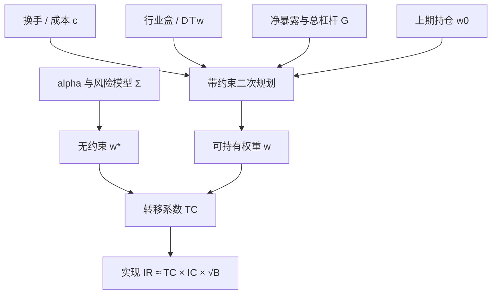

# 组合约束：换手、行业、杠杆

无约束的主动权重是信息与风险模型的乘积；一旦加上换手、行业与杠杆，实现组合只是理想组合的投影，信息比率按转移系数打折。

<footer>—— 据 Grinold and Kahn, Active Portfolio Management，以及 Clarke, de Silva and Thorley, Journal of Portfolio Management, 2002</footer>

[Markowitz](/quant/markowitz) 给出无摩擦二次规划，[Grinold 基本定律](/quant/ic-ir-timing) 把信息比率写成预测力乘以广度。实盘组合几乎从不落在那个解上：章程禁止过快换手，基准要求行业不能飘，融资与保证金钉死总杠杆。约束不是风控备忘录上的装饰，而是把 $\alpha$ 与 $\Sigma$ 映射成可持有权重的线性与锥约束。Clarke、de Silva 与 Thorley（2002）把这件事收成转移系数（transfer coefficient）：约束越紧，理想主动权重与实现权重的相关越低，定律里的 IR 按同一比例下降。本篇写换手、行业、杠杆三条最常见的硬约束如何进入优化器，以及它们如何彼此打架。信号层的[行业中性](/quant/industry-neutral)是另一件事——那是改描述子；这里改的是持仓。

## 问题

记无约束主动最优为 Grinold–Kahn 的特征组合

$$
w^{\ast}\propto \frac{1}{\lambda}\Sigma^{-1}\alpha,
$$

其中 $\alpha$ 是残差预期收益，$\Sigma$ 是风险模型协方差，$\lambda$ 是风险厌恶。这个 $w^{\ast}$ 通常不可交易：换手相对上期持仓 $w_0$ 过大，行业主动暴露 $D^\top(w-w_b)$ 超出章程，多空绝对值和 $|w|$ 超过融资额度。问题不是「要不要约束」，而是：**每一条约束切掉的是哪一块预期 IR，以及三条同时打开时，优化器到底在交易什么。**

换手约束针对的是实施缺口，不是 alpha 的符号。行业约束针对的是基准跟踪与板块拥挤，不是因子研究里的哑变量回归。杠杆约束针对的是融资、保证金与净暴露，不是把夏普乘一个倍数就能放大。把三者写成同一组不等式之后，可行集可能空，也可能只剩「几乎等于上期、行业贴着基准、杠杆顶满」的角点——那时你优化的已经不是 $\alpha$，而是在满足合规。

### 三条约束对应三种不可交易性

换手：$\sum_i |w_i-w_{i,0}|\le T$，或把线性成本 $c^\top|w-w_0|$ 放进目标。它承认价格冲击与价差是权重差分的函数，见 [因子衰减与换手](/quant/factor-decay-turnover) 与 [价差成本](/quant/spread-cost)。行业：对分类矩阵 $D$，要求 $D^\top w=D^\top w_b$，或对每个行业给出主动上下限。杠杆：净暴露 $1^\top w=N$（多头产品常钉 $N=1$），总暴露 $1^\top|w|\le G$，有时再加单票 $|w_i|\le \bar w$、beta 或因子暴露盒约束。三条分别限制「动多少」「偏向哪一类」「名义开多大」，不可互相替代：只限行业不管换手，仍会在行业内高频翻桌；只限换手不管杠杆，仍可能用期货把净暴露撬离产品说明书。

转移系数 $\mathrm{TC}=\mathrm{corr}(w^{\ast},w)$ 是 Clarke–de Silva–Thorley 对「约束有多贵」的可审计摘要。它不是交易成本的基点，而是理想权重与实现权重的相关。TC 掉到 0.5，基本定律里同一套 IC 与广度只能交付大约一半的无约束 IR——前提是定律本身的理想化仍近似成立。

## 方法

工程上把约束写进同一套二次规划，而不是先算出 $w^{\ast}$ 再手工裁剪。手工裁剪破坏一阶条件：被裁掉的股票的边际 alpha 不再与边际风险对齐，行业中性也会被裁剪重新打开。标准目标是

$$
\max_w\ w^\top\alpha-\frac{\lambda}{2}w^\top\Sigma w-c^\top|w-w_0|
$$

并叠：行业主动盒、总暴露与净暴露、单票与换手硬上限。$c$ 应来自价差与冲击模型，而不是事后从回测净值里减一个常数；否则优化器会用「免费的换手」去换纸面 IR。

行业约束要声明基准与分类。对等权截面中性、对沪深 300 行业权重中性、对风险模型行业因子暴露中性，可行集不同。分类与 [Barra 类模型](/quant/fundamental-risk-model) 不一致时，优化器会看到「残留行业」并反复交易——这是约束层最常见的口径冲突，不是 alpha 变了。硬等式 $D^\top w=D^\top w_b$ 在涨跌停、停牌时不可行，实务用带状（例如主动行业权重 $\pm 2\%$）或把违约写成罚函数。

杠杆要拆成三张账单：净杠杆（方向）、总杠杆（多空绝对值和）、风险杠杆（$w^\top\Sigma w$ 或对市场的 beta）。[风险平价](/quant/risk-parity) 把低波动资产加杠杆以提高风险贡献，那是在总杠杆上做文章；多空股票产品的 $G=2$ 是另一套章程。用波动目标倒推 $G$，等于让杠杆成为 $\Sigma$ 的函数：波动升则去杠杆，这与换手约束直接冲突——压力里你最想降暴露，也最不想在宽价差上交易。

### 约束作为正则，而不是作为「正确的信念」

Jagannathan 与 Ma（2003）证明：禁止卖空等价于对样本协方差做一种压缩——约束改变的是有效 $\Sigma$，而不必是你真相信「不能空」。换手惩罚类似：它把 $w$ 拉向上期，相当于在时间上收缩。行业盒把权重投影到基准的行业空间附近。这些正则可以降低样本外跟踪误差，也可以把真实的行业 alpha 裁掉。方法上应报告：无约束 IR、逐条打开约束后的 IR 与 TC、以及约束绑定（binding）的频率。只报告最终可行组合的夏普，等于把章程的代价藏进 alpha。

单票上限看起来像集中度风控，实质是对 $\Sigma$ 对角与 $\alpha$ 尾部的截断。若风险模型已经惩罚特异方差，再加很紧的 $5\%$ 上限，往往只是把权重推向次优的一篮子相关股票，换手上升、行业约束更难满足。上限应与流动性（ADV 占比）对齐，而不是与「看起来分散」的整数对齐。

## 机制

无约束解把预算分给 $\Sigma^{-1}\alpha$ 最大的方向。换手成本引入对 $w_0$ 的 L1 锚：只有预期效用增益超过往返成本的调仓才会发生，于是出现禁交易带（no-trade region）。这与 [再平衡规则](/quant/rebalance-rules) 是同一机制的优化器版本：不是日历到了就推到目标，而是目标与现仓的距离必须先穿过成本带。行业约束把可行增量限制在行业中性子空间（或盒子）里：个股 alpha 必须先被投影掉行业均值，才进得了持仓——若你的 $\alpha$ 本来就是行业配置，投影之后剩余接近零，TC 会崩溃。这不是优化器坏了，而是约束与 alpha 的经济对象不一致。

杠杆放大的是整个可行集的半径。线性约束下，$G$ 增大时，最优风险以近似二次上升，期望以近似线性上升，IR 先升后对冲击敏感。冲击与价差随 $|\Delta w|$ 与名义规模凸性上升，见 [平方根冲击](/quant/sqrt-impact)。于是存在一个有效杠杆：再往上，约束仍允许，成本后 IR 已经下降。这个拐点由冲击函数决定，不是由无约束夏普决定。[Kelly](/quant/kelly-sizing) 在无摩擦时给出增长最优分数；有约束与冲击时，分数必须对有效 $\mu(G)$ 重解，通常远小于纸面 Kelly。

### 三条约束的交叉项

行业中性迫使交易发生在行业内部：换手预算被「配对交易」耗掉，总换手上限会先绑在几个厚行业上，薄行业的 alpha 无法落地。杠杆上限在多空产品里与行业中性争夺：空头券不足时，行业中性退化成「多头相对低配」，净暴露上升，杠杆约束被净暴露先碰到。压力周三者同时收紧——价差走阔使换手变贵、行业相关升向 1、融资加保证金——可行集缩小，优化器输出接近 $w_0$。表观「低换手」是约束饱和，不是信号稳定。

A 股涨跌停让目标权重不可达，换手约束的左端 $|w-w_0|$ 应按可成交集合计算，否则优化器会把停牌票的权重当免费的对冲。融券与转融通额度是时变的杠杆约束，回测里按恒定 $G=2$ 做空，会把不可借的那一段 alpha 记进样本。

## 边界与工程取舍

约束清单越长，TC 越低，基本定律越不能当容量承诺。不要用全样本网格去搜 $T$、行业带宽与 $G$ 再报告最好的一条：那是对章程的多重检验，见 Harvey–Liu–Zhu 的逻辑在参数上的对应物。应预先按产品说明书写下三条数，再报告该章程下的成本后 IR，以及相对无约束的 TC。

Jagannathan–Ma 的「错误约束有时有帮助」只对估计误差主导的样本协方差成立；当你已经用压缩或基本面 $\Sigma$ 时，再叠加很紧的行业与换手，主要是在丢广度，不是在正则。反过来，完全无行业约束的多空，在 A 股很容易变成几个申万一级的轮动，跟踪误差的解释权在板块而不在选股。

不要把杠杆当夏普的乘数。波动目标与换手上限冲突时，应显式规定压力例外：例如跟踪误差超限允许突破 $T$，但必须按当时有效价差重估成本。否则回测里的「纪律」在 2015 或 2020 类月份不可执行，实现路径与纸面约束集不是同一个集合。

## 小结

- 换手、行业、杠杆把 Grinold–Kahn 的 $w^{\ast}$ 投影到可交易集合；Clarke–de Silva–Thorley 的转移系数度量这次投影损失了多少 IR。
- 换手是对上期持仓的 L1 锚，行业是对基准分类的暴露盒，杠杆是净、总与风险三张不同的账单，不能互相替代。
- Jagannathan–Ma（2003）表明某些约束等价于压缩 $\Sigma$；在已经正则化的风险模型上再叠很紧的盒，主要是丢广度。
- 三条约束有交叉项：行业中性消耗换手预算，空头约束破坏行业中性，压力里价差与保证金使可行集缩到 $w_0$ 附近。
- 章程应预先写死并报告绑定频率与成本后 IR，而不是事后网格搜索「最优约束」。
- 出处：Grinold and Kahn, *Active Portfolio Management*；Clarke, de Silva and Thorley, *Portfolio Constraints and the Fundamental Law of Active Management*, Journal of Portfolio Management, 2002；Jagannathan and Ma, *Risk Reduction in Large Portfolios*, Journal of Finance, 2003。
