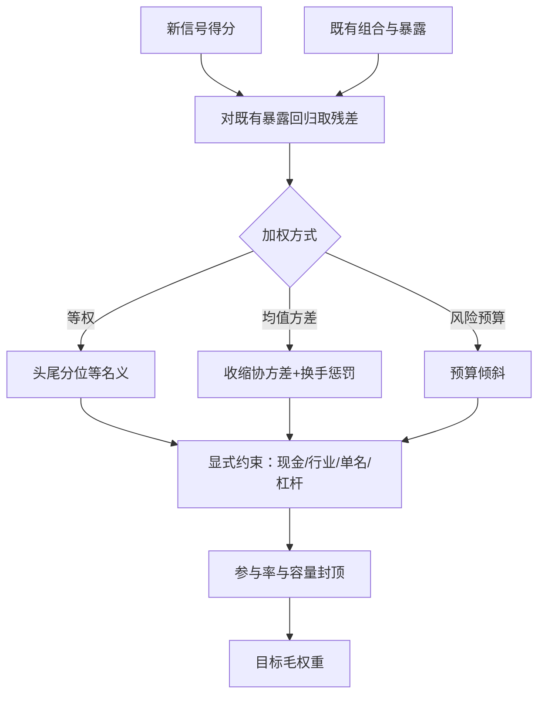
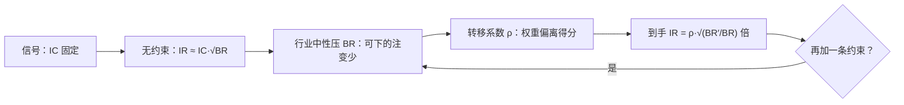

# 组合整合：约束与加权

信号只有变成权重才能赚钱；从 IC 到权重的每一步——加权、中性化、约束——都在决定信息率还剩多少交到账上。

<footer>—— 据 Grinold and Kahn, Active Portfolio Management；Markowitz, 1952 整理</footer>

[上一课](/quant/multitest-discipline-cap)把多重检验纪律落回现场：这次研究实际动用了哪几件工具——CSCV/PBO 管选择规则的质量、DSR 管选择后的缩水、Romano–Wolf 管家族显著性——怎么统一报告，以及如何不让纪律沦为盖章仪式；它留下的缺口是：信号作为独立下注成立，不等于能进组合。通过检验的信号仍只是横截面上的一个得分列。本单元从信号走向实盘，第一站把得分列变成目标权重；难点不在加权公式，而在与既有持仓的相关、约束集的形状、加权方式与估计误差的匹配。

## 问题

信号通过检验后最常见两种错误。其一，另开账本：新信号单独成组合，旧的照旧，两条曲线各自好看，风险上却在同一些名字上叠了双倍杠杆。整合先于加权：把既有组合收益对新信号回归看残差，增量集中在旧组合已超配的行业里时，边际贡献趋近于零。其二，全仓替换：清掉旧组合全押新信号，把分散性一次扔掉。正确的问题永远是「配多少增量、与旧持仓按什么比例混合」。

「同一些名字上叠了双倍杠杆」可以用拼桌点菜来类比：两桌人各自点了半桌菜，合起来可能有三份红烧肉——两份账单各自看都正常，合吃时风险敞口早超了。对新信号回归取残差，就是先问「新菜单里有多少道是旧菜单已经点过的」，只把没点过的算作增量。

### 三种加权，三种估计误差

等权按得分排序取头尾分位、组内等名义：不吃 $\mu$ 与 $\Sigma$ 的点估计，对估计误差免疫、可审计；代价是把同样的仓位花在高信心与低信心的名字上。优化器把得分当预期收益代理、配收缩协方差解均值–方差问题（Markowitz 的框架），理论上最有效，实际在放大估计误差：输入的小扰动给出剧烈变动的权重与爆炸的换手。风险平价与风险预算只吃波动结构不吃 $\mu$，得分只用于在预算上倾斜，介于两者之间。选择标准是哪种与你估计得动的东西匹配。

约束的代价有直接度量：目标权重与信号得分的截面相关，叫转移系数。同一信号在多空中性加行业中性下，转移系数可以比无约束低一半——先量这个数再争论信号好坏；系数接近零说明方向被约束集吃掉。

## 方法

流水线固定四步。**正交化**：新信号对既有持仓暴露回归取残差，后续一切在残差上做。**选加权**：按上节标准定等权、优化器或预算倾斜；优化器必须配协方差收缩与换手惩罚，否则再平衡换手会提前兑现下一课的成本折扣。**写显式约束**：现金比例、单名上限、行业与风格中性带、杠杆上限全部进优化器，而不是事后修剪。**容量封顶**：每个名字的目标仓位除以 ADV 得参与率，超阈值者削减——阈值由[策略容量与冲击衰减](/quant/strategy-capacity-decay)的 $\mu_{\mathrm{net}}(A)$ 曲线给出；单策略杠杆上界见[分数 Kelly 的边界](/quant/fractional-kelly-bound)，与组合约束取更紧的一个。若约束砍掉的恰是信号最强的一段，先改宇宙或信号表达，而不是让优化器沉默绕行。

数字实例（容量封顶）：某名字 20 日 ADV 为 2000 万股，目标仓位 40 万股，参与率 = 40 ÷ 2000 = 2%；阈值定 5% 就放行，超了就削减。注意 ADV 是 20 日平均——平静市够用，恐慌日成交量可能腰斩，同一笔仓位真实参与率当场翻倍，所以封顶口径要按压力期收紧，不能按平均日。

## 机制

Grinold 的分解 $\mathrm{IR}\approx\mathrm{IC}\cdot\sqrt{\mathrm{BR}}$ 说明了约束怎么吃掉信息率：行业中性把有效下注数从 $N$ 压到行业内可对的名子对数，转移系数 $\rho$ 再乘一次。约束组合的期望 IR 是无约束的 $\rho\sqrt{\mathrm{BR}'/\mathrm{BR}}$ 倍，多约束是连乘不是加法——这是「约束看着温和、IR 掉得快」的机制。与既有持仓相关的机制是边际贡献递减：已有暴露花掉了风险预算，新信号只在与现有暴露正交的那部分上产生增量。

约束吃 IR 是一段一段连乘的过程：

「毛权重」指还没扣交易成本、没叠风险约束前的目标仓位，像商品的标价——离你实际支付的到手价还远。初学者容易以为优化器吐出权重就万事大吉，实际上后面还有成本、风险叠加、上线台阶三道折扣，每一道都可能把正的净 IR 翻成负数，翻案要等下一课的数字才算数。

## 边界

优化器解只在输入邻域内可信：协方差误差经特征向量放大，最不稳的方向上权重最激进。等权也不免费：信号最强的常是流动性最差的名字，等权把仓位精准配到最难执行处——这是下一课成本预测接手的缺口。容量封顶用的 ADV 随体制变动，平静期的参与率在压力期翻倍超标。最后，本课权重仍是毛的：成本、风险叠加、上线台阶都可能把这条信号的经济性重新翻案。

## 小结

- 整合先于加权：信号价值以对既有组合的增量度量，正交化取残差是第一步。
- 加权要与估计误差匹配：等权免疫输入误差但浪费信心差异；优化器放大误差。
- 约束显式写进优化器，用转移系数度量代价；约束对 IR 的侵蚀是连乘。
- 容量封顶由参与率与 $\mu_{\mathrm{net}}(A)$ 给出，与单策略杠杆上界取更紧的一个。
- 毛权重之后还有成本、风险、上线三道折扣，任何一层都可能翻案。
- 出处：Grinold and Kahn, *Active Portfolio Management*；Markowitz, *JF*, 1952。
