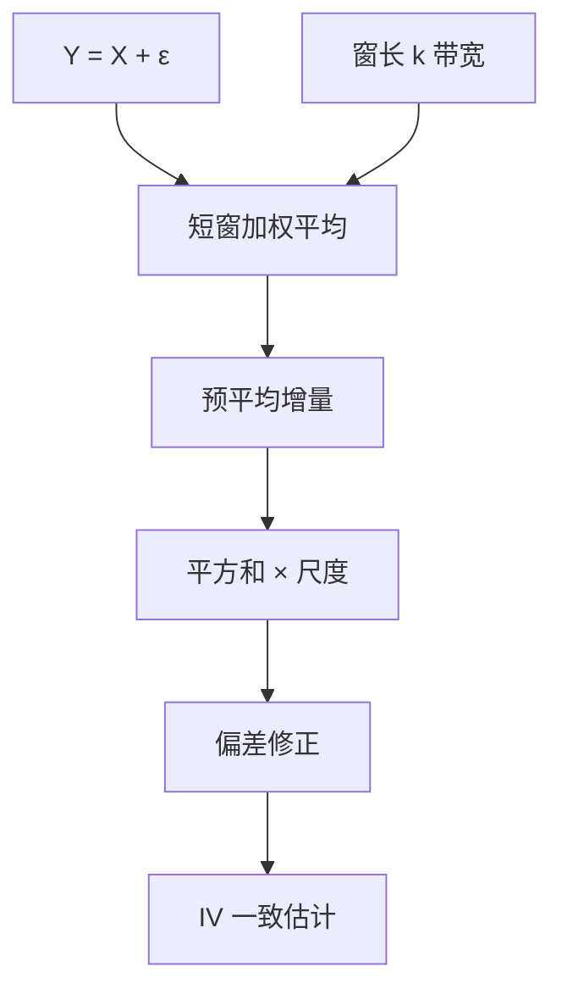

# 预平均

在短窗里先把带噪价格平均，噪声近似被压低，有效价格近似被留下；再对预平均增量做二次变差，并修正滤波给信号带来的偏差。

<footer>—— Jacod, Li, Mykland, Podolskij and Vetter, Microstructure Noise in the Continuous Case: The Pre-averaging Approach, Stochastic Processes and their Applications, 2009</footer>

上一课 [已实现半方差](/quant/realized-semivariance) 把 RV 按符号拆开，但密采样下符号与平方都被 [微观结构噪声](/quant/microstructure-noise) 绑走。[rv-noise](/quant/rv-noise) 已经点名三类修正；本单元把它们展开。预平均是第一课：Jacod 等人用局部加权平均当一阶降噪，对象仍是积分波动 $IV=\int\sigma_u^2 du$。缺口是：**窗长 $k_n$ 是带宽**，与核、两尺度同一偏差–方差前线。后课 TSRV 用两个采样频率解未知数，机制不同，可并列。本课起默认：朴素 tick RV 不作生产估计。

## 问题

观测 $Y=X+\varepsilon$。朴素 $\mathrm{RV}(Y)$ 的噪声项 $\asymp n\sigma_\varepsilon^2$。取长度 $k$ 的窗，权重 $g$，预平均增量

$$
\bar Y_i=\sum_{j=1}^{k}g(j/k)\,(Y_{i+j}-Y_{i+j-1}),
$$

$g$ 通常是 tent 或类似。若 $\varepsilon$ 近 i.i.d.，平均后噪声方差 $\propto 1/k$；若 $X$ 在短窗近似线性，信号损失可控。对 $\bar Y_i^2$ 求和再乘尺度、减偏差项，得到 $IV$ 的一致估计（网格 $\to0$、$k\to\infty$、$k/n\to0$ 等条件下）。问题是选 $k$ 与 $g$，使剩余噪声与平滑偏差平衡。

半方差、跳跃稳健版本把同一 $\bar Y_i$ 再拆符号或改幂次。先把对称 IV 做对。

### 与已实现核、五分钟

五分钟矩形采样是最粗的预平均（窗=五分钟、权=取端点）。已实现核用收益的滞后权加总，HAC 直觉。预平均是时域局部滤波。三者都有最优带宽公式，依赖 $IV/\sigma_\varepsilon^2$，随日、随票而变。固定五分钟是可复现的工程点；预平均适合还想留更细分辨率的人。

窗太短：噪声仍在，签名图上翘。窗太长：开盘季节被抹平，$IV$ 偏低，公告跳被摊成连续。带宽应随日自适应，或至少按流动性分组。

## 方法

**实现。** 先 [清洗](/quant/tick-cleaning)。选 $k_n\propto n^{1/2}$ 一类理论速率，或按估计的噪声方差自适应（后课噪声方差）。权重 $g$ 积分为零、边值条件满足文献要求，不要随手均匀平均而不做偏差修正——均匀平均对 $X$ 的偏差形式已知，须减。

**推断。** Jacod 等人给出渐近方差，可用已实现四次变差一类估计，构造置信区间。无噪声公式套在预平均估计量上会错。有限样本用模拟校准覆盖。

**跳跃。** 预平均后双幂次仍可用，但窗会把窄跳摊开，检验功效与水平都变。应声明对象是「预平均尺度上的 IV」还是「要定位的跳」。定位跳更应用 Lee–Mykland 在适当网格，而不是很长的预平均窗。

### 相关噪声

$\varepsilon$ 若序列相关（同一侧连续成交），i.i.d. 公式的 $k$ 不够，有效噪声记忆长于窗。应加长窗，或换已实现核（核带宽直接对准相关长度）。预平均不是对所有噪声结构最优，它是局部 i.i.d. 直觉最干净的一种。

## 机制

线性滤波：高频 $\varepsilon$ 被低通抑制，低频 $X$ 的增量留下。二次变差在滤波后的过程上算，再把滤波对连续半鞅二次变差的乘子（与 $g$ 有关）除回去。偏差修正项来自窗内 $X$ 的曲率与剩余噪声。机制与信号处理的预白化相反：这里是预**平滑**。

与 TSRV 对比：TSRV 用密网格估噪声水平、疏网格估 $IV$，代数上解二元未知数。预平均不显式估 $\sigma_\varepsilon^2$ 也能一致（偏差项里仍含噪声矩）。两者都可产出噪声方差的副产品，留给后课。

多元预平均要对齐窗。不同股票不同 $n$，窗的日历长度应可比，否则协方差的平滑尺度不一致。刷新时间课会处理对齐；这里先一元。

### 半方差与杠杆

对 $\bar Y_i$ 按符号拆平方，得预平均半方差。符号被平均过，杠杆测量的是窗尺度上的方向，不是单笔。与 Patton–Sheppard 的预报力对照时，须用同一窗定义。

## 边界与工程取舍

圆整噪声非加性高斯，小价格股上理论打折。异常成交未洗，平均也会留下尖刺。计算：每个 $i$ 一个窗，复杂度 $O(nk)$，全市场逐日要预算；可稀疏化 $i$ 的步长。

工程：流动性好的标的可用自适应预平均；横截面仍常用五分钟 RV。报告 $g$、$k$、是否偏差修正。不要把预平均 IV 年化后当隐含波动。不要在跨日拼接上预平均把隔夜当噪声。下一课 TSRV 用双尺度把「估噪声」说得更显式。

## 小结

- 预平均先局部滤波降噪，再对增量做二次变差并修正偏差，是噪声下 IV 的一类一致估计。
- 窗长是带宽，须在剩余噪声与平滑偏差之间选；相关噪声要更长窗或换核。
- 渐近方差不能套无噪声 RV 公式；跳会被窗摊开。
- 与五分钟、已实现核同一前线，差别是滤波形式。
- 出处：Jacod, Li, Mykland, Podolskij and Vetter, *Stochastic Processes and their Applications*, 2009；综述见 Jacod 与 Protter 的高频统计讲义传统；对照 [已实现核](/quant/realized-kernel)。
