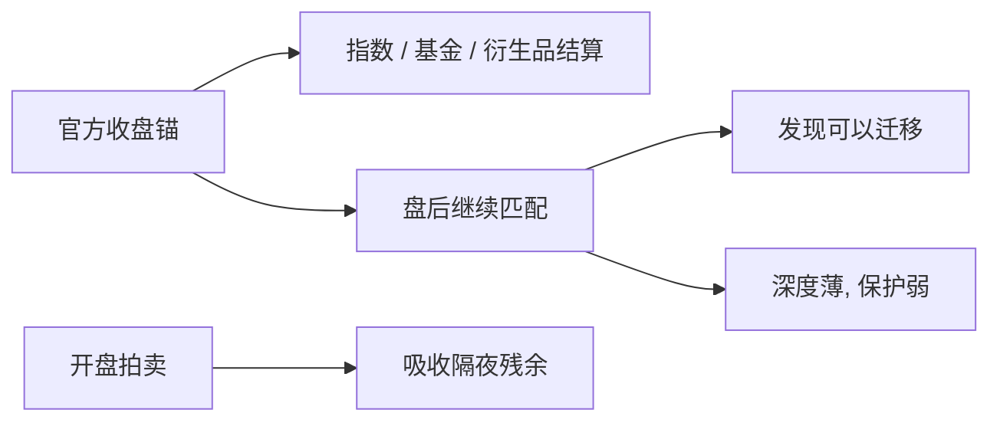

# 盘前盘后交易

官方收盘价是合同锚，不是发现的终点。锚钉住之后，更薄、更暗、更少保护的时段仍在交易；价格发现会迁到那些时段，流动性却不必一起迁过去。

<footer>—— Barclay and Hendershott, Price discovery and trading after hours, Review of Financial Studies, 2003</footer>

[熔断](/quant/circuit-breaker-design) 管的是常规连续时段如何停机。[收盘竞价](/quant/closing-auction-design) 已经警告：盘后若继续交易，「收盘」只是会计时刻。缺口是盘前盘后（extended hours）本身：谁在交易、价差为何更宽、发现份额为何可以很高。Barclay 与 Hendershott（2003, 2004）把盘后写成低量、高逆向选择、但信息含量不低的时段。本课写时段作为场所规则的一维，不重写收盘拍卖机制，也不把 24 小时外汇当成同一对象——外汇留给后课。

## 问题

常规时段有保护报价、LULD、做市义务与厚的噪声流。盘前盘后常常：参与场所更少、订单保护与熔断带宽不适用或弱化、批发商与暗处占比更高、展示深度更薄。盈余公告、宏观数据、指数再平衡的信息大量落在这个时钟上。于是出现分裂：发现可以发生在盘后（中点随后不再回复），流动性却极差（有效价差与冲击远大于日间）。问题是如何同时读这两张表，以及官方收盘价作为公共品，如何被盘后打印「修正」却不必改写合同。

Barclay–Hendershott 的流动性外部性在此更尖：人少则价差宽，价差宽则更多人等到开盘，薄的均衡可以自我维持。强制把发现赶到开盘拍卖，与允许盘后交易，是两种分配。

### 公告窗与不可保护的报价

许多公司把盈余放到常规收盘之后。盘后第一笔打印可以是信息，也可以是过薄簿上的噪声。没有完整 NMS 保护时，穿过、锁定、过时报价更常见；[SIP 与直连](/quant/sip-vs-direct) 的时钟差在参与者更少时反而更刺眼。LULD 若未覆盖，错误 tick 要靠经纪商风控而不是全国带宽。把盘后成交当「与日间同样可执行的 NBBO 对照」，会系统性低估成本。

A 股没有美股式延长时段连续簿；接近的是盘后固定价格与大宗。名称不能翻译，制度对象先对齐。

## 方法

分时段构造：成交量、有效价差、实现价差、Hasbrouck 信息份额或加权价格贡献、以及相对次日开盘的回复。发现高而流动性差，是盘后的典型签名，不是数据错误。事件研究以公告时戳分「落入延长时段 / 落入开盘拍卖 / 落入日间」，不要用日历日把盘后打印并进收盘价。对照官方收盘与 16:00 之后一段时间的中点，差额是「合同锚 vs 继续发现」。

与零售：部分零售经纪商有限开放盘前盘后，流的毒性结构与日间批发商内化不同。不要把 BJZZ 日间痕迹直接套到延长时段。

## 机制

延长时段接近经销商市场：参与者少、搜索成本高、存货不愿过夜，价差补偿逆向选择与库存。知情者相对更愿意在此交易（公告后立刻变现），噪声相对更愿意等开盘的厚批次——Easley–O'Hara 的事件日在钟面上被拉长。收盘拍卖解决的是合同同步，不解决公告后的发现；盘后解决发现，不提供日间那种公共深度。开盘拍卖再一次把隔夜订单聚成批次，暂时成分在开盘后被消化，永久成分留下。

对执行：必须在收盘拍卖完成的仓位，不应改到盘后去「补一点」；盘后 $\lambda$ 是另一市场。对冲若一边是日间期货、一边是盘后现货，基差含时段溢价，不是模型残差。

## 边界

各所延长时段的可交易品种、订单类型、是否纳入官方价格统计，差异大。ETF 与成分股若一个可盘后、一个不可，篮子无法复制。下一课把「薄、双边议价、关系型对手方」从延长时段的弱形式，推到完整的场外经销商市场。

用收盘价做日度因子，等于把盘后发现推迟到次日开盘。对公告日这是错的时间聚合，不是无害的惯例。

## 小结

- 盘前盘后可以承担发现、不必提供日间流动性；两张表必须分开。
- 保护、熔断与做市义务在延长时段往往弱化，有效成本不能对照日间 NBBO。
- 官方收盘是合同锚；盘后打印修正的是信息，不一定修正合同。
- 出处：Barclay and Hendershott, *RFS*, 2003；以及二人 *Journal of Finance*, 2004 对盘后逆向选择与流动性外部性的讨论。
