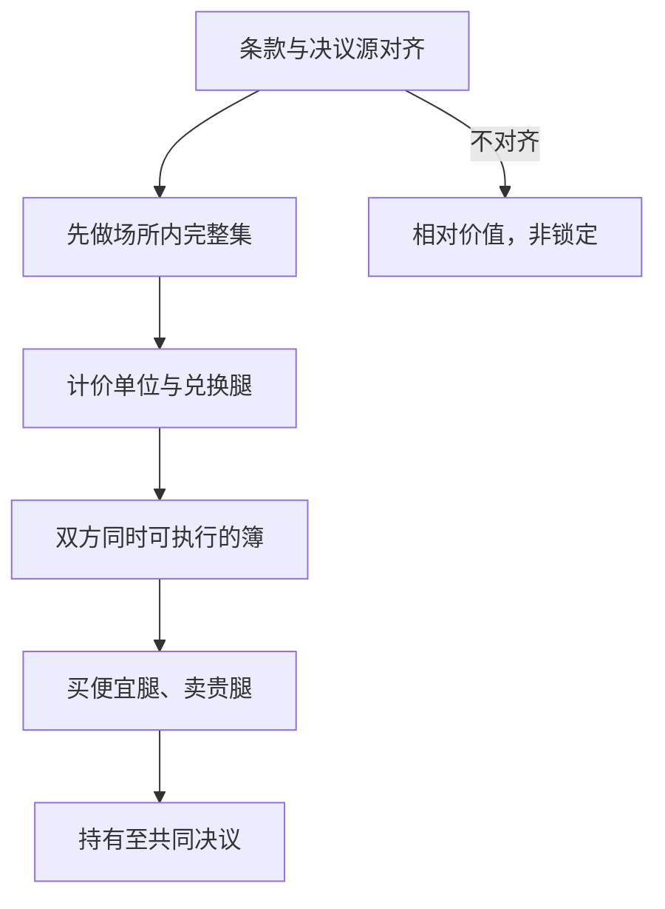

# 预测市场跨市场套利

同一可验证事件在两个公开场所各有一套完整集与决议条款；可锁住的是费用、抵押与结算源都对齐之后的价差，而不是两个标题长得像。

<footer>—— 据事件合约的完整集会计与公开场所规则整理；场所结构见 Polymarket / Kalshi 事件合约</footer>

[事件合约](/quant/prediction-market-venues) 写单个场所：铸造赎回、订单簿、决议源。本篇写**跨市场**：同一经济事件在 Kalshi、Polymarket 或其他公开簿上同时报价时，价差从哪来、何时能锁、何时只是看起来像锁。逻辑与 [ETF 创建赎回](/quant/etf-create-redeem)、[期现](/quant/cash-and-carry) 同族——两边必须是可交割（这里是可裁定）的同一支付——但没有篮子清单，只有文本定义。对象是公开簿上的机械关系：完整集、互斥穷尽、逻辑蕴含。不讨论延迟撮合漏洞、预言机干扰或规避准入。

## 问题

场所 $X$ 与 $Y$ 对事件 $A$ 报出可成交的 YES 买价/卖价。若决议条款使两边在 $T$ 支付同一美元（或可 1:1 兑换的单位），则

$$
p_X^{\mathrm{ask}}(A)+c_X+c_{\mathrm{fx}}+c_Y \lt  p_Y^{\mathrm{bid}}(A)
$$

时，存在买 $X$ 卖 $Y$ 的锁定候选。问题几乎总出在「同一支付」：货币（美元对稳定币）、决议源（两家指定的公开页面是否可能分叉）、截止时间、争议窗口、以及一边停市另一边仍开。标题同为「某人当选」而一边按宣誓就职、一边按选举人票认证，到期支付可以相反。那不是暂时无效率，是两个不同合约。

第二句话是资本。买入一侧占用抵押或保证金，卖出一侧在预测市场里通常是买入 NO 或卖出已铸造的 YES，而不是证券意义上的无限裸空。两边占用不能净额，除非同一清算主体承认对锁。跨链、跨法币的「套利」在途中是两笔方向性事件风险。

### 场所内恒等式先于跨场所

任何跨市场比较之前，先检查每个场所自己的完整集：

$$
p^{\mathrm{YES}}+p^{\mathrm{NO}}+c_{\mathrm{mint/redeem}}\stackrel{?}{=}1.
$$

若场所内已经裂开，优先做铸造/赎回或 YES 对 NO，不必跨所。分类市场上 $\sum_k p_k$ 对穷尽互斥结果应接近 1。逻辑蕴含：若市场承认「$A$ 蕴含 $B$」，则 $p(A)\le p(B)+c$；违反时是同一场所的荷兰书，仍然先于跨所。跨所只在两边条款映射到同一 $\sigma$-代数原子上才开始。

稳定币脱锚会把「两边都是 1 元票面」拆成两个计价单位。锁价差时必须指定兑换腿：哪一个稳定币、哪一个现货场所、脱锚时哪条腿还能赎回。未指定兑换的跨所价差是外汇加事件，不是纯事件套利。

## 方法

**条款对齐表。** 对候选事件列：定义文本、决议源 URL 或指定机构、提前决议条件、最小可交易单位、费用、限额、交易日历。只有定义与源在可预见争议下仍同真同假，才标成可对锁。相近但不相同的，最多做相对价值，收敛不是被完整集保证的。

**可执行带。** 用双方可成交档计算：买入贵的 NO / 卖出便宜的 YES 等组合，加上铸造赎回、链上 gas 或法币出金、稳定币兑换点差、资金占用至决议日的利息。带以内的「图上价差」只是展示。部分成交规则：任一腿未成，事件风险未锁，应有超时撤单而不是留下裸 YES。

**日历。** 一边是 24/7 链上匹配，一边是受监管场所的时段与熔断。可锁窗口是**双方同时可执行**的交集。用链上半夜的报价去对照已收市的 Kalshi 中间价，不是套利检验。决议临近若一方只允许平仓，锁定路径会单向断开。

### 相关事件不是复制品

选举、宏观数据、体育系列赛会产生一簇合约：胜出、得票区间、是否超过阈值。它们由联合分布连着，但边际价格不必满足你在纸上写的 copula。跨场所去对「同一候选人获胜」是复制品问题；去对「获胜」与「得票>50%」是结构产品问题，需要联合条款，通常锁不住。把相关性当成套利，等于在做观点，应计入风险预算而不是锁定价差。

## 机制

若两边真是同一支付，价差来自分割市场：准入、资本、费用、库存与注意力。散户堆在一个场所，做市商的库存与对冲在另一个场所，中间的几分可以存在很久，直到某类资本同时开通两边。这与 ADR、ETF 折溢价相同：管道开着时价差有上界，管道受限额、出金、合规关闭时，上界消失。预测市场的管道是账户准入加抵押可转移性，不是 NSCC 篮子。

费用使「无套利区间」是一条带子而不是一条线。越临近决议，若源清晰，带子收窄；若源可能分叉，带子突然变宽——那是决议基差被定价，不是流动性改善。跨所「套利」的历史夏普若集中在少数争议事件上，测的是对争议结果的押注。

### 荷兰书与预算约束

同一场所内的荷兰书（Dutch book）由完整集与逻辑约束保证，资本效率高。跨场所荷兰书还要求转换函数：货币、时间、法律。转换失败时，两边各自可以内部一致，合在一起对你不一致。工程上应把跨所仓位标成「基差交易」，把场所内完整集标成「会计恒等」，不要在风险系统里用同一个「arb」标签。

持仓限额会让表面上的 5 分价差在可执行数量上变成 0。回测若按中间价无限量成交，会把零售深度写成机构利润。容量是双方限额、深度与出金速度的最小者。

## 边界与工程取舍

不要用两个概率小部件的差当信号。不要在未声明计价单位时年化价差。不要把博彩公司盘口直接接进完整集会计——博彩常没有可赎回的 YES+NO=1，且可单边拒单。不要研究如何让一边的决议源失效。可做的研究是：公开簿价差的持续时间、费用后可执行频率、以及条款不对齐事件上价差为何不收敛。

与股票统计套利的差别：这里没有 cointegration，只有到期支付的几乎平凡的等式。不收敛的原因几乎总是条款、货币或管道，而不是「半衰期变长」。因此监控应读规则书修订与限额变化，而不是只读残差 CUSUM。

出处：完整集与事件合约会计见场所公开说明书及本站场所条目。预测市场信息加总见 Wolfers and Zitzewitz。不要把跨所延迟或结算争议写成可复制的无风险收益。

## 小结

- 跨市场套利要求两边到期支付同一单位下的同一事件，先对齐决议条款再看价差。
- 场所内完整集与逻辑蕴含优先；跨所是基差交易，占用通常不能净额。
- 可执行带必须计入费用、兑换、gas/出金、利息与双方同时可交易的日历。
- 标题相似、相关事件、博彩盘口，默认不是复制品。
- 限额与管道关闭会取消无套利上界；监控规则与准入，而不是只监控残差。
- 出处：Kalshi / Polymarket 公开规则；Wolfers and Zitzewitz。
