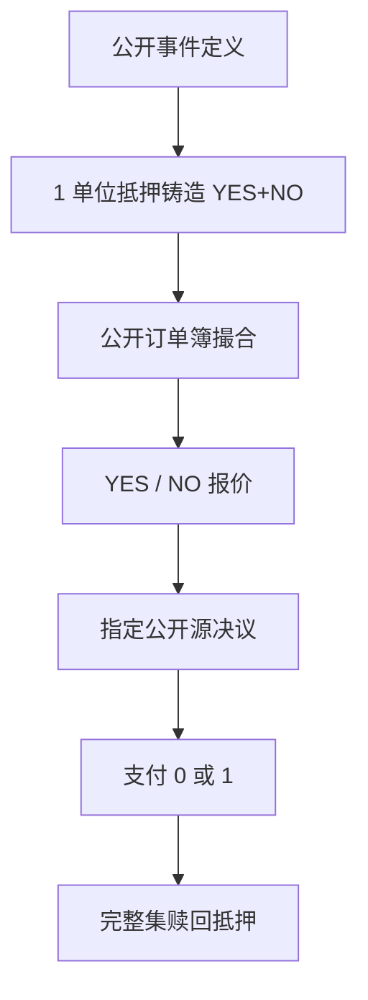

# Polymarket / Kalshi 事件合约

事件合约把一次可验证的公开结果映射成到期支付 0 或 1 的凭证；场内价格是风险中性概率扣掉费用、抵押与结算基差之后的报价，不是民调的另一个名字。

<footer>—— 据 Polymarket 与 Kalshi 的公开规则、订单簿与结算说明整理；合约设计对照 Wolfers and Zitzewitz 对预测市场的论述</footer>

预测市场把「某件公开事件会否发生」做成可交易合约。当代两个高可见场所是：Kalshi——美国商品期货交易委员会（CFTC）监管下的指定合约市场，法币清算；Polymarket——以链上抵押与公开订单簿撮合的事件市场，合约用稳定币计价。二者交易的都是**事件合约**（event contract），不是证券现货，也不是本站其他条目里的股票因子。本篇写公开场所的合约结构、抵押、结算与微观结构，为 [跨市场套利](/quant/prediction-market-arbitrage) 提供制度前件。只讨论公开规则与公开簿；不讨论如何干扰预言机、绕过地理限制或操纵结算源。

## 问题

记事件 $A$ 在决议日 $T$ 被裁定为真或假。标准二元合约：

$$
\mathrm{YES}_T=\mathbf{1}_{\{A\text{ 为真}\}},\qquad \mathrm{NO}_T=1-\mathrm{YES}_T.
$$

$t$ 时刻的成交价 $p_t^{\mathrm{YES}}\in(0,1)$（以 1 美元或 1 枚稳定币为单位）在无套利且可完全抵押时，接近风险中性概率 $\mathbb{Q}(A\mid\mathcal{F}_t)$ 减去费用与资金占用。它一般**不等于**真实世界概率 $\mathbb{P}(A)$：参与者风险偏好、抵押利率、仓位限制与意见分布都会把 $p$ 推离 $\mathbb{P}$。Wolfers 与 Zitzewitz 强调预测市场是信息加总装置；工程上首先要问的是：加总发生在哪一套清算规则上，违约与争议如何结束。

Kalshi 与 Polymarket 不是同一个加总装置。Kalshi 有中央对手方、会员准入、美元保证金与监管产品清单；事件种类、合约规格与持仓限额写在规则书里。Polymarket 用公开的链上抵押（常见为 USDC 一类稳定币）创建完整集（complete set），订单簿撮合 YES/NO，结算依赖事先写明的决议规则与争议流程。把两个场所的价格画在一张图上当「同一概率」，忽略了货币、准入、费用、决议源与停市条件。

### 完整集、抵押与票面 1 元

二元市场的会计单位是完整集：一份 YES 加一份 NO 在决议后合计支付 1。场所通常允许用 1 单位抵押**铸造**完整集，或把完整集**赎回**为 1 单位抵押（扣费前）。因此

$$
p^{\mathrm{YES}}+p^{\mathrm{NO}}\approx 1-c,
$$

$c$ 为往返费用、点差与铸造赎回摩擦。若两边同时可成交且和显著低于 1，存在买入完整集并持有到结算的锁定（费用后）；显著高于 1 则反向赎回。这是场所内最干净的无风险关系，先于任何跨场所比较。分类市场（多结果互斥且穷尽）把 1 拆到 $K$ 个互斥合约上，和应接近 1。体育与选举的「多候选人」若未穷尽「其他」，和可以合法地不等于 1，那不是套利，是合约没覆盖样本空间。

价格是「每份到期或赔 1 元」的报价。杠杆来自你用更少净值买入 YES，而不是合约本身再乘杠杆倍数。把 0.20 读成「20% 且无资金成本」会漏掉抵押占用、稳定币脱锚与机会成本。

## 方法

**读产品说明书，再读簿。** 对每个事件记录：精确的真值定义、决议源（官方统计、认证数据源、场所指定的公开页面）、截止交易时间、争议窗口、是否允许提前决议、持仓与订单限额、费用表。Kalshi 的合约是标准化的监管产品，规格变更走规则；Polymarket 每个市场有自己的决议条款，相近标题的市场不必同分布。回测若用标题字符串匹配事件，会把「候选人 X 当选」与「候选人 X 获得选举人票」当成同一标的。

**订单簿状态。** 两个场所都提供公开的买卖档。可成交概率应用买一/卖一或可执行量加权，而不是最后成交。薄市场里最后成交可以停在过期价上很久。做市与点差随事件临近通常收窄，但在争议期、监管新闻或抵押拥堵时会跳开。容量取可执行深度与持仓限额的最小者。

**时钟与停市。** 选举夜、数据发布、法庭文件都有官方时间戳。场所可能在决议临近暂停匹配，或只允许减仓。用停市后的「概率」去评价预测能力，测的是结算预期，不是实时加总。链上场所还要加上区块确认与抵押到账延迟：你在网页上看到的报价，不等于保证金已经锁定的可执行价。

### 决议风险是基差，不是残差噪声

事件合约的独特风险是**决议基差**：链上价格收敛到场所裁定，场所裁定再去贴事先指定的公开源。源延迟、源修订、规则模糊（「以哪家媒体的宣布为准」）会让 $p\to 1$ 或 $0$ 的最后一跳不等于你对真实世界的判断。Kalshi 作为受监管市场，争议走规则与监管程序；Polymarket 走其公开的决议与争议条款。二者都可以出现「价格早已定价、裁定尚未出」的窗口。把这一窗口里的波动当成 alpha，是在做法律与运营风险，不是在做概率预测。

## 机制

信息加总：持不同信念的人把钱放在同一清算所（或同一抵押合约）里，价格成为加权后的风险中性概率。费用与库存使做市商要求价差；极端信念与仓位限额使 $p$ 不必等于 $\mathbb{P}$。临近 $T$，若决议源清晰，时间价值消失，$p$ 被钉向 0/1，点差往往先收后——若出现争议——再张开。这与期权在到期日的钉住类似，但标的是离散事件而不是连续标的价格。

与民调、博彩公司的差别。民调没有强制的完整集会计，样本权与问题措辞是另一套误差。博彩公司可以调整盘口与限额，不必提供可赎回的 YES+NO=1。预测场所的公开簿让外部观察者能审计深度与费用；这是把它写进量化笔记的理由。与 [比特币现货 ETF 基差](/quant/btc-etf-basis) 一类的现金流收敛不同：事件合约没有可交割的「一篮子比特币」，只有裁定文本。收敛质量完全取决于决议条款写得清不清。

### 谁能交易、用什么货币

Kalshi：合格参与者、美元、受持仓限额与产品清单约束，适合把事件风险放进传统经纪与清算报告。Polymarket：稳定币抵押、链上结算路径公开，全球可观察的簿更深地暴露在稳定币与链的运营风险上。同一选举事件在两边可以长期存在几分的价差，来源是准入、费用、资本与决议条款，而不自动是「一边更有效」。把链上场所的 24/7 交易当成 Kalshi 的夜盘，会在停市与合规上算错可执行性。

完整集的铸造赎回把预测市场连到固定收益：锁定 YES+NO 等价于把 1 元放到决议日再拿回（扣费）。「无风险」的参照是该抵押品在同期的利率与脱锚风险，不是国债曲线本身。

## 边界与工程取舍

不要把网页概率小部件当成可成交价。不要在未读决议源的情况下比较两个标题相似的市场。不要用杠杆账户的收益率去外推场所内 0–1 合约的夏普——那是融资，不是事件溢价。监管状态会变：产品能否对美国零售开放、稳定币是否仍被接受为抵押，都会突然改变深度。这些是制度跳跃，应当成 [体制断裂](/quant/regime-break-risk)，而不是抽样噪声。

本篇不提供如何选择「更容易被裁定争议」的市场，也不讨论攻击结算源。量化用途是：把公开簿、费用、完整集会计和决议条款写成可审计的状态机，然后再谈预测力或套利。预测力检验必须用当时可成交的中间价或买价，并在事件级别做聚类标准误——同一选举的十个相关合约不是十个独立样本。

出处：场所规则以 Kalshi 与 Polymarket 当时有效的公开说明书为准。预测市场作为信息加总见 Wolfers and Zitzewitz。跨场所价差见本站预测市场套利条目。不把民调机构的方法论当成场内结算规则。

## 小结

- 事件合约是到期支付 0 或 1 的凭证；价格接近风险中性概率，需扣费用、抵押与决议基差。
- Kalshi 是受监管的法币场所，Polymarket 是稳定币抵押的公开簿场所，货币、准入与决议流程不同。
- 完整集 YES+NO≈1 是场所内最干净的会计恒等式；分类市场必须检查是否互斥穷尽。
- 可执行报价来自订单簿与限额，不来自最后成交或外部概率小部件。
- 决议风险是独立的基差来源，应写进条款，而不是残差。
- 出处：两场所公开规则；Wolfers and Zitzewitz 对预测市场的论述。
