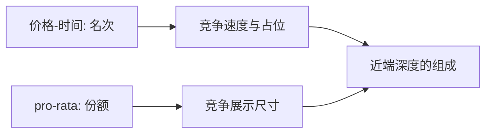

# 价格-时间对 pro-rata

同一价位上先到先得，会把竞争赶到速度与占位；按剩余量比例分配，会把竞争赶到订单尺寸。优先规则改的是排队博弈的策略空间，不是簿的几何画法。

<footer>—— 据 Harris, Trading and Exchanges 对优先权的论述；对照 Cordella and Foucault, Minimum Price Variations, Time Priority and Quote Dynamics, Journal of Financial and Quantitative Analysis, 1999</footer>

[最优放置](/quant/optimal-limit-placement)默认价格优先再时间优先（price-time / FIFO）。缺口是另一常见规则：同一价位按尺寸比例分配（pro-rata），期货与部分利率产品常用。Cordella 与 Foucault（1999）已说明时间优先与 tick 如何共同决定报价动态。本课比较两种规则下的占位、尺寸与速度激励，不重画两侧价量阶梯。

## 问题

FIFO 下，队尾的边际执行概率低，交易者要么提前占位，要么提高一个 tick 买新队头，要么改市价。速度的价值是到达次序。pro-rata 下，后到的大单仍能分到一刀，尺寸成为份额，「排队」不再是严格的名次。激励变成：在最优价上挂尽可能大的量，甚至超过真实意愿，成交后再撤余量。问题是规则如何改变：(i) 谁提供近端深度；(ii) 撤单与虚报尺寸；(iii) 小单是否被挤出。

Harris 把优先权当作市场设计的一等对象。本课是这一等对象的理论比较，具体期货匹配算法留到市场设计单元。

### 混合规则

实务常是 FIFO + 顶层比例、或做市商保证配额再 FIFO。混合把两种博弈叠在一起：先抢配额，再抢时间。理论比较先看纯规则的极端，再理解混合为何出现——保护小单或指定做市商。

时间优先在连续时间极限里变成速度竞赛：谁的线短谁当队头。这是 Budish 等人的起点。pro-rata 并不消灭速度，因为更快仍能在分配窗口内更新尺寸，但一阶武器从次序变成量。

## 方法

在同一 Parlour 式状态上改成交匹配。FIFO：吃 $q$ 从队头依次耗尽。pro-rata：吃 $q$ 按各订单剩余量占比分配，常有最小分配单位。均衡策略：FIFO 下最优是中等尺寸、早到、少虚报；pro-rata 下最优尺寸膨胀，真实需求被「展示量」掩盖。被捡风险在 pro-rata 上更尖锐：虚报的大量在信息跳时来不及全撤，可能被按比例打中。

比较静态：tick 越粗，同一价位堆积越严重，规则差异越大。tick 极细时价格优先已把量打散到许多格，同价位规则不那么关键——与 Cordella–Foucault 的 tick–时间优先互动一致。

### 对最优放置的改写

FIFO：贵一 tick 抢队头常常值得。pro-rata：贵一 tick 可能把自己放到一个更空、但仍按比例的新价位，份额高但价格更差；或留在拥挤的 BBO 用尺寸换份额。放置的 $k$ 选择因此翻转，不能把 FIFO 校准的档位策略搬到国债期货上。

## 机制

优先规则分配的是即时性租金。FIFO 把租金给先到者，鼓励常设挂单（Grossman–Miller 的在场）和低延迟。pro-rata 把租金给大单，鼓励做市商用资本堆量，小的限价单预期份额低，可能改走市价，限价比例下降。经验上利率期货近端极厚，与 pro-rata 堆量一致；美股股票近端相对薄、速度竞争更明显，与 FIFO 一致。当然还有产品本身的 tick 与用户结构。

虚报尺寸是 pro-rata 的阴暗面：展示深度不是真实可成交意愿。隐藏与冰山在 FIFO 上主要损失时间优先；在 pro-rata 上隐藏会直接损失份额，激励更弱。规则与隐藏是一对设计，不能分开选。

## 边界

分配的最小单位、是否允许超出需求的挂单、撤单速度限制，都会改变 pro-rata 博弈。监管若限制「明显超过意向」的挂单，堆量策略受限。跨市场 FIFO 与 pro-rata 并存时，同一宏观信息会在两个场所留下不同的扫簿形态。本课不讨论具体交易所参数表。

看见期货簿「第一档上万手」不要用股票 FIFO 的直觉读成无限流动性。比例分配下你的市价单会同时打到许多挂单，但下一瞬大量撤余，深度是一次性的。

## 小结

- FIFO 让竞争落在到达次序与跳价抢队；pro-rata 让竞争落在展示尺寸。
- 规则改变最优放置、虚报激励与小单是否愿意挂限价。
- tick 越粗，同价位规则越重要。
- 出处：Harris, *Trading and Exchanges*；Cordella and Foucault, *Journal of Financial and Quantitative Analysis*, 1999；排队基准见 Parlour, 1998。
