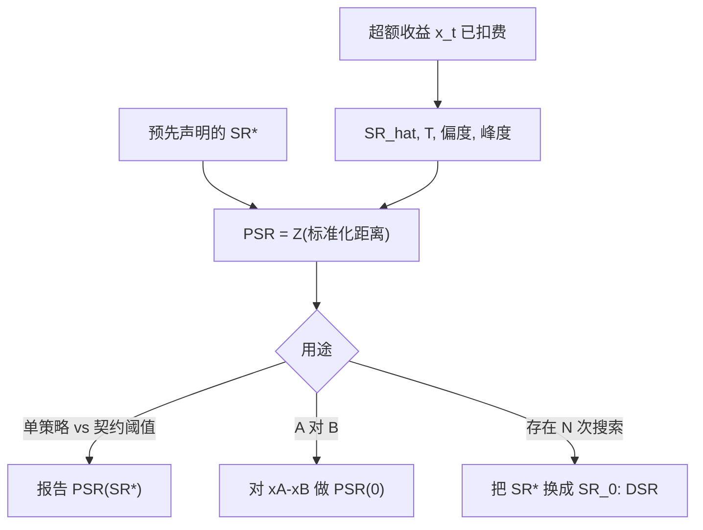

# 概率夏普 PSR

夏普是估计量。我们要的是：在估计了偏度、峰度与样本量之后，真实夏普超过某条预先声明阈值的概率。

<footer>—— Bailey and López de Prado, The Sharpe Ratio Efficient Frontier, Journal of Risk, 2012</footer>

[Deflated Sharpe](/quant/deflated-sharpe) 把 PSR 当成 DSR 的构件一笔带过：先有「超过阈值的概率」，再把阈值换成多次试验的极值。Bailey 与 López de Prado 2012 年在 *Journal of Risk* 的 *The Sharpe Ratio Efficient Frontier* 里，PSR 是**主对象**。它回答单次（或预先指定的）策略：给定观测夏普、样本长度、偏度与峰度，$\mathbb{P}(\mathrm{SR}\gt \mathrm{SR}^*)$ 的渐近估计是多少。$\mathrm{SR}^*$ 可以是 0，可以是融资与风险厌恶要求的最低夏普，也可以是另一个基准策略的夏普。DSR 是两年后才加上「被选过的最大值」这一层。本篇写 PSR 本身、非正态修正、两条策略的比较，以及原文的夏普有效前沿——在给定高阶矩下，夏普不能任意高。不把 PSR 再讲成 DSR。

## 问题

样本夏普 $\widehat{\mathrm{SR}}=\bar x/s_x$ 即使在 IID 正态下也有误差；非正态时误差更大。从业者却常用「夏普大于 1」或「大于 2」当确定性标签。Opdyke（2007）给出夏普的渐近分布；Mertens 把偏度与峰度写进方差。Bailey–López de Prado 把这些收成一个单边概率：

$$
\widehat{\mathrm{PSR}}(\mathrm{SR}^*)=Z\left[\frac{(\widehat{\mathrm{SR}}-\mathrm{SR}^*)\sqrt{T-1}}{\sqrt{1-\hat\gamma_3\widehat{\mathrm{SR}}+\frac{\hat\gamma_4-1}{4}\widehat{\mathrm{SR}}^2}}\right],
$$

$Z$ 为标准正态 CDF。直观：$\widehat{\mathrm{SR}}$ 越高于阈值、$\sqrt{T}$ 越大、高阶矩越接近正态，PSR 越高。左偏或肥尾抬高分母，同样的点估计对应更低的 PSR。问题是把夏普从「表上的一个数」还原成「对 $\mathrm{SR}\gt \mathrm{SR}^*$ 的检验」。

阈值必须预先声明。看完 $\widehat{\mathrm{SR}}=1.4$ 再把 $\mathrm{SR}^*$ 设为 1.3，PSR 接近 1 没有信息。合法的 $\mathrm{SR}^*$：0；资金成本折明年化后的最低可接受；或对照组的样本夏普（比较用）。

### 两条策略的 PSR 不是两个 PSR 相减

比较 A 与 B，应对超额差 $x_t^A-x_t^B$ 直接算夏普，再对这个差的夏普做 PSR，阈值通常为 0。分别报告 PSR(A)、PSR(B) 再看谁大，会忽略相关：高度相关的两个策略，差的夏普标准误远小于「两个独立夏普之差」。原文的比较框架针对的是差，不是两个概率的排序。基准必须可投资且与 A 同期，否则差的夏普没有实施意义。

年化约定要与 $T$ 一致。用年化夏普、却把 $T$ 当交易日数而不把阈值与方差同步年化，会把 PSR 算爆。应在同一频率上算 $\widehat{\mathrm{SR}}$ 与 $\mathrm{SR}^*$，再年化只用于展示。

## 方法

输入：同一频率的超额收益序列（已扣费、已含融资），$T$、$\widehat{\mathrm{SR}}$、$\hat\gamma_3$、$\hat\gamma_4$，以及预先写死的 $\mathrm{SR}^*$。短样本的峰度极噪，应报告 PSR 对 $\gamma_4$ 截尾或 Winsorize 的敏感性，而不是只报一个点。序列相关时，先把有效样本量换成长期方差意义下的 $T_{\mathrm{eff}}$（Newey–West 或 Lo 的调整），再进入公式；假装日度点独立，PSR 会虚高，见 [IR / Sharpe](/quant/ir-sharpe)。

最小轨迹长度（MinTRL）：原文问，要把 PSR 推到某置信度，区分 $\mathrm{SR}^*$ 与真夏普，需要多少年。所需长度大致随 $(\mathrm{SR}-\mathrm{SR}^*)^{-2}$ 增长。高换手策略看起来 $T$ 很大，有效独立信息可能很少；用日历天数去套 MinTRL 会低估需要的样本。这与 DSR 的 $\mathrm{SR}_0$ 是不同计算：MinTRL 假定你已经指定了一个策略和一个阈值，没有「选了 $N$ 次」这一层。

### 夏普有效前沿：高阶矩限制 SR

原文的「efficient frontier」不是 Markowitz 的 $\mu$–$\sigma$ 前沿。它说：给定偏度与峰度（以及矩存在），样本夏普不能任意大——极端夏普与极端高阶矩互相约束。观测到又高又稳的夏普、同时声称收益接近正态，往往自相矛盾：要么矩没估计对，要么样本不够展示左尾。前沿给出一个诊断：把 $(\widehat{\mathrm{SR}},\hat\gamma_3,\hat\gamma_4)$ 标在图上，若落在不可能区域附近，应怀疑数据清洗、截断损失或卖出期权式的未实现左尾。短波动策略的样本 PSR 可以很高，直到左尾到来；前沿提醒 PSR 仍是渐近陈述，不是对跳跃风险的保险。

对收益做去极值、截断回撤年、换波动估计，都会改变 $\widehat{\mathrm{SR}}$ 与高阶矩，从而改变 PSR。这些属于额外试验，晋级到 DSR 时 $N$ 应增加，而不是继续声称「只算了一次 PSR」。

## 机制

PSR 的机制是 Wald 型单侧检验：分子是点估计相对阈值的距离，分母是考虑了高阶矩的标准误，再映射到正态概率。它比「夏普是否大于 1」多了样本量与形状，比自举便宜。正态 CDF 的代价是：真实抽样分布在小 $T$、大峰度下并不正态，PSR 的 0.95 不是精确的 95% 置信。大样本、近对称时近似可用；日内肥尾、两年样本时，应把 PSR 当排序工具，并用自举核对。

与 Sortino、Calmar 的差别：那些换分母或换路径泛函，仍是点估计。PSR 不改变绩效定义，只给**同一个夏普**配上推断。产品契约若承诺的是下行偏差，应另做下行比的推断，而不是用 PSR 假装已经管了左尾——PSR 只通过 $\gamma_3,\gamma_4$ 部分进入左尾，不读取最大回撤。

### 从 PSR 到 DSR 只改阈值

$N=1$ 且 $\mathrm{SR}^*$ 取你的最低可接受夏普时，DSR 与 PSR 重合。一旦存在未申报的搜索，继续报 PSR$(0)$ 是在用错误的原假设。正确升级是把 $\mathrm{SR}^*$ 换成 $\mathrm{SR}_0(N,V)$，即 [原文 DSR](/quant/bailey-dsr)。两者在代码里应是同一函数、不同阈值，而不是两套互相竞争的「更好的夏普」。研报应同时给：预先指定阈值的 PSR（技能相对产品契约），以及计入 $N$ 的 DSR（技能相对搜索过程）。缺一个，叙事就不完整。

## 边界与工程取舍

PSR 高不等于可交易：成本应先进入 $x_t$。PSR 也不处理标签泄漏与切分选择；那是 purge 与 CPCV 的事。不要对滚动窗口的每一段都算 PSR 再挑选最高的那段展示——那是把 PSR 当成新的选择对象。截面因子的 $t$ 统计量有自己的多重检验文献，不要用 PSR 去替代 Harvey–Liu–Zhu。

估计 $\gamma_3,\gamma_4$ 需要比估计均值更多的样本。极端值对峰度的影响可以单独翻转 PSR 的结论，应报告剔除最大亏损日之后的 PSR 作为压力，而不是把剔除当作正式收益定义——除非产品规则本来就会截断。

PSR 的 $Z[\cdot]$ 在自变量很大时饱和在 1 附近，失去分辨率。比较两个都「PSR=1.000」的策略，应回到差的夏普、路径分布与经济约束，而不是比更多小数位。

## 小结

- PSR 是 2012 年原文的主统计量：在非正态下，观测夏普超过预先声明阈值的渐近概率。
- 比较两个策略应对收益差做 PSR，而不是比较两个概率；频率、$T$ 与阈值必须一致。
- 夏普有效前沿用高阶矩限制「可能的」夏普，用于诊断截断左尾与自相矛盾的矩。
- $N=1$ 时 DSR 退化为 PSR；有搜索时必须升级阈值，两者是同一函数的两种用法。
- 出处：Bailey and López de Prado, *The Sharpe Ratio Efficient Frontier*, Journal of Risk, 2012；Opdyke, *Journal of Asset Management*, 2007；Lo, *FAJ*, 2002；DSR 见 Bailey and López de Prado, *JPM*, 2014。
