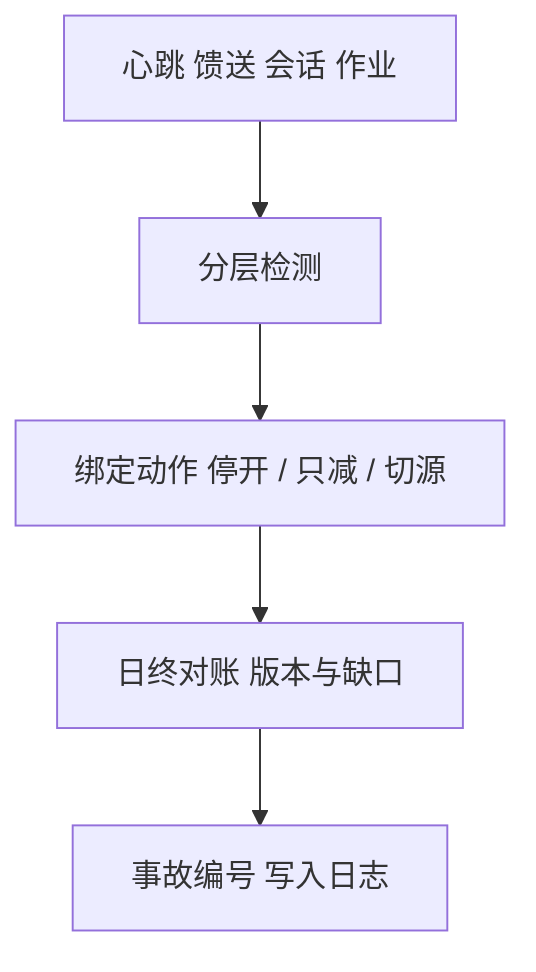

# 生产监控与告警

实盘与回测的差要在分钟级被拆开：行情陈旧、拒单、敞口越权、特征版本漂移。告警是动作，不是仪表盘上的红色装饰。

<footer>—— Perold, The Implementation Shortfall, JPM, 1988；SEC Knight Capital 处罚令（Release No. 70694）；对照[监控：PnL、敞口、拒单](/quant/trading-telemetry)</footer>

[上一课](/quant/research-log-discipline)把实验室账本收好。本课的缺口是**上线之后**：生产监控如何接到已有的遥测课，并覆盖本课程特有的对象——特征版本、馈送序号、清算状态、容量。Perold 的实施缺口给出会计对象；Knight 给出变更失败的监管案例。[遥测课](/quant/trading-telemetry)已拆 PnL / 敞口 / 拒单；本课补研究栈上线后的告警策略，不重写那三张时间序列的定义。

## 问题

回测假设特征版本哈希不变、行情无缺口、成交皆确认、容量按登记的参与率。生产里每一项都会破。问题是把破标记成可分页的告警，并预先绑定动作：停开新仓、只许减仓、切备用行情、回滚特征版本。没有绑定动作的告警会在噪声中被静音，真正的故障（脏行情、错误映像）就会穿过。

告警要分层：数据（序号缺口、as-of 落后）、模型（特征缺失率、IC 的实时代理异常——谨慎使用）、执行（拒单率、部分成交）、风险（敞口、VM、涨跌停锁仓）、清算（fail、未确认）。全部塞进一个「健康分」会重现遥测课批评过的混加总。

### 研究–实盘对账是日课

每日把生产成交与信号快照对账：是否用对特征版本、是否在 stale 簿上发过依赖名次的单、实施缺口各成分。差应归入登记过的成本模型容忍带；超出则开事故，而不是调参数把曲线修平。这与研究日志衔接：生产事故也是实验，要有编号。

A 股还要监控：可卖量违规、程序化报撤形态接近阈值、两融维持担保比例。阈值来自公开规则与会员合同，不是来自夏普。

## 方法

每个告警：检测统计量、时钟、阈值、抑制（避免行情微缺口刷屏）、升级路径、自动动作。自动动作必须可逆且保守：默认停开。心跳覆盖旁路网卡、特征作业、报盘会话，而不只覆盖策略进程。变更窗口：映像与特征版本发布后进入强化监控，参照 Knight——新版本是先验危险。

容量监控：实时参与率、借券费率、期货保证金占用，对照登记的容量曲线。接近曲线则降仓，而不是等冲击把当日 PnL 洗掉再解释。后课专门写容量估计，本课只要求监控读那条曲线。

### 假阳性与假阴性

过密告警导致静音；过疏导致 Knight 式发现过晚。用历史中断日与故意注入的 stale 行情做演练，统计检测延迟。演练失败则改检测，不改「我们盯着屏幕」。

## 机制

生产是另一个数据生成过程：延迟、部分成交、人为变更。监控把该过程观测出来，使策略假设可证伪。没有观测，回测纪律全在实验室，实盘变回无日志试错。告警绑定动作，是把[故障课](/quant/exchange-outages)的状态机接到运行时。

特征版本漂移是静默的未来函数反面：训练用 v12，生产误发 v11 或未发布的 v13。哈希比对应在开盘前完成，失败则不准开盘交易。

## 边界

不提供绕过告警继续交易、或把监管报撤监控当成可优化的「距离阈值还有多远」的交易策略。告警阈值若来自交易所规则，只能留安全边际，不能贴线运行。本课不替代会员与合规的官方监控。

## 小结

- 告警必须绑定保守动作；健康分不能混加总数据、执行与清算。
- 每日对账特征版本与实施缺口；变更窗口强化监控。
- 容量与制度约束（可卖量、两融、报撤）进入同一套分页。
- 出处：Perold, *JPM*, 1988；SEC Release No. 70694；本栏遥测课。
