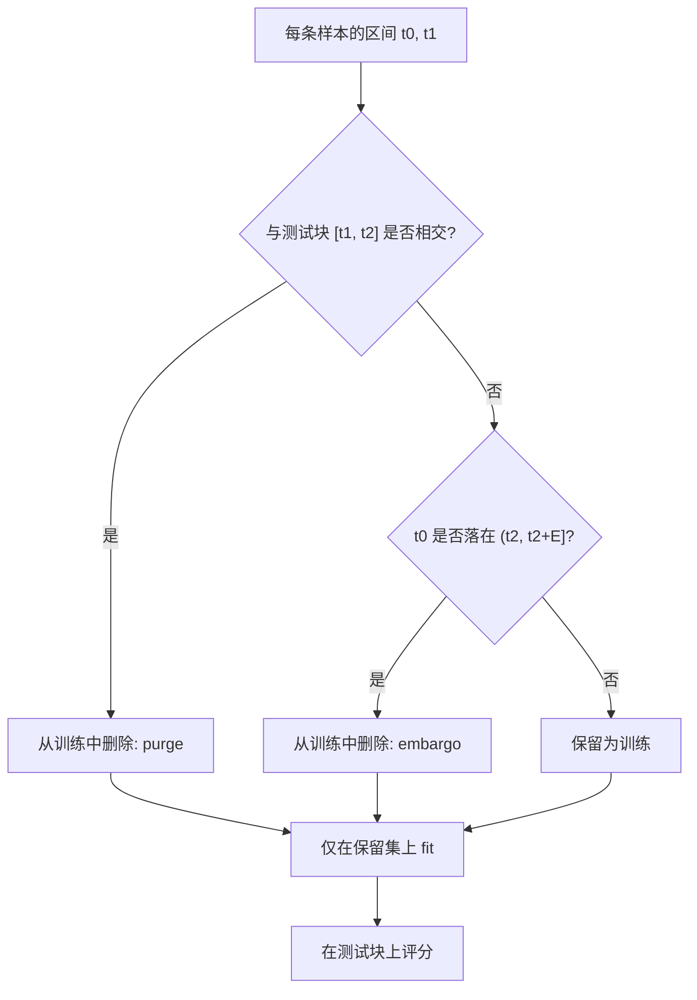

# Embargo 与 Purge

训练标签的时间区间只要与测试期相交，测试路径就已经进了损失函数；即便标签不再相交，测试期之后紧邻的样本仍可能通过残差相关泄漏。

<footer>—— López de Prado, Advances in Financial Machine Learning, Chapter 7, 2018</footer>

[交叉验证在金融中的泄漏](/quant/cv-leakage-finance) 说明为什么随机 $K$ 折会把未来路径写进训练。[标签重叠](/quant/label-horizon-overlap) 说明固定 $h$ 期收益使相邻 $y$ 共享路径。本篇把 López de Prado 的两步修补写成可执行的区间运算：purge 删除**标签区间与测试时间相交**的训练样本；embargo 在测试块结束后再空出一段，切断残差与特征的短程相关。它们是 CPCV 与 purged $K$-fold 的接缝工艺，不是新的评分规则。没有每条样本的标签终点 $t_{i,1}$，清洗只能用保守的固定 $h$，会多删或漏删。

## 问题

样本 $i$ 在信息时点 $t_{i,0}$ 可交易，其标签由未来路径决定，终点为 $t_{i,1}$（三重障碍的首达，或固定期限的 $t_{i,0}+h$）。标签的随机性来自区间 $[t_{i,0},t_{i,1}]$ 上的价格。测试集覆盖时间 $\mathcal{T}_{\mathrm{test}}$。若某训练样本满足 $[t_{i,0},t_{i,1}]\cap\mathcal{T}_{\mathrm{test}}\ne\emptyset$，则该样本的 $y_i$ 已经看见测试期的价格，把它留在训练集里，等于让损失函数预习考题。这就是 purge 要删的对象。注意：删的是训练样本，不是测试样本；测试标签可以与更早的历史重叠，那是测试自己的问题，不通过训练损失泄漏。

即便 $[t_{i,0},t_{i,1}]$ 完全落在测试期之后，紧挨测试终点的那些 $t_{i,0}$ 仍可能有问题：波动集群、订单流余波、尚未消化的公告使 $X_{i}$ 与测试期残差相关。模型若在训练里记住「测试刚结束后的特征形态」，折外分数仍偏乐观。Embargo 把测试终点之后长度为 $E$ 的一段时间从训练中拿掉（当训练落在测试右侧时），专门堵这一条。

### 泄漏窗口长度是随机的

固定期限标签的重叠长度是 $h-1$，purge 规则可写成「丢掉测试开始前 $h$ 期内、以及测试期内的训练点」。三重障碍的 $t_{i,1}-t_{i,0}$ 是随机的，有的事件当日触达，有的拖到垂直壁垒。用同一个 $h$ 去 purge，要么对短标签过杀，要么对长标签漏洗。正确索引是每条样本自己的 $t_{i,1}$：凡 $t_{i,1}$ 落入测试时间（或 $t_{i,0}$ 落入测试时间）的训练行，一律删除。这要求标签生成器把 `t1` 与特征表对齐，见 [Triple Barrier](/quant/triple-barrier)。

只按 $t_{i,0}$ 是否落在测试组来切分、却不看 $t_{i,1}$，是最常见的假清洗：开仓点在训练期、止盈却发生在测试期的样本，标签已经含测试路径。

## 方法

记测试块为若干连续时间区间的并（组合划分里测试组可以不相邻，每块单独处理）。对每一测试块 $[t_1,t_2]$：

**Purge。** 从训练集删除所有满足 $t_{i,1}\ge t_1$ 且 $t_{i,0}\le t_2$ 的 $i$（区间相交）。若标签在 $t_{i,0}$ 尚未开始、只有终点，用 $t_{i,1}$ 落入 $[t_1,t_2]$ 作为相交定义。实现上对 $t_{i,0}$、$t_{i,1}$ 做排序后的区间查询，避免 $O(n^2)$ 的朴素双重循环。

**Embargo。** 设块长 $L=t_2-t_1$，禁运长度 $E=\lambda L$ 或 $E$ 等于标签的平均持有期、或等于残差显著自相关的阶数。从训练集再删除 $t_{i,0}\in(t_2,t_2+E]$ 的样本。$\lambda$ 常见为几个百分点到与持有期同阶；它是超参，必须预先冻结。测试块之前一般不需要对称禁运：过去的特征不包含未来测试路径，除非特征本身用了中心化窗口（那是特征泄漏，应改成因果窗口，而不是用 embargo 补）。

特征管道在清洗之后的训练索引上单独 `fit`。标准化、PCA、$d^\star$、分位阈值，看见测试分布即作废。嵌套时，内层划分同样要 purge，否则超参选在泄漏的折外分数上。

### 组合划分上的多块测试

CPCV 一次划分有 $k$ 个测试组，可能不相邻。应对**每一个**测试块分别 purge 与 embargo，再把删除集合并。两块测试之间夹着的训练组，若其标签跨进任一块，照删；不要以为「夹在中间」就安全。相邻测试块之间的间隙若短于平均持有期，间隙里可能几乎没有合法训练样本——这是 $(N,k)$ 与标签长度不匹配的信号，应改划分，而不是把间隙样本强行加回。

清洗后训练折空了，说明折太短或标签太长。取消 purge 会让折外夏普回到泄漏世界。应加长组、减短垂直壁垒，或改用锚定滚动。

## 机制

Purge 切断的是 **$y$ 对测试路径的直接依赖**。Embargo 切断的是 **$X$ 与测试残差的短程相关**。前者是标签重叠的几何，后者是序列相关的缓冲。只做 purge、把测试结束后下一根 bar 立刻放进训练，模型仍可利用波动状态在测试期与其后的连续性——尤其是用了已实现波动、价差、不平衡这类慢变量时。只做 embargo、不做 purge，则长标签会直接跨过禁运区把测试收益写进 $y$。两步缺一，评估器仍偏。

与 Hansen–Hodrick 的关系：HAC 修正的是**已经拟合完的**回归标准误；purge 修正的是**训练/测试切分**本身。两者都要。以为「我用了 Newey–West 就可以随机切折」，是把推断修补当成了样本切分修补。

### 唯一性权重不能替代清洗

平均唯一性降低重叠样本在损失函数里的权重，减轻同一段路径被重复学习，但它不删除跨过切分点的那些 $y$。一个权重很小的泄漏样本仍把测试噪声的方向告诉模型。唯一性是训练期内部的样本加权；purge 是训练与测试之间的硬删除。CPCV 里两者一起用：路径内部用唯一性，路径接缝用清洗。

## 边界与工程取舍

Embargo 过长会浪费测试右侧的训练数据，估计方差变大；过短则泄漏残留。应报告折外分数对 $\lambda$ 的敏感性，并把 $\lambda$ 写进协议，禁止为了提高折外夏普而缩短禁运。截面策略还要按日期整组进出，避免同一天另一半股票留在训练里传递共同因子，见泄漏一文。

不要用 purge 替代点-in-time 特征。财报更正、指数成份、未来分位，清洗解决不了。也不要把清洗后的折外夏普直接当可交易夏普：无偏评估器仍要过成本与容量。尝试次数照计：改过 $\lambda$、$h$、障碍宽度再挑最好的清洗方案，属于对评估器过拟合，见 [过拟合作为风险](/quant/overfit-as-risk)。

验证集若用于早停，它已是训练的一部分，对最终检验集仍要 purge/embargo。把早停曲线叫做样本外，是泄漏的礼貌形式。

## 小结

- Purge 按标签区间与测试时间的相交删除训练样本，处理的是 $y$ 的重叠；embargo 删除测试块之后长度为 $E$ 的训练点，处理的是 $X$ 与残差的短程相关。
- 泄漏窗口应由每条样本的 $t_{i,1}$ 决定，固定 $h$ 只是没有三重障碍索引时的保守上界。
- 组合划分要对每个测试块分别清洗再取并集；清洗后训练集空洞说明划分与标签不匹配。
- 唯一性权重、HAC、点-in-time 特征是不同层的修补，不能互相替代。
- 出处：López de Prado, *AFML*, 第 7 章；三重障碍的 $t_1$ 见第 3 章；推断侧的重叠见 Hansen and Hodrick, *JPE*, 1980。路径如何拼起来见 [Combinatorial Purged CV](/quant/cpcv-lopez)。
