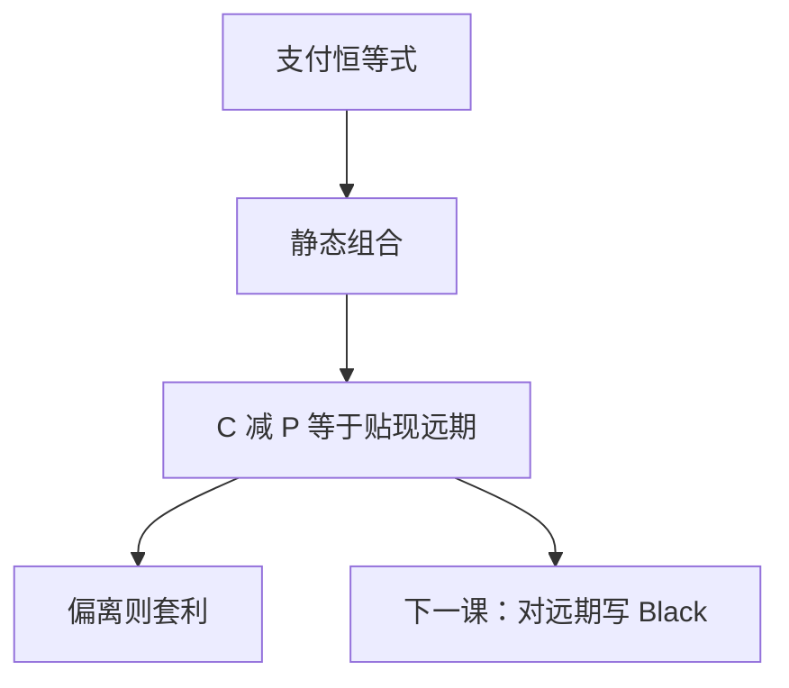

# Put–call 平价作为无套利

欧式看涨与看跌的差等于远期合约：同一 $K,T$ 上 $C-P=S\mathrm e^{-qT}-K\mathrm e^{-rT}$（连续股息）。这是静态无套利，不依赖布朗或 PDE。

<footer>—— 据 Stoll, Journal of Finance, 1969；Merton, Bell Journal of Economics, 1973；Hull, Options, Futures, and Other Derivatives 整理</footer>

上一课[复制与 delta](/quant/replicating-delta)用动态策略复制单个期权。缺口是更粗、也更硬的约束：看涨和看跌不能各自随便定价，它们的差必须等于可静态复制的远期。这条在有跳、有随机波动、甚至没有扩散时仍成立，只要欧式、同一标的、同一交割、允许持有现货与债券。本课只钉平价，为下一课 Black 公式提供「先定远期再定期权」的分解。

## 问题

支付恒等式 $(S_T-K)^+-(K-S_T)^+=S_T-K$。两边贴现、取 $Q$ 期望（或直接静态持仓），得到价格恒等式。缺口不是再解一次 PDE，而是承认：任何让 $C-P$ 偏离远期价值的报价表，都可以在到期前锁定无风险利润。动态模型可以错，$\sigma$ 可以随意，平价仍要满足。把它当成 BSM 的推论，会在微笑市场上误以为平价也失效。

美式因提前行权，平价变成不等式。本课先钉欧式等号。

### 平价不是「看涨看跌隐含波动率必须相等」的定义

同一 $K,T$ 的欧式看涨与看跌，在无套利下共享同一个隐含波动率——那是平价的推论，因为两者价格被远期锁在一起，反解 $\sigma$ 只能给出一个数。先校准两个不同的 $\sigma$ 再谈平价，顺序反了：先平价，再谈微笑沿 $K$ 怎么变。

外汇、期货上把 $S\mathrm e^{-qT}$ 换成相应的远期本金。形式永远是 $C-P=$ 贴现远期合约。

## 方法

无股息：$C_t-P_t=S_t-K\mathrm e^{-r(T-t)}$。连续股息 $q$：$C-P=S\mathrm e^{-q\tau}-K\mathrm e^{-r\tau}$，$\tau=T-t$。静态策略：多看涨、空看跌、空（或借）现货、持债券 $K\mathrm e^{-r\tau}$，终值恒为零，故初值必须为零，否则套利。这不需要 Itô，不需要完备到能复制非线性支付——线性支付 $S_T-K$ 用现货加债券即可。有股息时，静态空头现货要补上股息再投资，否则终值不再是 $S_T$；平价里的 $S\mathrm e^{-q\tau}$ 正是这笔持有成本，不是新的随机项。

合成远期：多看涨空看跌就是远期多头。市场若同时报期权与期货，平价提供跨市场核对。下一课把 $C$ 写成关于远期 $F$ 的 Black 公式，正是把平价里的线性部分抽走，只对凸性定价。

## 机制

线性支付不产生 Itô 凸性，价格由贴现与持有成本完全决定。期权的价值超出线性的部分，看涨与看跌必须相同（同一 $K$），因为它们的非线性正好抵消成直线。因此微笑、跳、随机波动可以改变 $C$ 的水平，但必须同等改变 $P$，以保持差等于远期。这是模型无关的对称。报价系统若对看涨、看跌各做一次插值，应先把两者压到平价流形上再插 $\sigma_{\mathrm{imp}}(K)$，否则同一行权价会出现两个远期。

交易成本与卖空限制会把等号撑成带宽度的无套利带。主干仍写等号，把带宽留给制度课。现金结算与实物交割若不一致，还要核对交割条款是否真是同一个 $S_T$。

## 边界

本课不推导美式提前行权溢价的上界细节，只声明欧式等号、美式不等式。不把平价推广到奇异路径依赖（亚式、障碍一般没有如此干净的配对）。后课默认：欧式 $C$ 与 $P$ 只报一个；给了 $C$ 和远期就有了 $P$。动态模型可以全错，这条静态约束仍先核对。下一课[对数正态与 Black 公式](/quant/lognormal-black-formula)在平价抽出线性之后，对凸性给出闭式。线性部分不再进 $\sigma$。

## 小结

- 欧式平价：$C-P=$ 贴现远期，模型无关。
- 来自支付恒等式，静态即可复制线性部分。
- 同一 $K,T$ 的看涨看跌共享隐含波动率。
- 美式是不等式；路径依赖一般没有同样平价。
- 核对交割条款是否对应同一个 $S_T$。
- 出处：Stoll 1969；Merton 1973。
