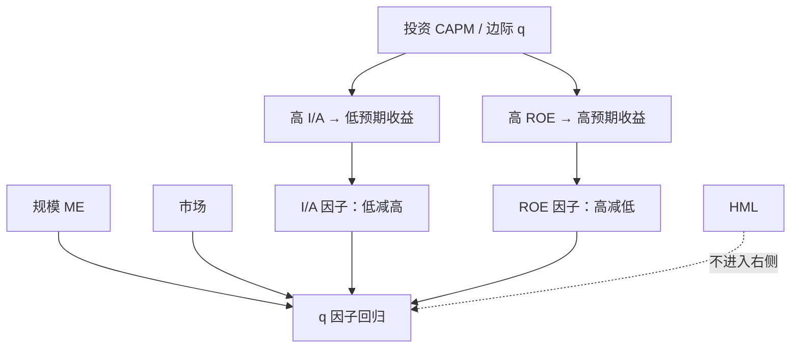

# Hou-Xue-Zhang q-因子

在投资 CAPM 里，高投资对应低贴现率，高盈利能力对应高贴现率；用规模、投资与 ROE 做成多空，可以消化大量用特征命名的异常。

<footer>—— Hou, Xue & Zhang, Digesting Anomalies: An Investment Approach, Review of Financial Studies, 2015</footer>

[五因子](/quant/ff5) 从股利贴现启发式引入 RMW 与 CMA，仍保留 HML。[投资](/quant/investment-factor) 与[盈利](/quant/quality-profitability) 两篇写特征和会计。Hou、Xue 与 Zhang 走的是 **q 理论 / 投资 CAPM**：公司的投资与盈利是贴现率的可观测结果，因子应直接做在 I/A 与 ROE 上，账面市值比不是独立的定价核。他们的 q 因子模型右侧是市场、规模 ME、投资 I/A、盈利 ROE，没有 HML。时间上与五因子同为 2015 年，检验组合与盈利的更新频率却不同。本篇写投资 CAPM 的动机、2×3 构造、月度 ROE，以及它消化异常时与五因子、与[错误定价因子](/quant/sy-mispricing) 的分工。

## 问题

股利贴现说：给定账面，高预期盈利或低预期投资对应高内部收益率。q 理论说得更硬：边际 q 高时公司多投资，而边际 q 高可以来自低风险溢价，于是**高投资是低预期收益的结果**；高 ROE 则要求高贴现率才能与高盈利能力在一阶条件上对齐。若市场按这套一阶条件定价，大量「异常」只是投资与盈利的代理——应计、净发行、失败概率，都会在 I/A 与 ROE 排序上留下足迹。问题不是再发现两个能分开组的特征，而是：用投资与盈利做成与 SMB/HML 同一语言的因子之后，还剩多少 α。

Fama–French 保留 HML，并在部分样本里发现它变得多余。q 因子一开始就不用 HML，等于主张价值溢价应被投资与盈利吸收。这是可检验的：把 HML 对 q 因子回归，α 是否接近零；把 q 因子对五因子回归，I/A 与 ROE 是否仍有增量。两套模型不是五因子少一条腿的记号变换——盈利的会计、更新频率与规模的定义都不同。

### 为何是 ROE 而不是营业利润率

五因子的 RMW 用年度营业利润除以账面股权，6 月重构。q 因子的盈利用 ROE，且用最近季报更新，更接近股东口径的当期盈利能力。季频让盈利因子能更快吸收盈余公告后的截面，也让它与动量的相关高于年度 RMW。分母用账面股权，高杠杆亏损公司会进入弱腿，与 RMW 类似，但分子是净利润类 ROE 而非扣 SG&A 的营业利润，金融与税收项目的影响更大。复制时不要用 GP/Assets 或 RMW 冒充 ROE 腿。

投资腿 I/A 与 CMA 同属资产增长家族，但交叉格子、断点与是否再对盈利中性并不自动相同。下载「投资因子」必须看是 Hou–Xue–Zhang 的 I/A 还是 French 的 CMA。把两条画成一条连续序列是会计错误。

## 方法

每年（投资）与每月（ROE）用 NYSE 断点。规模 ME 用市值。投资 I/A 用总资产相对上一年的变化率，与 Cooper 等及 CMA 同族。ROE 用最近可用季报的盈利相对滞后账面。主方案是规模与投资、规模与 ROE 的两套 2×3 价值加权组合：I/A 因子是低投资减高投资，ROE 因子是高盈利减低盈利，ME 是小减大并在投资与盈利上尽量中性。市场仍是价值加权超额收益。对资产 $i$，

$$
\begin{aligned}
R_{it}-R_{ft}&=\alpha_i+\beta_{iM}(R_{Mt}-R_{ft})+\beta_{iME}\mathrm{ME}_t\\
&\quad+\beta_{iI}(I/A)_t+\beta_{iR}\mathrm{ROE}_t+\varepsilon_{it}.
\end{aligned}
$$

检验组合包括规模、投资、盈利、B/M 等交叉格子，以及文献中的异常组合。评价看 GRS 与 α 的均方，而不是四个 β 都显著。Hou 等人强调：许多异常在 q 因子下 α 不再显著，尤其是与投资、盈利高度共线的那些；动量与部分微观结构异常仍更顽固——这也是后来 q^5 加入预期增长、以及与六因子赛马的背景。

### 财务滞后与月度重构

投资用年报，滞后与 6 月对齐，避免前视。ROE 月度更新必须用**当时已公布**的季报，不能用财政季度结束但尚未披露的盈利。这比年度 RMW 更容易在实现时踩错公告日。季报季节性、一次性项目会让 ROE 腿换手高于 CMA。金融行业的 I/A 与 ROE 含义不同，通常剔除。负账面使 ROE 未定义或符号翻转，需预先规则。

2×3 相对 2×2×2 更接近 FF 惯例，格子更厚。若同时对规模、投资、盈利三重独立切分，微型组合噪声大，但中性更干净。复制论文表应按原文 2×3，稳健性再上三重排序，不要用三重排序的漂亮 α 代替主结果。

## 机制

投资 CAPM 的机制是一阶条件，不是行为。贴现率低 → 多投资、高估值、随后收益低；盈利能力高 → 在同样的投资机会下要求更高的贴现率补偿，随后收益高。价值（高 B/M）在这套语言里是高贴现率的价格侧影子，应被 I/A（少投资）与 ROE（未必高）的组合解释，而不必单独占一个因子。过度投资、帝国建造同样能产生「高 I/A → 低收益」，q 因子的多空并不检验 q 理论对不对，只检验投资与盈利的共同收益是否吸收异常。

与五因子的机制差在定价核的维度：五因子把 HML 留在右侧，允许价值有一块不被盈利与投资说完的共同变动；q 因子把这块从模型里拿掉。经验上若 HML 的 q 因子 α 接近零，两种描述在该样本上几乎等价；若国际样本或早期样本里 HML 仍有 α，价值就还不是投资与盈利的线性组合。A 股的会计与退市制度会改变 I/A、ROE 的排序含义，不能把美股「消化异常」的表直接当定律。

### 消化异常不等于异常不存在

「消化」指时间序列回归里 α 变小，指异常组合的收益能被 I/A 与 ROE 的 β 说明。特征在截面上仍然预测收益，只是预测被改写成对 q 因子的暴露。若你的交易是按应计排序而不是按 I/A 排序，持仓仍不同，成本与换手仍按应计腿算。不要因为 q 因子 GRS 更好，就停止对应计做[多空排序](/quant/long-short-sort) 诊断；诊断与定价模型是两句话。

后续 q^5 加入预期投资增长等，使模型更靠近「预期」而非已实现 I/A。那是另一篇论文的因子。2015 年 q 因子是四因子（含市场），不要把 2020 年代的扩展写进 2015 年的回归方程。

## 边界与工程取舍

不要用 CMA+RMW 冒充 I/A+ROE 去声称「已经复制 q 因子」。盈利频率与会计不同，对动量组合的 α 尤其会分叉。不要在 q 因子回归里再塞 HML 并解释为「更完整」——那是另一个模型，嵌套检验应单独报告，而不是默认六因子。过拟合同样真实：用投资与盈利排序的检验组合去表扬投资与盈利因子，是一致性检查；真正的压力在动量、低波动、换手、微观结构异常上。

季频 ROE 对盈余公告的暴露高，事件月的因子收益会跳。交易成本在小盘盈利空头上很重。与 [Pástor–Stambaugh](/quant/pastor-stambaugh) 流动性、与微观结构因子之间，q 因子没有声称闭合；投资宇宙若已是大盘可投资，ME 腿变弱，模型几乎是市场加投资加盈利。

真实出处：Hou, Xue & Zhang, *Digesting Anomalies: An Investment Approach*, Review of Financial Studies, 2015。Fama & French, Journal of Financial Economics, 2015 是五因子，不要写成 q 因子的附录。投资 CAPM 的教科书表述见 Zhang 及相关综述，实证因子以 2015 年组合定义为准。

## 小结

- q 因子用市场、ME、I/A、ROE 作为投资 CAPM 的可交易实现，不含 HML。
- I/A 与 CMA 同族但定义不必相同；ROE 是季频股东盈利，不是年度 RMW。
- 「消化异常」指 α 被投资与盈利 β 吸收，不是说特征排序失去交易内容。
- 与五因子的赛马看嵌套与 GRS，看动量等压力组合，而不是看 $R^2$。
- 出处：Hou, Xue & Zhang, Review of Financial Studies, 2015。
