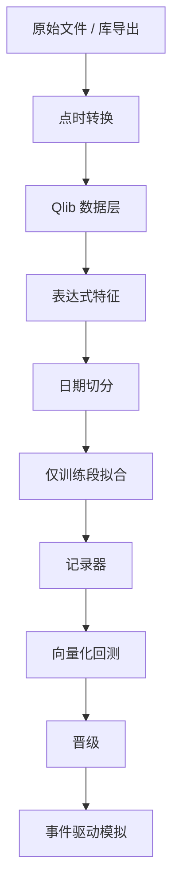

# Microsoft Qlib

    
把行情与基本面整理成点时可用的数据层，再把特征、模型、记录器与回测串成可复现的工作流——Qlib 提供的是研究管线的骨架，而不是一个已经过拟合检验的 alpha 工厂。

    <footer>—— 据 Microsoft Qlib 文档与 Yang et al. 对 Qlib 作为量化投研平台的描述</footer>

开源投研框架要解决的不是再写一个梯度提升，而是让数据版本、特征定义、训练切分与回测假设能被同一套配置钉住。Microsoft Qlib 把这些环节收成：二进制数据层、表达式特征、可插拔模型、实验记录与简单回测。[点时基本面](/quant/point-in-time) 与 [前视](/quant/look-ahead-bias) 是它声称要处理的核心风险；[金融交叉验证](/quant/cv-leakage-finance) 则是它未必替你做完的部分。本篇写 Qlib 作为研究架构：数据如何落盘、工作流如何保证可复现、以及它的回测与 [事件驱动引擎](/quant/event-driven-backtest) 之间差哪一层。它不提供可交易的内置策略，也不把示例因子的历史曲线当成容量证明。

## 问题

研究事故通常不是模型选错，而是同一字符串「收盘价」在训练与回测里不是同一个对象：一个复权、一个不复权；一个用了当时未公布的财报；一个在日频矩阵里用当日收盘成交。Qlib 的数据层把字段按工具、按日（或更高频）存成列式二进制，并配合日历与复权信息。特征用表达式或学习器从数据层取列。问题是：表达式的时间算子是否真的只看过去；数据集的 `handler` 是否在拟合时泄漏了全样本统计；回测模块默认的成交价是否把冲击设为零。框架可以提供钩子，但不能替你声明识别条件。

第二个问题是工作流状态。没有记录器，网格搜索的胜者无法复现；有记录器但数据版本没进哈希，复现的是代码而不是输入。Qlib 用 recorder 把参数、指标与产物挂到一次实验上。架构上应把数据快照 ID 也写进去，否则「可复现」只到脚本这一层。

### 数据层与点时

Qlib 官方流程强调把 CSV 等原始文件转换成内部格式，并提供日历、停牌与复权。点时意味着：基本面字段带着可使用日期，而不是财报期末。若你把供应商的「最新财报」直接灌进数据层，框架无法事后知道当时不可见。正确做法是在转换脚本里就按公告日对齐，见点时一文。高频若只存分钟 bar，所有依赖队列的策略都不在这个数据层的表达力之内——应换 LOB 研究栈，而不是把分钟当成 tick。

Alpha158 / Alpha360 一类内置特征集是教学与基准，不是经过净化的生产因子。它们的定义、回看窗口与行业中性是否存在，必须在论文或内部笔记里逐条打开。直接上报这些特征的 IC，比较的是框架默认，不是你的研究假设。

## 方法

工作流按配置文件切分，避免把路径写死在笔记本里。典型顺序：冻结数据版本 → 声明特征与标签（标签窗口不得覆盖特征窗口之外的未来，除非明确是预测任务并在回测里平移）→ 按日期切训练/验证/测试，切分要考虑重叠标签，见 [标签视界重叠](/quant/label-horizon-overlap) → 拟合只在训练段计算标准化统计 → 把预测写回记录器 → 回测用明确的成交假设。模型插槽可以是线性、GBDT 或深度学习；换模型不应偷偷换数据切分。

与外部库的边界：重训练可以在 Qlib 里调 LightGBM；定制损失与图模型应在外面训，把预测表按日期索引写回，再走同一套回测。这样回测假设只有一份。导出预测与特征时走 [Arrow](/quant/apache-arrow) 或 Parquet，便于和 DolphinDB/ClickHouse 的分区对账。不要让每个模型自己读一份不同复权的 CSV。

### 回测模块的成交假设

Qlib 文档中的回测更接近日频向量化：在 bar 上开仓、用开盘或收盘、加简单成本。这与事件驱动引擎的「下单—排队—部分成交」不是同一保真度。把它当作因子研究的第一层筛选是合理的；当作执行策略的验收则不够。晋级规则应写明：日频 IC 与简单回测通过后，必须在事件引擎与 [研究/模拟/生产隔离](/quant/research-sim-prod) 里再跑。成本参数若只是常数费率，对容量与冲击敏感的策略会系统性高估。

标签常取未来收益。必须保证特征在 $t$ 只用 $\le t$ 的信息，标签用 $t$ 之后的收益，并且交易只能发生在特征可获得之后的下一可交易时点。框架的 `shift` 能帮忙，也能在频率转换时帮倒忙：分钟特征配日标签，对齐一错就是前视。测试应包括故意把标签前移一格，看指标是否异常变好——这是泄漏探针，不是优化手段。

## 机制

机制上，Qlib 是「数据层 + 可插拔学习器 + 实验记录」的胶水。它降低的是从文件到一次离线实验的工程税，不是统计税。表达式特征把滞后、滚动变成可配置的图，便于复现；学习器把 sklearn 风格的 `fit/predict` 接到量化的日期切分上。记录器让同一配置能重跑。这些组件合在一起，使团队可以比较模型而不是比较「谁的笔记本当时碰巧没泄漏」。

它不实现交易所。撮合、拒单、涨跌停、停牌后的可成交性，若数据层没有相应字段，回测就不会看见。中国市场的 T+1、集合竞价、涨跌停应作为数据与规则插件存在，而不是指望通用美股日历。把 Qlib 当生产执行网关，是把研究骨架误认为交易系统——生产应看 [vn.py](/quant/vnpy-framework) 或内部网关，并保持单向：研究产出信号文件，交易系统消费，不反向共享可变状态。

### 过拟合与框架便利

框架越便利，网格越大。Qlib 让换模型、换特征变得便宜，于是试次爆炸。应把试次计入 [过拟合](/quant/backtest-overfitting) 与 CPCV 的分母，而不是只报告最佳一次。记录器若只存胜者，失败的试次从分母消失，这是选择性报告。规范是：搜索空间与全部试次的摘要进版本库，胜者只是其中一个 ID。

微软研究院的示例权重与论文数字，对应的是他们声明的数据与切分。换成你的供应商之后，同一配置可以给出完全不同的 IC。复现实验必须复现数据契约，而不是复现仓库里的 YAML 文件名。

## 边界

Qlib 不是行情库：底层文件适合研究读取，不适合当盘中 RDB。它也不是风控系统。内置数据集与模型有版本漂移，升级库而不锁定数据会改变历史曲线。社区贡献的策略示例质量不齐，不能当代码审计的替代。许可证与依赖（PyTorch 等）要在内部合规里单独看。

不要用全样本标准化。不要在测试段调特征窗口。不要把示例策略的净值图贴进对外材料当实盘。多市场拼接时，日历与复权必须分市场，Qlib 的一份全局日历不够用就应拆 handler。高频与 LOB 策略应离开这个日频骨架。

把 Qlib 写成「微软的量化圣杯」是广告。它是可复现研究的脚手架：数据层、特征、模型、记录、简单回测。脚手架上能搭出泄漏，也能搭出干净实验，差别在你声明的点时与切分。

## 小结

- Microsoft Qlib 提供点时数据层、特征、模型插槽、实验记录与日频回测的研究骨架。
- 点时与无泄漏切分必须在转换与 handler 里落实；框架钩子代替不了声明。
- 内置 Alpha 特征集是基准，不是生产因子；回测成交假设偏向量化，执行策略须另走事件引擎。
- 便利会放大试次，记录器应保存搜索分母，而不仅是胜者。
- 与行情库、vn.py 的边界是单向的数据与信号，而不是共享可变状态。
- 出处：Microsoft Qlib 文档与 Yang et al. 对 Qlib 平台的论文/技术报告。
