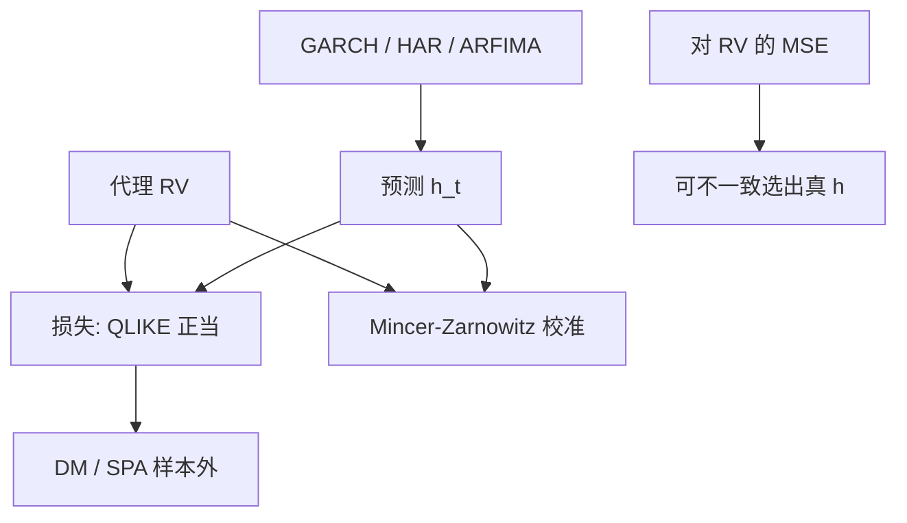

# QLIKE 与波动预测评估

用带噪声的已实现量去比较波动预测时，大多数损失函数会把更差的模型判成更好；少数损失——包括 QLIKE——在代理无偏时仍能排出正确的顺序。

<footer>—— Patton, Volatility Forecast Comparison Using Imperfect Volatility Proxies, Journal of Econometrics, 2011</footer>

[ARFIMA](/quant/arfima-long-memory) 与 [HAR](/quant/har-rv)、[GARCH](/quant/garch) 都会给出 $\hat\sigma_{t+1}^2$。样本内 $R^2$、对 RV 的 MSE，在 RV 只是积分波动的带噪代理时，**可以选错模型**。Patton 刻画：哪些损失对代理噪声稳健（仍一致地选出真条件方差）。QLIKE $L(h,x)=x/h-\log(x/h)-1$（$h$ 预测，$x$ 代理）属于此列。本课缺口：比较波动模型必须换正当损失，并用 Diebold–Mariano / [Hansen SPA](/quant/hansen-spa) 做样本外推断。下一课把一元方差变成多元 BEKK，评估仍用这里的损失纪律。

## 问题

真对象是 $E[r_{t+1}^2\mid\mathcal{F}_t]$ 或 $IV_{t+1}$。观测到的是 $RV_{t+1}$ 或 $r_{t+1}^2$。MSE $E[(RV-\hat h)^2]$ 在 $RV=IV+\eta$、$\eta$ 与模型相关时，可以偏向于拟合噪声的模型。Patton 给出充分条件：损失必须让「对真 $h_0$ 的期望损失」在代理无偏时仍最小化于 $h_0$。QLIKE 与归一化 MSE 一类满足；对 $\sqrt{RV}$ 的 MAE 往往不满足。

问题是：固定代理（哪一种 RV）、固定损失、固定样本外窗口，再比较。对象不是「谁 $R^2$ 高」，而是**条件期望的评分规则**。

### 代理选择

日收益平方噪声极大，排序功效低。五分钟 RV、TSRV、已实现核更好，但仍有偏差，见 [rv-noise](/quant/rv-noise)。代理有偏（噪声未减）时，连 QLIKE 的稳健性也要打折——Patton 的定理要求代理对 $IV$ 无偏或偏差与 $h$ 无关。隔夜是否并入须两边一致。

对 $\log RV$ 做 MSE 再指数化，比较的是对数域，不是 QLIKE 的对象。变换必须写进损失。HAR 估对数、GARCH 估水平，不能直接比 $R^2$。

## 方法

**QLIKE。** 对每个 $t$，用 $\hat h_t$ 与 $RV_t$ 算损失，样本外平均。数值上 $\hat h_t\gt 0$ 强制，GARCH 要检查。QLIKE 重罚低估波动（$x/h$ 大），对风控比对称 MSE 更对口。

**推断。** Diebold–Mariano 对损失差做 t，HAC 滞后与重叠地平线匹配。嵌套模型（GARCH 对常数方差）DM 的零分布非标准，应用 Clark–West 或自助。多模型用 Hansen SPA 或 Romano–Wolf，避免「扫十个 HAR 变体再报最佳」。

**校准。** Mincer–Zarnowitz：$RV_{t+1}=a+b\hat h_{t+1}+e$，无偏要 $a=0,b=1$，标准误 HAC。$b\lt 1$ 常见于噪声代理导致的衰减，不一定是预测有偏——又一个 Patton 警告。应同时看 QLIKE 与 MZ，不单看 $R^2$。

### 与 VaR 回测分工

QLIKE 评的是整个条件方差，不是单分位。VaR 命中率可以过、方差预测仍差（尾部形状补偿）。风控应两套都报。CAViaR 用分位损失，不是 QLIKE。

## 机制

评分规则严格正当：真条件期望唯一最小化期望损失。QLIKE 来自高斯似然（忽略常数）对方差的部分，故对条件方差正当。代理 $x=h_0+\eta$，$E[\eta\mid h_0]=0$ 时，期望 QLIKE 仍在 $h=h_0$ 最小——噪声平均掉。MSE 对 $x$ 正当，对 $h_0$ 在异方差噪声下不必。这就是「不完美代理」论文的机制。

样本外必须时间序列切：滚动或固定训练–测试，禁止打乱。这与 [bootstrap](/quant/bootstrap-finance) 的块原子、与标签重叠课同一纪律。

多步波动预测（周、月）把 HAR 的周月成分派上用场。损失应对齐地平线：用周 RV 评周预测，不要用日 QLIKE 加总假装评了周。

### 到多元的交接

一元 QLIKE 有多元推广（Frobenius 对协方差、或 Wishart/QLIKE 型）。下一课 BEKK 产出完整 $H_t$，应用协方差损失，而不是只比对角线。先一元纪律，再多元参数爆炸。

## 边界与工程取舍

跳跃日 RV 极大，QLIKE 会被几天主导——可并列跳跃稳健 BV 作代理，或对损失 winsor，并声明对象是否含跳。模型在危机切换后全样本赢家可能是「危机专用」，应分段评，接 Chow。

工程：默认代理 = 预登记的 RV；损失 = QLIKE + MSE 对照；推断 = DM/HAC 或 SPA。不要用样本内似然选生产模型。不要对 tick 平方做 QLIKE 当高频预测评估——代理定义将在高频单元重写，见最后一课 [高频预测损失](/quant/hf-forecast-loss)。

## 小结

- 用不完美 RV 比较波动预测时，应用 Patton 意义下稳健的损失，QLIKE 是默认。
- 代理须尽量无偏（噪声修正、隔夜定义一致）；样本外用 DM/SPA，嵌套须校正。
- MZ 回归的 $R^2$ 与 $b$ 受代理噪声衰减，不能单独当选模依据。
- 跳跃、断点、地平线错配会让单一赢家没有对象。
- 出处：Patton, *Journal of Econometrics*, 2011；Diebold and Mariano, *Journal of Business & Economic Statistics*, 1995；Hansen SPA 见 Hansen, 2005。
