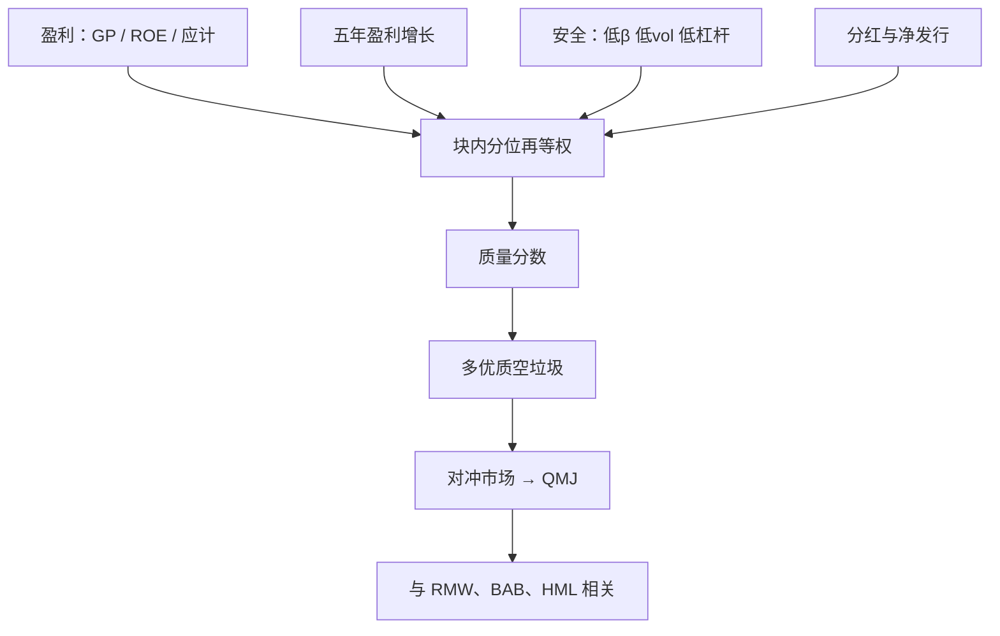

# QMJ：优质减垃圾

把盈利能力、盈利增长、安全与分红政策合成一个质量分数，做多高分、做空垃圾，并对冲市场；高质量公司往往更贵，却仍留下正的经风险调整收益。

<footer>—— Asness, Frazzini & Pedersen, Quality Minus Junk, Review of Accounting Studies, 2019</footer>

[质量与盈利](/quant/quality-profitability) 一文以 Novy-Marx 的毛利率和 Fama–French 的 RMW 为主。本篇写 Asness、Frazzini、Pedersen 的 **QMJ**（Quality Minus Junk）：它不是单变量盈利定理，而是四块指标的分位合成，再做成接近市场中性的多空。读 QMJ 之前先分清：毛利率腿回答「赚钱的资产是否被低估」；QMJ 回答「一张综合质量表能否在贵的同时仍然赚 α」。安全块会把 [BAB](/quant/low-vol-bab) 偷运进来，分红块会把[净发行](/quant/net-issuance)偷运进来——这是设计，不是笔误，但报告时必须拆开。

## 问题

若价格只补偿风险，更安全、更赚钱、杠杆更低的公司预期收益应更低。截面符号经常相反：高质量组合事后收益更高，且对 [HML](/quant/ff3) 的载荷为负——它们看起来像成长。三因子因此给质量一个更大的 α：贵、偏成长、却赚得多。单用毛利率可以抓住一块，但「质量」在卖方与基本面里还包括低破产概率、低波动、稳定增长与股东友好的分红。把这些东西平均成分位，历史夏普会很好看，共线性也会立刻出现。

需要一条可复制的定义，而不是形容词。AFP 的做法是：先在每一块内部把若干会计或市场度量转成分位，再把四块等权合成质量分数，最后做多最高一组、做空最低一组，并在组合层面对冲市场。问题由此变成两个：四块各自预测收益吗？合成之后多出来的，是真正的质量溢价，还是低 β 加净回购？

### 质量贵，为什么还能有溢价

股利贴现的比较静态说：给定价格，更高的盈利、更安全的现金流应对应更高的预期收益；给定盈利，更高的价格应对应更低的预期收益。高质量公司通常估值不低，价值因子会做空它们。若市场对质量支付过度，QMJ 应为负；若支付不足，QMJ 应为正。原文的核心实证是后一条：控制 [B/M](/quant/value-factors) 之后质量溢价更干净，因为「贵而好」与「便宜而差」被拆开了。把 QMJ 理解成「又一条价值」会看反符号。

QMJ 与 RMW 相关，但不是同一条腿。RMW 是营业利润/账面的 2×3；QMJ 每月再平衡，含 β、波动、杠杆、Z 分数与净发行。复制 French 的 RMW 对不上 AQR 的 QMJ，不要用其中一条去「验证」另一条失败。

## 方法

四块在原文里大致如下。**盈利能力**：毛利率/资产、ROE、ROA、现金流/资产、利润率、低[应计](/quant/accruals-anomaly)。**增长**：上述盈利度量的五年变化。**安全**：低 β、低特异波动、低杠杆、低破产分数（O-score、Z-score）。**分红**：高净分红、低股权与债权净发行。每个度量在截面上排序打分，块内平均，再四块平均，得到质量分数。做多高质量、做空垃圾，价值加权或对市场中性化后的多空即 QMJ。

$$
\mathrm{Quality}_i=\tfrac14\bigl(z^{\mathrm{Prof}}_i+z^{\mathrm{Growth}}_i+z^{\mathrm{Safety}}_i+z^{\mathrm{Payout}}_i\bigr)
$$

其中 $z$ 是块内标准化分位。形成频率是月度：安全块依赖市场数据，不能像 RMW 那样每年 6 月才动。检验时把 QMJ 放进四因子或[五因子](/quant/ff5)右侧，看按毛利率、按破产分数、按净发行排序的组合 α 各被吃掉多少。

### 拆开四块，再谈合成

默认报告应是四条单块多空的均值、夏普、以及它们与 MKT、HML、RMW、[BAB](/quant/frazzini-bab)、CMA 的相关。盈利块应接近 RMW/GP；增长块与动量、与投资的镜像纠缠；安全块与 BAB、低波动高度相关；分红块与[净股票发行](/quant/net-issuance)同向。若全样本夏普主要由安全贡献，把产品标成「盈利质量」就名不副实。合成的意义是降低单一会计科目的噪声，代价是解释权被摊薄。

## 机制

行为叙事最顺：投资者为故事型「junk」——高 β、高杠杆、亏损成长——支付过高价格，对无聊的高利润率公司反应不足。质量溢价是价值溢价的另一面，只是分子从账面换成了经济利润与安全。风险叙事困难：高质量更像低风险，CAPM 会给出负的预期超额。修补包括：高质量在某些宏观状态下久期更长，或「junk 的高收益是卖空约束下的补偿」。证据并不整齐，但资金约束与 BAB 机制对安全块是适用的。

会计叙事：应计高、发行股份多的公司随后盈利均值回归，质量分数提前给出警告。这一条与 Sloan、与净发行文献重叠，QMJ 相当于把它们写进多空规则。持久性是原文强调的事实：质量分数的自相关很高，换手低于动量，高于年度价值。高质量今天仍大概率明年高质量，溢价更像「特征被持续低估」，而不是一次性事件。

### 与价值、动量同时持有

QMJ 对 HML 为负、对动量接近零到略正。价值-质量组合类似 Novy-Marx 的「便宜且赚钱」：双重排序而不是先正交再排序。动量崩溃时 junk 空头可能回补困难，QMJ 不是保险。跨市场：原文在美股、国际股票上报告质量溢价；安全块在融资紧张期更强，盈利块更稳。把 QMJ 当成全球统一的「第四因子」之前，先看当地空头是否可借券——垃圾组贡献大量账面收益。

增长块用的是长期盈利变化，不是一个月的[盈余惊喜](/quant/pead-sue)。把 PEAD 写进 QMJ 会把事件时间的漂移当成质量。同样，一年资产扩张属于[资产增长](/quant/asset-growth)，不要与五年盈利增长混成一个 z。

## 边界与工程取舍

金融业毛利率与 Z-score 难定义，通常剔除或单独模型。负账面使 ROE 爆炸，需缩尾或改用资产口径。A 股 ST、壳与融券标的会使 junk 空头不可复制；只做多高质量、不做空，得到的是低 β 质量组合，不是 QMJ。交易成本：月度再平衡加安全块的 β 更新，换手高于 RMW；容量主要在大盘价值加权。

不要把 QMJ、RMW、GP、ROE 四个名字当同义词。不要在五因子已含 RMW 时再塞一条高度相关的 QMJ 还报告两个 α——应先[正交化](/quant/factor-orthogonal)。不要把低波动指数的历史夏普算进「质量」。成分权重是研究选择：去掉安全后仍显著，才能声称独立于 BAB。

出处：Asness, Frazzini & Pedersen, *Quality Minus Junk*, Review of Accounting Studies, 2019（AQR 工作论文更早）。毛利率见 Novy-Marx, 2013；RMW 见 Fama & French, 2015。禁止把 QMJ 的四块定义写进 2013 年那篇毛利率论文。

## 小结

- QMJ 是盈利、增长、安全、分红四块分位合成后的市场中性多空，不是单变量 RMW。
- 高质量往往更贵，对 HML 为负；溢价在控制价值之后更干净。
- 必须拆开四块贡献，以免把 BAB 与净发行算成「质量」。
- 月度再平衡、空头可借券与行业清洗决定可交易性。
- 出处：Asness, Frazzini & Pedersen, Review of Accounting Studies, 2019。
