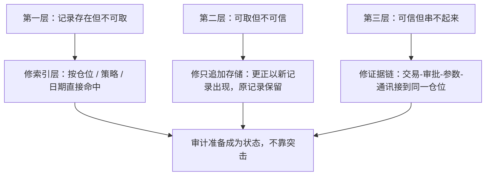
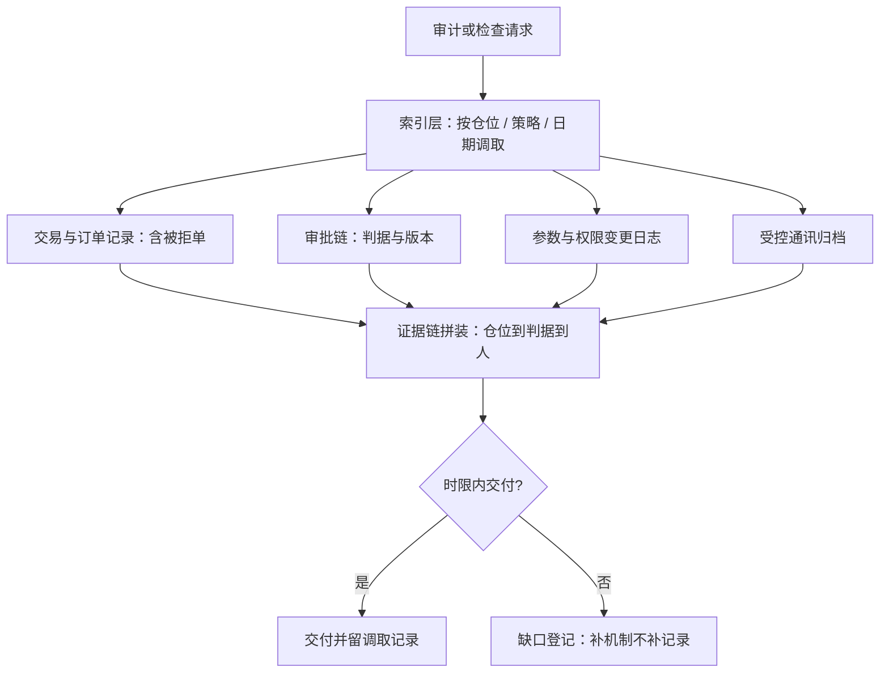

# 审计准备

审计不是一场考试，而是一种状态：任何一条昨天的记录，今天必须原样可取。

<footer>—— 据 Federal Reserve SR 11-7（2011）与公开监管检查口径整理</footer>

[上一课](/quant/qo-reporting-obligations)把记录按监管口径出口；审计要求每一条出口都能**反查回源头**。[策略生命周期治理收束](/quant/sl-map)立过七条不变量——追加不改写、仓位可沿指针链反查；[SR 11-7](/quant/sr-11-7-model-risk)写过模型治理的预期，[ML 审计](/quant/fml-audit)写过模型侧的可审计对象；本课写机构侧：审计有哪些对象、留痕靠什么维持、检查来了怎么应答。

## 问题

审计被当成事件突击，是最贵的准备方式：检查通知到位再翻记录，翻不到的补不出来，补出来的互相矛盾。缺口的状态学有三层：**记录存在但不可取**——数据在，调取要跨系统拼一周，赶不上时限；**可取但不可信**——记录事后可改，没有追加不改写的机制约束，证据力归零；**可信但串不起来**——交易、审批、参数变更、通讯各自留痕，但某笔仓位为什么在跑，四条链接不到一起。审计准备的全部内容，就是把这三层提前修好，让「状态」不依赖「事件」。

直觉类比：三层缺口像三种借不到的书——书在库房但没有架位索引（不可取）；有索引但书页能私下涂改（不可信）；每页都在但缺了目录，拼不成一段完整论证（串不起来）。三样都修好，任何一天来查都一样，这才叫状态。

## 方法

先分对象，再配留痕，最后演练。**对象四类**：财务审计盯估值与净值——托管复核链见[托管与柜台](/quant/cn-custody-counter)；监管检查盯合规义务的履行证据——监控告警的处理记录、报备与速率画像的勾稽、训练与演练记录；内部审计与模型验证盯模型生命周期——验证报告、假设清单、使用范围，按 [SR 11-7](/quant/sr-11-7-model-risk) 的相称性配置深度；客户尽调（DDQ）盯同一套材料的对外版本。**留痕清单**：交易与订单记录（含被拒单）、审批链（谁在何时以何判据批准）、参数与权限变更、受控通讯归档。**演练**：定期做模拟调档——随机抽一个已平仓仓位、一次限额变更、一次告警，计时「多久能给出完整证据链」；目标与[生命周期治理收束](/quant/sl-map)的自检同口径：五分钟答出凭什么。

数字实例：演练可以这样计时——随机抽一笔三个月前已平仓的仓位，从提问到交出「交易单、审批人、当时参数、相关通讯」四件套，超过五分钟算不合格。这个标准不是摆设：监管问询的反馈时限通常以小时计，临时拼数据的团队必输。

## 机制

为什么「追加不改写」是全部机制的核心：审计的本质是**过去不可变**。一份事后能改的记录，无论存了多少份，证明力都是零；所以留痕必须落在只追加的存储上，更正以新记录形式出现并保留原记录——这与报告纠错的回填留痕、[策略台账体系](/quant/sl-registry)的台账纪律是同一条不变量在不同对象上的实例。为什么索引层值得单独建设：记录散在四个系统里不算可取，调取能力是「按仓位、按策略、按日期」三个维度直接命中的能力；没有索引层，每次检查都是一次人肉数据工程。为什么缺口要登记成机制改进：演练暴露的缺口只补这一次的记录，等于每次检查都从零开始；缺口进[研究复盘](/quant/research-postmortem)同模板的归档，下一次演练复测。[MiFID II RTS 6](/quant/mifid-ii-rts6)对高频技术订单记录的要求是同一逻辑的极端版：逐笔记录、指定字段、按年保存——记录义务的深度随交易方式的复杂度上升，机制不变。

术语翻译：「追加不改写」（append-only）就是数据库只许插入新行、不许修改或删除旧行。想改数？只能加一行新记录，写明「更正了什么、谁改的」，原行原样留着——就像纸质账本画线更正而不是撕页重写，撕页本身就是问题。

调取演练最常暴露的一环不是数据缺失，而是「口径对不上」：交易系统、估值系统、报备系统对同一笔仓位三个数量。证据链拼装的第一步永远是先对平三本账，再回答问题。

## 边界

本课写准备的状态，不写应答的策略：对抗性应对、选择性提供、口头补充解释都是自伤——检查语境下，取不出的记录按不存在处理，比慢更糟。法律意见边界同前两课。模型验证的技术细节见 [SR 11-7](/quant/sr-11-7-model-risk) 与 [ML 审计](/quant/fml-audit)，台账与判据的治理结构见[策略生命周期治理](/quant/sl-map)课程，本课只接它的不变量，不重写它的内容。

## 小结

- 审计准备是状态不是事件：记录可取、可信、可串成证据链，三层都要提前修。
- 对象四类：财务审计、监管检查、内部审计与模型验证、客户尽调，共用一套留痕。
- 核心不变量是追加不改写：更正以新记录出现，原记录永留。
- 索引层决定调取能力：按仓位、策略、日期三维命中，模拟调档计时验收。
- 出处：据 Federal Reserve SR 11-7（2011）与 RTS 6 订单记录条款的公开口径整理；模型侧对象见[ML 审计](/quant/fml-audit)。
