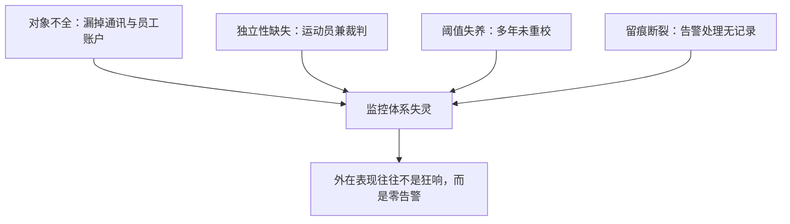
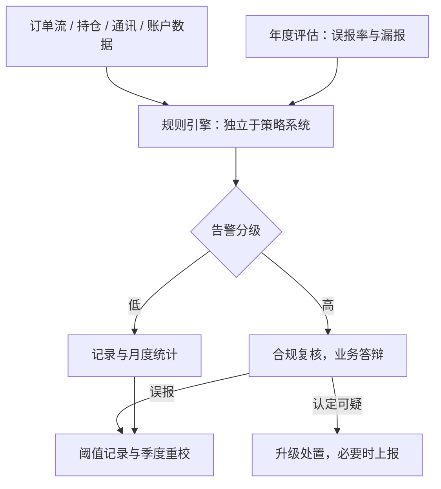

# 合规监控体系

监控体系的价值不在抓到多少违规，而在让「仍在被允许的范围内」这句话，每天由数据说一遍。

<footer>—— 据 MiFID II 第 17 条与 RTS 6 第 13 条、MAR 第 12 条口径整理</footer>

[上一课](/quant/qo-vendor-channel)把外部依赖管成可测可退的对象；运营四课到此，机器每天正确运转。本课起转合规单元，回答另一个问题：运转是否仍在**被允许的范围内**。[合规红线与收束](/quant/cn-compliance-map)把红线写成行为加数据的清单，[MiFID II RTS 6](/quant/mifid-ii-rts6)写过操纵监测的公开要求——自动监测、告警、每年评估误报与漏报；本课写这套监测在机构内部的架构：对象、阈值、独立性。

## 问题

红线清单是静态文本，交易是每秒都在发生的流；合规监控就是把流映射回清单的在线系统。缺口的形态有四：**对象不全**——只盯交易行为，漏掉通讯、员工账户、关联账户；**独立性缺失**——监控跑在策略系统里，误报被业务侧一点点调低，等于运动员兼裁判；**阈值失养**——市场节奏变了（波动率、参与率、撤单习惯），阈值还是三年前标的，监控失灵的形式不是狂响而是**零告警**；**留痕断裂**——告警处理没有记录，事后既无法自证也没有改进输入。这四条合起来是一个判断：监控体系是运营系统，不是合规部门的一摞制度文件。

直觉类比：红线清单是交规，合规监控是路口的摄像头——交规写在纸上不会自己抓违规；摄像头必须独立于司机、随车流变化调参数、每张罚单都有底片存档。少一样，整套体系就只剩威慑的姿态。

## 方法

监控对象按红线清单展开，四类。**交易行为**：撤单率与申报节奏、自成交、价格逼近约束边时的排单行为、[幌骗与分层](/quant/spoofing-layering)一类的模式特征；预防设计在下单引擎（禁自成交过滤、节奏控制），监测在其后独立复核。**持仓与限额**：敞口、集中度、[限额体系](/quant/rk-limit-system)的逐档执行情况，越线即告警。**信息与通讯**：信息墙的越墙接触登记、受控通讯渠道之外的动作。**人员与关联方**：员工与关联账户的个人交易核对。架构上固定四层：规则引擎（独立部署、独立数据线）→ 告警分级 → 复核与升级（合规职能定级，业务职能答辩）→ 留痕与月度统计。阈值管理写成流程：每条规则记当前阈值、上次校准时间、当期误报率与漏报估计，按季重校。

数字实例：撤单率阈值不应写死「30%」。平静时段全市场撤单率可能只有 10%，开盘竞价附近可能冲到 50%——阈值应写成相对量，比如「自身近一季分布的 99% 分位」，并在市场波动率翻倍时自动触发重校提醒。

## 机制

阈值选择的机制是误报与漏报的权衡，而这个权衡**不该**由业务侧单方决定：误报率 $\Pr[\text{告警}\mid\text{正常}]$ 太高，复核通道瘫痪，真信号被淹没；漏报率的困难在于它不可直接观测——只能靠规则覆盖对标监管口径、靠抽检与情景回放来估计。[MiFID II RTS 6](/quant/mifid-ii-rts6)把「每年评估误报与漏报」写成义务，机制理由正在这里：阈值不是法典，是与市场节奏共同漂移的参数，没有定期评估的监控必然走向零告警。为什么引擎必须独立：策略系统的第一目标是执行，监控的第一目标是质疑执行；两者共用一套数据可以，共用一套代码与一个负责人不行——这与[合规审查](/quant/sl-compliance-review)里「合规门独立于判据」是同一条结构。为什么留痕是机制而非手续：告警处理记录是阈值重校的输入、是审计的证据、也是[EU AI Act 的金融条款](/quant/eu-ai-act-finance)一类新规落到既有监控时的改造底图。

术语翻译：误报是「狼来了」——把正常交易当违规告出来；漏报是「真狼来了却没叫」。统计上它们是一对跷跷板：阈值调严误报少、漏报多，调松则相反。难点在漏报没法直接数——没人知道漏掉了多少，只能靠对标与回放去估。

监控失灵最常见的形式不是漏报大案，而是「本季度零告警」被当成好消息。健康指标是反向的：告警量骤降要先查阈值与数据线是否漂移，再谈市场变干净了。

## 边界

本课是合规意识的工程化检查工具，不构成法律意见；认定标准、阈值与处罚尺度以当期法律法规与交易所、协会规则为准，口径同[合规红线与收束](/quant/cn-compliance-map)。监测规则的细节不写成规避指南：讨论阈值校准是为了让体系有效，不是为了找出告警器的盲区——后者本身是操纵认定的从重情节。模型信号的模型风险治理不在本课，见 [SR 11-7](/quant/sr-11-7-model-risk) 与 [ML 审计](/quant/fml-audit)。

## 小结

- 监控把静态红线清单映射到交易流上，对象四类：交易行为、持仓限额、信息通讯、人员关联方。
- 架构四层：独立规则引擎、告警分级、复核升级、留痕统计；引擎与策略系统分开部署、分开负责。
- 阈值是与市场节奏共同漂移的参数：误报率受控、漏报靠对标与回放估计，按季重校、按年评估。
- 「零告警」是失灵信号；告警处理留痕是重校、审计与新规改造的共同底座。
- 出处：据 MiFID II 第 17 条与 RTS 6 第 13 条、Regulation (EU) No 596/2014 第 12 条口径整理；红线清单见[合规红线与收束](/quant/cn-compliance-map)。
