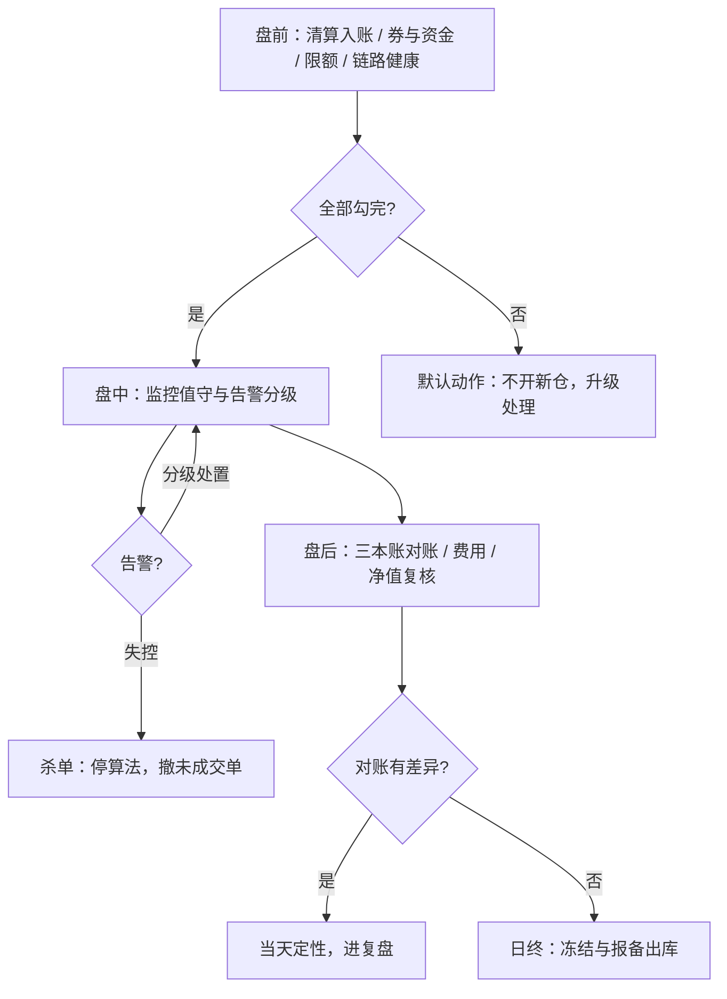

# 交易日的操作清单

清单的价值不在列出做什么，而在把「忘了」变成「未勾」：每天同一组格子，错误才无处藏身。

<footer>—— 据 Gawande, *The Checklist Manifesto*, 2009 与 RTS 6 盘前、盘中、盘后控制结构整理</footer>

[上一课](/quant/qo-margin-clearing-ops)把资金变成有预算与追缴流程的供应链，更早一课把券变成有断供预案的供应链；本课把券、资金、系统装进一天的时钟。运营知识最常见的存放处是老员工的脑子，交接、扩产品线、人一请假就失效。[MiFID II RTS 6](/quant/mifid-ii-rts6)把算法交易的盘前控制、实时监控与盘后对账写成义务，[托管与柜台](/quant/cn-custody-counter)写过日终以清算结果为准的固定流程；本课把它们落成一张每天执行、每项可勾的操作清单。

## 问题

量化运营的事故很少源于不会做，源于**以为做了**：以为清算文件到了、以为券源确认了、以为限额检查跑过了。缺口的根源是三项缺位：每项作业没有绑定的**数据源**——「看一眼」看的是哪张表没有定义；没有**截止时刻**——几点前必须完成没有约定；没有**未过项的默认动作**——查不出来时该停谁没有预写。三者缺任何一项，清单就退化成流程文档：贴在墙上，不产生动作。所以清单不是知识管理工具，而是控制协议。

## 方法

### 一天的三段结构

**盘前**：清算结果入账、可用资金与券确认（以清算为准，不以委托回执为准）、保证金预警带检查、行情与交易链路健康、策略限额与风控参数核对、当日事件（到期、分红、指数调仓）过目。**盘中**：监控值守、告警分级处置、异常申报或成交的即时核对、杀单功能可用——杀单不是按钮存在，是演练过（[风控闸门](/quant/trading-kill-switch)）。**盘后**：三本账对账——柜台、交易所与清算、托管各一本，差异当天定性；费用与费率核对；净值复核与头寸冻结；报备数据出库；当日事故进复盘。

## 机制

清单为什么必须绑定截止时刻：一天的链条上全是别人的硬截止——清算文件、追缴时限、报备窗口，错过任何一环，后面全段变成即兴处理。截止要写成**硬掩码**：过点未完成的项自动阻塞下游动作（如未完成对账则次日不开新仓），而不是靠人记得。[MiFID II RTS 6](/quant/mifid-ii-rts6)对实时监控的告警时限、盘后控制与业务连续性的要求，翻译到机构内部就是同一张清单上的具体行。为什么未过项要有默认动作：模糊地带必然产生即兴决策，而即兴决策的分布是偏乐观的；「查不清就不开新仓」把不确定性的一侧提前封死。清单与自动化的分工也因此清楚：能自动核对的（对账勾稽、参数比对）由系统执行并在清单上留结果，差异与例外留给人工——清单记录的不是「做过」，是「差异在哪、谁定了性」。

盘前可用头寸最容易错的一格：以清算结果为准，节假日与清算异常日清算文件晚到，依赖盘前精确头寸的策略要留现金与券的缓冲，而不是假设文件永远准时。

## 边界

本课写运营协议，不写合规手册：红线与异常交易监控是合规单元的对象，本课只保证「每小时的机器状态有人看、有记录」。清单也不替代复盘制度——事故的归档与死因分析按[研究复盘](/quant/research-postmortem)的同模板口径走，清单只是把「当天发生了什么」的原始记录留全。清单行数本身有成本：每行检查消耗人力与开盘前的时间窗，无区分度的检查项应按季清理，否则清单会在疲劳中被整体跳过——这正是航空清单实践的核心教训（Gawande, 2009）。

## 小结

- 清单是控制协议：每项绑定数据源、截止时刻与未过项默认动作，缺一即退化为文档。
- 一天三段：盘前以清算结果入账并核对券、资金、限额；盘中值守与告警分级；盘后三本账对账与净值复核。
- 截止写成硬掩码，过点自动阻塞下游动作；杀单要演练过才算存在。
- 自动核对留结果，差异留给人工；清单记录差异与定性，不记录「做过」。
- 出处：据 Gawande, *The Checklist Manifesto*, 2009 与 RTS 6 盘前、盘中、盘后控制结构整理；日终口径见[托管与柜台](/quant/cn-custody-counter)。
