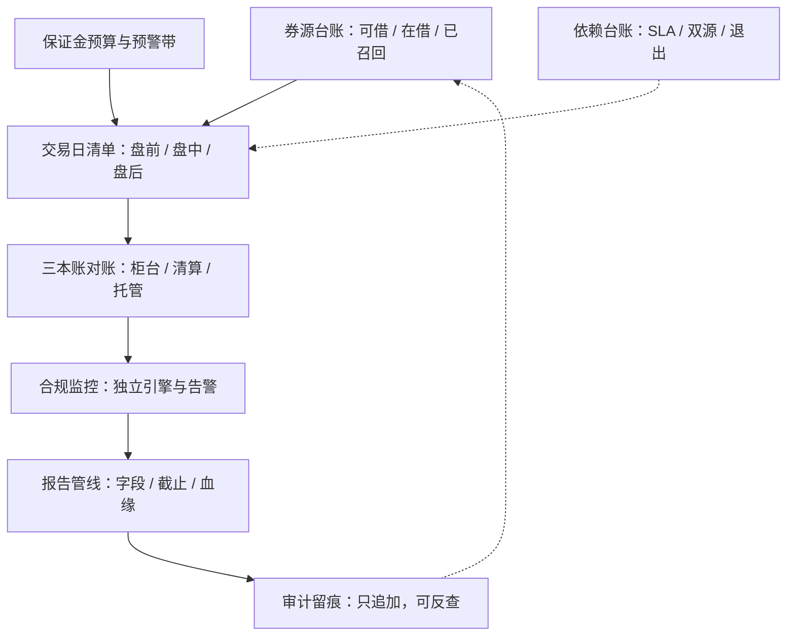
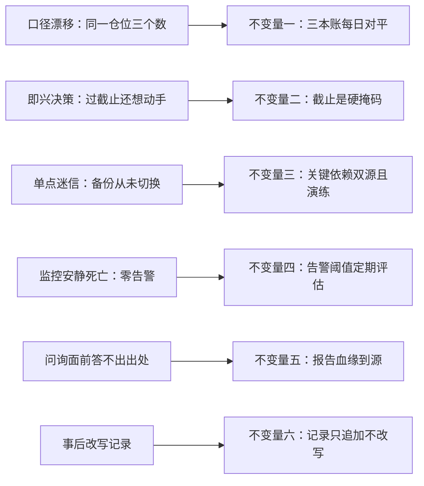

# 运营与合规收束

运营回答「今天还能不能开张」，合规回答「开张的方式是否被允许」；两句话都必须每天有数据回答，不能靠感觉。

<footer>—— 据 RTS 6、SR 11-7 与本课程各课口径整理</footer>

[上一课](/quant/qo-audit-preparedness)把审计写成可维持的状态；本课程到此收束。八课收成一条主线与一组不变量，并交代与相邻课程的分工。策略怎么想、判据怎么设，是研究课与治理课的对象；本课程回答的始终是两件日常：钱和券每天怎么周转，周转的方式是否始终被允许。

## 问题

收束要回答的是：八课合起来，运营与合规到底保证了什么？答案不是「更赚钱」，也不是「永不违规」——运营不创造 alpha，合规不消除风险。它保证的是两组**可回答性**：运营侧，此刻的券还续得上吗（券源台账）、保证金补得上吗（预算与预警带）、今天的清单勾完了吗（日清单）、供应商断一天会怎样（依赖台账）；合规侧，运转在范围内吗（监控）、对监管说清楚了吗（报告）、检查来了拿得出来吗（审计留痕）。所有答案在任何交易日都可查、可复现——这是本课程的全部产出。

「可回答性」可以翻译成：把运营与合规的日常问题变成必须当场交卷的考题——券续得上吗、保证金补得上吗、这个数从哪来——答案只认台账与留痕，不认「我感觉没问题」。它把管理从靠记忆升级成靠数据。

## 方法

主线折成四段。运营单元：**券**是一条有断供风险的供应链，台账三态、到期阶梯、断供预案；**资金**是按日重估的信用额度，预算不等式、两道预警线、追缴与强平预写；**时钟**把前两者装进一天，盘前以清算入账、盘中值守、盘后三本账对账；**底座**是外部依赖，可测、双源、可退出。合规单元是三个出口：红线清单经**监控**在线化，告警分级、阈值重校；记录经**报告**按口径出口，字段、截止、血缘三元组；证据经**审计**准备维持可反查，追加不改写。贯穿的不变量六条：三本账每日对平；截止是硬掩码；关键依赖双源且演练过；告警阈值被定期评估；报告血缘到源；记录只追加不改写。

## 机制

不变量为什么是这六条：每条堵一个已知失效形态。三本账对平堵口径漂移——同一仓位三个数，是审计与追缴里最常见的第一故障；截止硬掩码堵即兴决策——过点的作业自动阻塞下游，不靠人记得；双源演练堵单点迷信——没切换过的备份等于没有备份；阈值评估堵零告警失灵——监控死掉的形式不是狂响而是安静；血缘到源堵答不上来——问询面前答不出出处的数按不利方向理解；只追加堵历史重写——事后能改的记录证明力为零。六条的机制是同一个：让「运营或合规失效」在发生当天就被看见，而不是在亏损、追缴或问询到来时才暴露。这与[生命周期治理收束](/quant/sl-map)的七条不变量互为内外：那边管策略凭什么在跑，这边管跑得是否被允许——两套台账共享「追加不改写」与「单一事实来源」，因为失效形态同源。

自检三个问题：随机抽一个空头仓位，能否五分钟说出它的券从哪个池子借、哪天到期、断了怎么办？随机抽一条硬截止，能否确认它昨天以硬掩码生效？随机抽一份已报送报告，能否沿血缘走到源系统快照？三个「能」，就是本课程的落地测试。

数字实例：三本账对平查的是同一仓位在柜台、清算、托管三处的数是否一致——比如柜台 10,000 股、清算 9,900 股、托管 10,000 股，这 100 股差异若当天不查清，追缴日按最不利口径计保证金，多占的额度没人替你解释；对平就是把差异在当天逼出来。

## 边界

本课程刻意没覆盖的三块都在知识树的紧邻位置：策略台账、判据与退出是[策略生命周期治理](/quant/sl-map)课程的对象，本课程只沿用其台账纪律；数据管线与时点质量是量化数据工程课的对象，报告血缘接在其输出上；风险的计量与限额设计是风险课程的对象，监控引用其限额而不定义它。运营也有成本：每道核对、每个双源都耗人力与预算，按规模与复杂度相称地配——小团队可以窄门，但没有免门。最后一点诚实：运营与合规保证「可周转、可回答、可停」，不保证赚；alpha 仍然是一切的前一课。

常见误区：以为运营与合规做得好就等于少亏钱。它们保证的是「可周转、可回答、可停」——亏损发生时你还能交易、能说清楚、能按预案退出；赚不赚是研究的事。把两者混为一谈，容易把风控做成求签。

## 小结

- 八课两组可回答性：券、资金、时钟、底座答「今天能不能开张」；监控、报告、审计答「开张是否被允许」。
- 六条不变量：三本账对平、截止硬掩码、双源演练、阈值评估、血缘到源、记录只追加。
- 与治理课程共享台账纪律，失效形态同源：让失效当天现形，不等问询。
- 相称性配深度：核对与冗余按规模与复杂度调节，没有免门。
- 出处：据 MiFID II 与 RTS 6、SR 11-7（2011）及证券借贷、保证金与报告公开制度口径整理；治理面见[生命周期治理收束](/quant/sl-map)，红线清单见[合规红线与收束](/quant/cn-compliance-map)。
