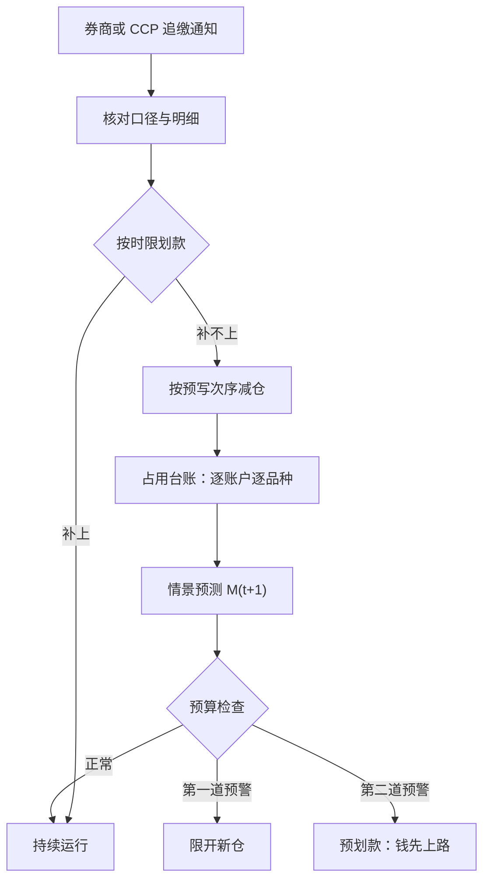
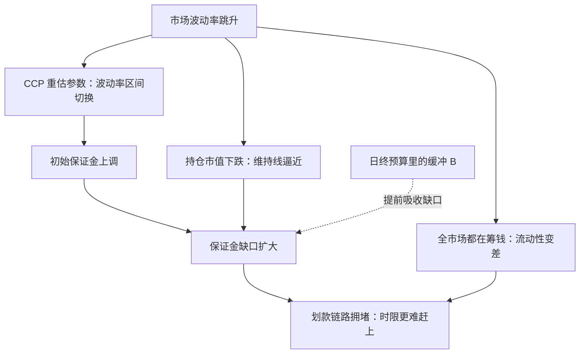

# 保证金与清算运营

保证金不是手续费，是按日重估的信用额度；追缴通知到达的时刻，能依靠的只有昨天就算好的预算。

<footer>—— 据保证金逐日盯市与中央对手方违约瀑布的公开机制整理</footer>

[上一课](/quant/qo-stockloan-ops)把券变成一条每天要续的供应链；本课管另一条供应链——资金。中央对手方的净额与违约瀑布机制已在[中央对手方与违约瀑布](/quant/ccp-default-waterfall)写过，失败交收的状态已在[结算周期与失败](/quant/settlement-fails)写过，T+1 对运营窗口的压缩已在[美国 T+1 结算](/quant/us-t1-settlement)写过；本课写机构自己的那本账：保证金占用怎么预算、追缴怎么走流程、清算截止怎么守。

## 问题

策略层把保证金当常数或当比例，运营知道它是被 CCP 与券商**每日重估的随机变量**：初始保证金随波动率参数跳变，维持线随持仓市值移动，追缴恰好发生在波动最大、流动性最差的日子。缺口的形态有三：**口径**——期货、场外、融券、回购各有一套保证金逻辑，加总口径没人管，账户层面集中触线；**时点**——资金划款要过托管与银行链路，晚于追缴时限就是违约；**次序**——真到强平时先平什么，没有预写就是现场发挥。不解决这三条，一次全市场的波动率跳升就能把一个本没有方向性亏损的组合打成被动减仓。

「逐日盯市」（mark-to-market）就是每天收盘后按最新市价重算一遍盈亏与占用的制度：赚了当天进账，亏了当天补钱。它让风险每天结清、不攒隔夜雷，代价是坏日子里的补钱要求恰好最急——「追缴通知」就是这么来的。

## 方法

把保证金做成预算科目，四个动作。**占用台账**：逐账户、逐品种记初始与维持保证金，并与券商与 CCP 的日结逐项对平——口径对不上的账户不许开新仓。**情景预测**：保证金参数有公开的变动节奏（定期重估、到期换月、波动率区间切换），用参数日历做压力情景，估下一天的占用 $M_{t+1}$，而不是拿今天的数外推。**预算与预警带**：$\mathrm{IM}_t+\mathrm{VM}_t+B_t\le C_t$，占用加缓冲不超过可用资金 $C_t$；设两道预警线，第一道限开新仓，第二道启动预划款——钱在路上比钱在账上慢，预警线就是给这段路留的。**追缴与强平的预写**：收到通知后的核对、划款、争议路径与责任人固定；强平次序按「对组合功能的伤害最小」预先排好，与[退出机制](/quant/sl-exit-mechanism)的分级逻辑同源。

## 机制

为什么预测必须用情景而不是均值：保证金参数是波动率的阶梯函数，参数跳变的日子恰是追缴与流动性紧张重合的日子——这是逐日盯市的顺周期性，均值外推会在最需要缓冲的那天给出最错的预算。预算不等式里缓冲 $B_t$ 的作用因此不是「多留一点钱」，而是把追缴从「违约事件」降级成「划款动作」：CCP 的瀑布里，会员违约前的每一道防线（保证金、违约瀑布资源）都是公开设计的（[中央对手方与违约瀑布](/quant/ccp-default-waterfall)），机构内部同样要有一条自己的瀑布——现金缓冲、可变现抵押、预先批准的减仓次序。清算侧同理：交收失败不是异常态而是常态状态变量，未确认的腿、缺券的交付、外汇未备妥都要当天就出现在对账差异里（[结算周期与失败](/quant/settlement-fails)）；回购融资腿的保证金与折扣率是同一条资金链的上游（[回购市场与融资](/quant/repo-funding)）。

保证金与结算保证金是两笔占用：前者跟杠杆与额度有关（券商给的），后者跟交收周期与净额有关（CCP 收的）。周期从 T+2 压到 T+1 改的是后者，前一项不会自动少——把两笔混在一个科目里，压缩周期后预算会两头都算错。

把预算不等式代入数字：某账户初始保证金 $\mathrm{IM}=200$ 万、变动保证金 $\mathrm{VM}=50$ 万、缓冲 $B=30$ 万，则可用资金 $C$ 至少要 280 万；若情景预测明天参数上调把 $\mathrm{IM}$ 推到 260 万，缺口 50 万今天就该走预划款——等追缴通知到了再筹，钱多半还在路上。

## 边界

本课写机构侧的预算与流程，不重写 CCP 内部的违约瀑布与净额法律安排，见[中央对手方与违约瀑布](/quant/ccp-default-waterfall)；各产品保证金的具体公式以交易所、清算所与券商文本为准，SPAN 类情景扫描的参数不在本课复刻。强平次序的预写不改变一条边界：运营保证「补得上、平得有序」，不保证不平——方向性亏损与保证金不足是两件事，前者是研究的问题，后者才是本课的对象。

初学者容易以为强平是因为「亏了钱」。实际上方向亏损与保证金不足是两件事：一个几乎不亏但高杠杆的组合，也可能在波动率跳升、保证金参数上调时被追缴甚至强平；混同两者，会把运营风控问题错当成择股问题去修。

## 小结

- 保证金是被每日重估的随机变量，按预算科目管理，逐账户对平口径。
- 预测用参数日历做情景，不用均值外推；盯市的顺周期性让追缴与流动性紧张重合。
- 预算不等式 $\mathrm{IM}_t+\mathrm{VM}_t+B_t\le C_t$ 配两道预警线，给划款链路留时间。
- 追缴路径与强平次序预写；交收失败是常态状态变量，当天进对账差异。
- 出处：据逐日盯市、SPAN 类情景保证金与 CCP 违约瀑布公开机制整理；对照[中央对手方与违约瀑布](/quant/ccp-default-waterfall)、[美国 T+1 结算](/quant/us-t1-settlement)。
