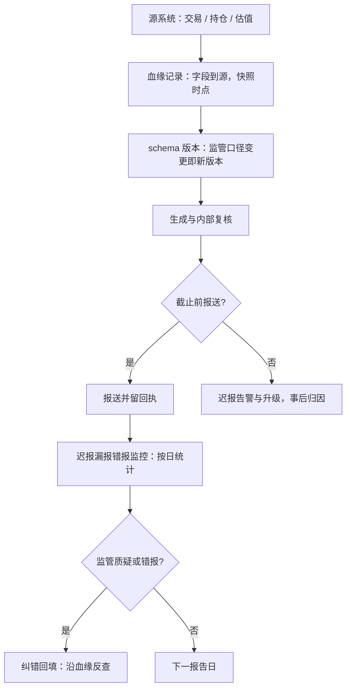

# 报告义务

每份监管报告都是字段、截止与质量的三元组；迟报、漏报、错报不是三种错误，是同一种运营故障的三种表面。

<footer>—— 据程序化交易报备、交易报告与大额持仓报告的公开制度口径整理</footer>

[上一课](/quant/qo-compliance-monitoring)把红线清单搬上在线监控，让「在范围内」每天由数据确认；监控产生记录，本课写记录如何按监管口径**出口**。程序化交易的报备实践已在[程序化交易的报备实践](/quant/cn-programmatic-filing)写过台账与速率画像的勾稽，红线里「报备不实本身就是红线」的口径见[合规红线与收束](/quant/cn-compliance-map)；本课把所有报告义务当成一类对象管理：它们的共同结构，与把它们做成数据产品的方法。

## 问题

报告常被当成文案工作，交给离数据最远的人；事故也由此长出来。缺口的形态有三：**口径**——同一份持仓在交易系统、估值系统与报备系统里三个数，谁也不知道该报哪个；**截止**——报送窗口是硬时限，迟报与错报同等可见，临时凑数必然错；**质量不可审计**——监管问「这个字段为什么是这个值」，答不出数据从哪来。三者的共同根源：报告没有被当成**数据产品**——没有 schema 管理、没有数据血缘、没有迟报漏报的监控。监管侧的方向也在加重这一侧：[量化监管演进](/quant/cn-quant-regulation-history)的趋势是把更多行为纳入定期与事件性报告，报告面只会变宽。

「数据血缘」就是给每个数字记家谱：这个值出自哪个系统的哪张表、哪个时点的快照、经过什么加工得来。监管问「这个字段为什么是这个值」时，家谱就是答案；答不出家谱的数，再对也会被按不利方向理解。

## 方法

先立谱系，再立管线。**谱系**按对象分：向监管的程序化报备与变更报备（见[程序化交易的报备实践](/quant/cn-programmatic-filing)）、大额持仓报告、逐笔或逐日的交易报告（如 MiFID II 第 26 条一类的交易报告制度）、可疑交易上报（监控体系的升级出口，见[合规监控体系](/quant/qo-compliance-monitoring)）、对托管人与投资者的定期报告。**管线**把每份报告拆成三元组：字段——schema 版本化，监管改字段等于新版本，旧版本归档；截止——报送日历进[交易日的操作清单](/quant/qo-daily-ops-checklist)，按硬掩码执行；质量——每个字段有血缘记录，能反查到源系统与快照时点。

## 机制

为什么必须血缘：报告的价值在可反查。监管问询的形态通常是「抽查某日某字段」，血缘断掉的报告在问询面前等于错报——答不上来的数，监管只能按不利方向理解。为什么迟报监控按日甚至按小时统计：截止是硬约束，迟报本身是监管可见的状态，漏报率 $\Pr[\text{应报未报}]$ 要靠「应报清单」与「已报清单」的自动勾稽来压到零，两份清单不自动勾稽，漏报就是静默的。为什么纠错要写成回填而不是重报了事：错报的修正路径本身要留痕，哪一版报错、哪一版更正、差异在哪，这条链就是下一轮审计的现成材料。报告管线与[策略台账体系](/quant/sl-registry)的指针链同构：台账答「这个仓位凭什么」，报告管线答「这个数字从哪来」——都是让答案在任何时点可复现。

「应报与已报清单自动勾稽」用数字理解：日历上本月应报 22 份，回执库收到 21 份，差集立刻亮出那 1 份漏报；靠人工回忆对账，漏报往往到监管催报才被发现——而迟报本身已经是监管可见的状态。

报备与速率画像必须勾稽：报备里写的申报撤单节奏，要能和实盘监控的同名指标对上；两套数对不上，「报备不实」比超速本身更难解释——这是红线清单里唯一一条由文件不一致单独触发的红线。

## 边界

各辖区的报告义务差异大、变更频繁：字段、频率、阈值以当期监管文本与自律规则为准，本课不罗列具体制度清单，也不构成法律意见。可疑交易上报的触发与表述是合规职能的判断，本课只提供管线与留痕。刻意规避报送或择时择报的技巧不在讨论范围——那不是运营优化，是违规本身。

常见误区：把报告当成「文案活」，交给离数据最远的人排版应付。实际上每份报告是一次数据发布：字段有 schema、截止是硬时限、每个值可反查。排版错了是小事，口径错了在问询面前与错报同罪。

## 小结

- 报告义务的共同结构是三元组：字段（schema 版本化）、截止（硬掩码进日历）、质量（血缘可反查）。
- 谱系五类：程序化报备、大额持仓、交易报告、可疑交易上报、对托管与投资者的定期报告。
- 应报与已报两份清单自动勾稽，迟报漏报按日统计；纠错写成留痕的回填。
- 血缘断掉的报告在问询面前等于错报；报备口径必须与实盘监控画像勾稽。
- 出处：据程序化交易报备、MiFID II 第 26 条类交易报告与大额持仓报告公开制度口径整理；台账口径见[策略台账体系](/quant/sl-registry)。
