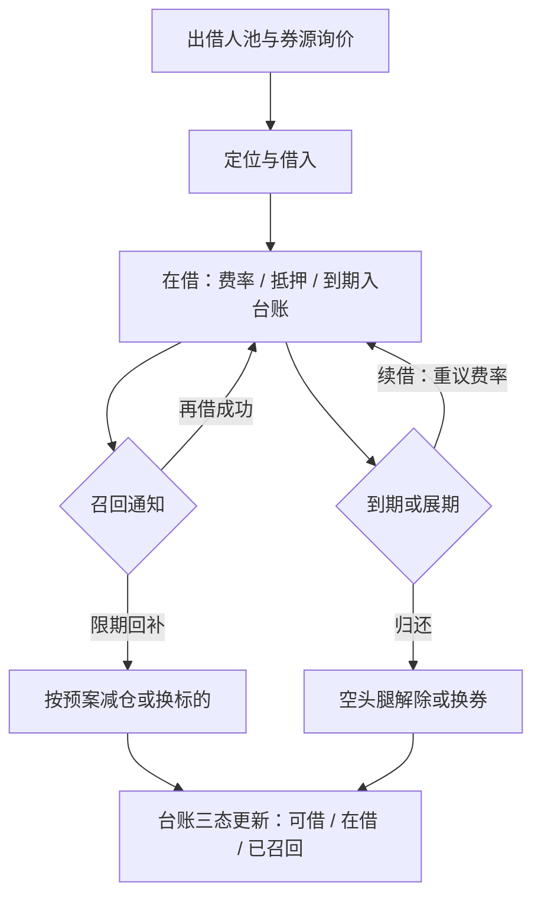

# 券源与借券运营

空头腿不是仓位符号取负，而是一条有供给方、有价格、有断供风险的供应链；运营把它从回测里的一行成本，变成每天都要续上的合同。

<footer>—— 据 Duffie, Gârleanu and Pedersen, *JFE*, 2002；D'Avolio, *JFE*, 2002 整理</footer>

[上一课](/quant/mac-backtest-map)把宏观策略的回测收成四件套口径：vintage 首发值、as-of 连接、滚动窗口、迟滞敏感性，独立样本按周期数计，叙事计入 $N$。回测把账算对；账算对之后，钱每天真正过日子的地方是运营。本课程第一课从最像供应链的一块讲起：券。每份空头都是借来的——[证券借贷与做空成本](/quant/securities-lending)写过费率与召回怎么进定价，[融券与转融通](/quant/cn-margin-lending-structure)写过 A 股的制度结构；本课写运营侧：怎么把券变成每天可盘点、可续借、有断供预案的供给线。后课默认已经读完本课。

## 问题

策略层习惯把「可空」写成静态集合：信号日能定位，就一直当它能空。运营看到的是库存：出借人构成、每笔合约的费率与到期、抵押在谁手里、哪些券已被召回。缺口因此不是「找不找得到券」，而是三条会断的线同时在场：**存量**——在借合约的到期与展期；**流量**——新增券需求从哪个池子里来；**断供**——召回、名单调出、暂停出借把已有空头变成强制回补。信号日可借与持有期可借是两个事件；把前者当后者，回测里的空头腿在实盘第一个召回潮就现原形。

### 券源台账是这条供应链的账本

台账按合约粒度记：券、出借方、借入日与到期、费率、抵押与折算率、召回条款，向上勾稽中介月结，向下喂给组合系统当「可空集合」的唯一事实来源。研究端读的可用券清单与运营端读的合约台账若不是同一份数据，容量估计与实际供给就会漂移——「单一事实来源」与[策略台账体系](/quant/sl-registry)是同一条不变量，只是对象换成了券。

## 方法

把券当库存管理，四个动作固定成日常。**盘点**：每日开盘前核对可借、在借、已召回三态，与中介数据对平；差异当天查清。**计价**：空头腿的日持有成本写成 $c_t=b_t-\rho_t+\kappa\,\lambda_t$——借券费率 $b_t$ 减抵押品再投资收益 $\rho_t$，加召回强度 $\lambda_t$ 乘以回补冲击 $\kappa$ 的期望项；这笔钱按天进损益归因，不做一次性预扣。**到期阶梯**：新借合约的到期日刻意错开，避免同一日集中展期——展期日是费率重议日，集中等于交出议价权。**断供预案**：对敞口前几名的名字预写「若断供先减哪条腿」，与[退出机制](/quant/sl-exit-mechanism)同一逻辑：临场再想，动作一定偏晚。

## 机制

为什么按供应链管而不是按成本管：召回把空头持有期变成随机停时，供给紧张时费率、召回强度与失败交收三者同源上涨——不是三个独立风险，是同一份供给曲线的三个读数。运营的意义是把这三个读数变成**每天可观测的状态量**：费率看询价，召回看通知流，断供看覆盖率。覆盖率 $\text{cover}_t=L_t/D_t$ 是可借库存对在借需求的倍数，跌破阈值就该在价格还好的时候主动减，而不是等通知到了被动市价回补。不这么做会错在哪：把券当静态持有，召回潮到来时的回补冲击全由自己吃；美国 T+1 拿掉了召回与交收的缓冲夜（[美国 T+1 结算](/quant/us-t1-settlement)），同样的预案整体提前了一天。

特殊券费率是截面变量，年化可从贴近无风险利差涨到两位数甚至三位数百分比；按全样本均值预扣，恰好在供给最紧、召回概率最高的名字上系统性高估空头利润——那正是空头腿贡献 alpha 的地方。

## 边界

本课不重写借券市场的定价机制与特殊性经济学，那是[证券借贷与做空成本](/quant/securities-lending)的对象；转融通与两融的制度细节、前端检查规则见[融券与转融通](/quant/cn-margin-lending-structure)与[合规红线与收束](/quant/cn-compliance-map)，本课只管运营侧。抵押品再投资的信用风险、收入分成谈判、借贷协议法律文本不在本课展开，运营只需把条款字段记进台账并按字段执行。券源的报备与异常交易红线，留到合规单元。

## 小结

- 券是一条供应链：存量（到期展期）、流量（新增需求）、断供（召回与调出），三线每天盘点。
- 台账按合约粒度记费率、抵押、到期与召回条款，是可空集合的单一事实来源。
- 空头腿成本按天计 $c_t=b_t-\rho_t+\kappa\lambda_t$，进损益归因，不一次性预扣。
- 到期阶梯错开展期日；断供预案预写减仓次序，覆盖率 $\text{cover}_t$ 跌破阈值先动。
- 出处：Duffie, Gârleanu and Pedersen, *Securities Lending, Shorting, and Pricing*, *JFE*, 2002 与 D'Avolio, *JFE*, 2002；中国制度口径见[融券与转融通](/quant/cn-margin-lending-structure)。
