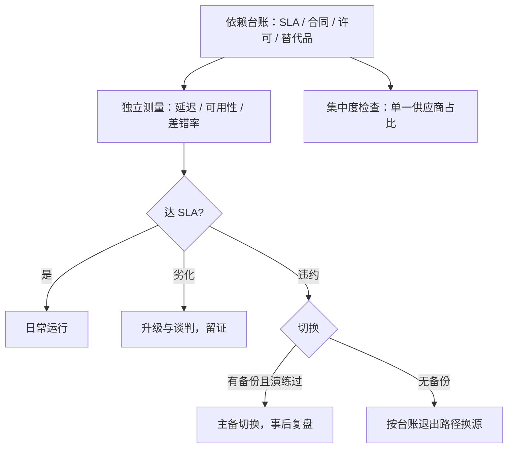
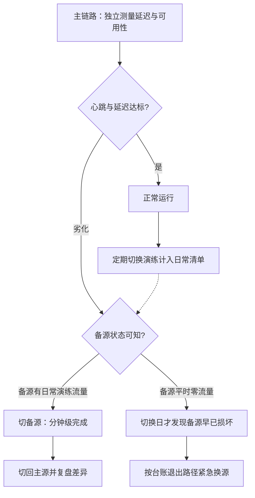

# 供应商与通道管理

外包转移的是工作，不是责任；供应商的每一句承诺，都要变成一条你这边测得出来的指标。

<footer>—— 据 MiFID II 外包条款与 RTS 6 口径、巴塞尔操作风险原则整理</footer>

[上一课](/quant/qo-daily-ops-checklist)把一天排成可勾的清单；清单的每一行都默认外部供应商按时交付——行情线、数据、柜台、托管、网络。本课管清单底下的人。数据供应商的选择对照已在[数据供应商对照](/quant/cn-vendor-comparison)写过，柜台与托管链路已在[托管与柜台](/quant/cn-custody-counter)写过；本课不选型，写**管理**：怎么让外部依赖变成可测量、有备份、能退出的对象。

## 问题

运营事故的来源排序里，供应商与通道排在策略系统之前：行情断一线，策略全瞎；柜台前端检查改一个口径，全线委托被拒；数据供应商改字段，日终对账静默漂移。缺口的形态是「三无」：**无测量**——SLA 写在合同里，但延迟、可用性、差错率没有一侧的独立读数，劣化发现靠用户投诉；**无备份**——单源依赖，切换方案停在口头；**无退出**——数据许可与格式锁定让「想换也换不走」。三者共同的组织根源：采购部门看价格签合同，运营部门用服务，两边没有同一张指标表。

SLA（服务等级协议）就是供应商白纸黑字承诺的服务底线，比如「月可用性不低于 99.7%、行情延迟不超过 10 毫秒」。它本身不保证服务好——保证好的是你这边天天有人测：低于承诺的那一天，要有自己一侧的数据能拿出来。

## 方法

管理外部依赖的四个动作。**依赖台账**：每个供应商记服务范围、SLA 条款、合同到期、数据许可与可携带性、替代品与切换时长；台账与券源台账、保证金台账同构——先有单一事实来源，再谈管理。**独立测量**：延迟用自己的时间戳测，可用性用自己的心跳测，数据差错率用对账差异率按天记；供应商的管理界面只作参考，不作凭据。**冗余与切换**：关键线路双源——主备行情、主辅券商、主备网络；切换本身要演练，没有演练过的备份是安慰品。**退出与集中度**：每项依赖写清最短退出路径与所需时间，集中度设限——单一供应商承载的关键功能比例超过阈值即立项扩源。

## 机制

为什么「可测」排在「双源」之前：没有独立测量，双源也无法验证——备用链路平时没有流量，切换日才发现它半年前就坏了；测量还把谈判从「感觉服务变差了」变成「第三季度可用性 $99.5\%$，低于合同 $99.7\%$」。为什么退出要写进合同与台账：数据供应商的锁定在签约日决定——许可范围、格式、历史数据可携带性都是合同条款，事后没有谈判空间；[数据供应商对照](/quant/cn-vendor-comparison)里供应商口径差异的坑，落到运营就是字段映射与对账规则要按点时保存。为什么外包不转移责任：[MiFID II RTS 6](/quant/mifid-ii-rts6)明确外包开发不转移测试责任——监管问的是你，不是你的供应商；这句话翻译到内部治理，就是供应商的每一次变更（字段、口径、线路）都要进你自己的变更控制与对账，供应商的告警不能代替自己的监控。

可用性 99.7% 与 99.5% 差多少：按 30 天一个月算，前者允许停机约 2.2 小时，后者是 3.6 小时——多停 1.4 小时。谈判桌上「感觉服务变差了」没有用，「本季度多停了 1.4 小时、差错率翻倍」才是可以拿上台面的证据。

对账差异率是供应商质量的总指标：把柜台、清算、托管、行情、参考数据各线的日差异率画在一张图上，哪家劣化当周就能看出来——比年度供应商评审早三个季度。

## 边界

本课不推荐商业选型，不写具体供应商的优劣；数据口径与历史问题见[数据供应商对照](/quant/cn-vendor-comparison)，柜台链路与托管复核见[托管与柜台](/quant/cn-custody-counter)，接口协议见 [FIX 协议](/quant/fix-protocol)。冗余的成本边界也要承认：双源贵一倍不止——许可、接入、对账都是两套；哪些功能值得双源由「停一天的代价」反推，全量双源是预算失控，全量单源是事故等待。两者的分界线是运营决策，不是工程偏好。

常见误区：把外包理解成「这事有人负责了」。恰恰相反——外包转移的只是工作量，出事时监管与客户找的仍然是你：供应商的系统故障导致你违规，责任主体还是你。所以供应商的每次变更与告警，都必须并入你自己的监控与对账。

## 小结

- 外部依赖的管理形态是三个词：可测量、双源、可退出，全部挂在依赖台账上。
- 测量必须独立于供应商：延迟、可用性、对账差异率用自己一侧的读数。
- 没演练过的备份是安慰品；切换演练计入日常清单。
- 退出成本在签约日决定：许可、格式、可携带性写进合同，集中度设限。
- 出处：据 MiFID II 外包条款与 RTS 6「外包不转移责任」口径、巴塞尔操作风险原则整理；选型对照见[数据供应商对照](/quant/cn-vendor-comparison)。
