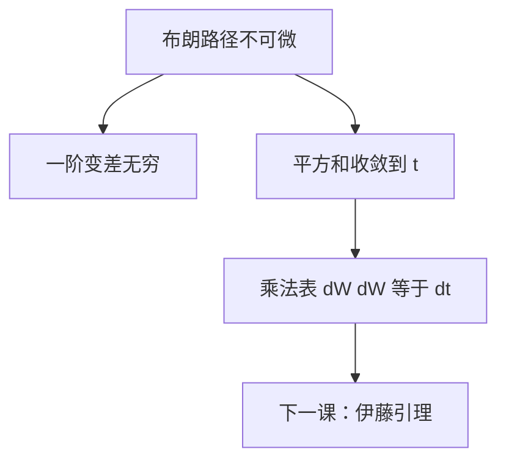

# 二次变差

分区细化后，布朗增量的平方和几乎必然收敛到日历时间 $t$；一阶变差却发散。乘法规则因此是 $(\mathrm d W)^2=\mathrm d t$，不是零。

<footer>—— 据 Karatzas and Shreve, Brownian Motion and Stochastic Calculus, 1991, §1.5；Shreve, Stochastic Calculus for Finance II, 2004, 第 3 章整理</footer>

上一课[布朗运动与路径性质](/quant/brownian-motion-paths)钉死了连续、不可微、$\mathrm{Var}(W_t)=t$。缺口不是再列一遍公理，而是：在这种路径上，经典链式法则丢掉的二阶项究竟收敛到什么。没有二次变差，伊藤引理没有修正项，SDE 只是记号。本课只补这一块收敛。

## 问题

光滑函数满足 $|\Delta x|^2=o(|\Delta x|)$，泰勒展开可以丢掉二阶。布朗路径太粗：一阶变差 $\sum_i|W_{t_{i+1}}-W_{t_i}|$ 随网格加密趋于无穷，Riemann–Stieltjes 积分 $\int H\,\mathrm d W$ 不能沿路径当普通 Stieltjes 来定义。同时，平方和 $\sum_i(W_{t_{i+1}}-W_{t_i})^2$ 并不发散——它收敛到一个确定的有限极限。缺口是把这个极限命名，并写成后课要用的乘法表。

### 二次变差不是方差的另一写法

$\mathrm{Var}(W_t)=t$ 是分布的二阶矩，对固定 $t$ 取期望。二次变差 $[W]_t$ 是**路径上的**平方增量极限，几乎必然等于 $t$。一个是 $\mathbb E[W_t^2]$，一个是沿单条路径累加 $(\Delta W)^2$。Levy 刻画把两者焊在一起：连续局部鞅若二次变差为 $t$，则是布朗运动。本课先把路径极限钉死，不把刻画定理证一遍。

实现波动率是二次变差的离散估计，属于高频计量，不是本课对象。这里只需要 $[W]_t=t$ 作为伊藤乘法表的来源。

## 方法

取分区 $0=t_0\lt \cdots\lt t_n=t$，令 $Q_\pi=\sum_{i=0}^{n-1}(W_{t_{i+1}}-W_{t_i})^2$。网格步长 $\|\pi\|\to 0$ 时，$Q_\pi\to t$ 依概率（沿合适的细分序列则几乎必然）。定义 $[W]_t=t$。交叉变差 $[W,t]=0$、$[t,t]=0$。形式乘法表：

$$
\mathrm d W\cdot\mathrm d W=\mathrm d t,\qquad \mathrm d W\cdot\mathrm d t=0,\qquad \mathrm d t\cdot\mathrm d t=0.
$$

对半鞅 $X_t=X_0+\int\mu+\int\sigma\,\mathrm d W$，有 $[X]_t=\int_0^t\sigma_s^2\,\mathrm d s$（连续情形）。后课 GBM 的 $[S]_t=\int\sigma^2 S^2\,\mathrm d s$ 直接套这条。

## 机制

独立高斯增量使 $Q_\pi$ 的期望恰好是 $t$，方差随 $\|\pi\|\to 0$ 消失，所以极限是确定性过程 $t$，不是新的随机过程。这解释了「噪声的平方变成时间」：随机性在一阶，二次项平均掉只剩日历钟。伊藤积分把被积过程放在左端点（非预期），正是为了让 $\int H\,\mathrm d W$ 对二次变差的收敛保持鞅性质；那是后课积分方程的事，本课只提供 $[W]$。

有界变差的有限变差过程与 $W$ 的交叉变差几乎必然为零。因此漂移项不贡献二次变差，只有扩散系数进入 $[X]$。定价里「谁贡献凸性、谁只贡献漂移」从这里分开。

## 边界

本课不定义伊藤积分，不证 Itô 等距，不讨论 p-变差。分数布朗运动的二次变差可以是零或无穷，主干不用。带跳过程的二次变差会多一项跳幅平方和，留给[跳过程直觉](/quant/jump-process-intuition)。后课默认：$[W]_t=t$，写泰勒展开时 $(\mathrm d W)^2$ 保留为 $\mathrm d t$。下一课[伊藤引理](/quant/ito-lemma)把这条乘法表装进链式法则。

## 小结

- 布朗二次变差 $[W]_t=t$；一阶变差发散。
- 形式规则 $\mathrm d W\cdot\mathrm d W=\mathrm d t$，其余交叉为零。
- 二次变差是路径极限，不是 $\mathrm{Var}(W_t)$ 的别名。
- 连续半鞅的 $[X]$ 只由扩散系数决定。
- 出处：Karatzas–Shreve §1.5；Shreve, SDE II 第 3 章。
