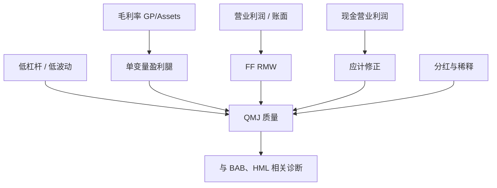

# 质量与盈利

毛利率高的公司在截面上平均收益更高；这一溢价不能被价值吸收，反而像价值的另一面：便宜的是价格，赚钱的是基本面。

<footer>—— Novy-Marx, The Other Side of Value: The Gross Profitability Premium, Journal of Financial Economics, 2013</footer>

价值问价格相对账面或盈余是否低；盈利问同样资产能产出多少经济利润。Novy-Marx 用毛利率证明：盈利能力本身预测收益，而且控制 B/M 之后更强——贵的高盈利与便宜的低盈利是不同方向。Fama–French 把营业利润率做成 [RMW](/quant/ff5)。Asness、Frazzini、Pedersen 的 Quality Minus Junk（QMJ）再把盈利、成长、安全与分红政策捆成一条质量腿。本篇以毛利率与 RMW 为主，写质量综合指标何时在帮、何时在把低波动与低杠杆偷运进来。

## 问题

若市场只对风险补偿，高盈利公司更安全，预期收益应更低。截面上符号相反：高毛利率、高营业利润率、高 ROE 的组合事后收益更高。这与 CAPM 的直觉冲突，也与「成长股贵所以收益低」的粗俗价值叙事冲突——高盈利公司往往估值不低。三因子用 HML 解释不了它：高盈利组的 HML β 常常为负（更像成长），α 因此更大。问题是找到一个会计定义，既接近经济利润，又少被应计操纵，还能做成与 HML 并存的多空。

另一个问题是「质量」这个词过宽。杠杆低、波动低、盈利稳、应计低、分红高都可以叫质量。把它们平均成分位，几乎一定能做出一条漂亮的历史多空，但也一定与 [BAB](/quant/low-vol-bab)、投资、价值共线。需要先固定盈利，再谈更宽的质量。

### 毛利率为什么比净利润干净

净利润扣过利息、税、特别项和各种费用，截面排序会被资本结构与一次性项目主导。毛利润（营收减销售成本）更靠近生产函数的单位利润，除以总资产（不是净资产）是为了不让杠杆把分母缩小、把亏损公司的 ROE 打成极端值。Novy-Marx 的

$$
\mathrm{GP}=\frac{\mathrm{Revenue}-\mathrm{COGS}}{\mathrm{Assets}}
$$

在当时美股样本里预测力强于净利润率，也能在控制 B/M 后保持。它仍会被存货会计与收入确认影响，但比底部净利润稳。

RMW 的分母是账面股权，分子是营业利润（扣 SG&A 与利息）。GP/Assets 的分母是总资产。同一家高杠杆银行在两种定义下的分位可以差很多。复制 French 数据库必须用营业利润/账面，不要用毛利率然后抱怨对不上。

## 方法

年度（6 月）用上一年财报算 GP 或营业利润率，NYSE 30%/70% 分位，与规模做 2×3，价值加权多空即盈利因子。Ball、Gerakos、Linnainmaa、Nikolaev 主张用现金营业利润（扣应计）替代应计制利润，预测力在部分样本更强，换手与对盈余公告的暴露也变。ROE 用于 q 因子，更接近股东口径，对杠杆敏感。

QMJ 把多块分位得分平均：盈利能力（包括 GP、ROE、利润率）、盈利增长、安全（低 β、低波动、低杠杆、低破产分数）、分红（高净分红、低稀释）。每月再平衡、对冲市场之后，QMJ 接近一条「高质量减垃圾」的可交易腿。它不是 Novy-Marx 的单变量定理，而是一个组合定义；成分权重一变，与 RMW、BAB 的相关就变。

$$
R_{it}-R_{ft}=\alpha_i+\beta_{iM}\mathrm{MKT}_t+\beta_{iS}\mathrm{SMB}_t+\beta_{iH}\mathrm{HML}_t+\beta_{iR}\mathrm{RMW}_t+\varepsilon_{it}
$$

在四因子或五因子里检验：按毛利率排序的组合应被 RMW 吸收；按 QMJ 排序的则未必，因为安全块会留下与低 β 有关的 α。

### 价值的另一面如何一起用

Novy-Marx 的关键实证是：同时做多便宜且高盈利、做空贵且低盈利，比单做价值或单做盈利更强。这不是数据挖掘出的第四个维度，而是股利贴现的比较静态：给定价格，更高的盈利应对应更高的预期收益。实务上用独立双重排序（B/M × 盈利）看交叉格子，而不是先做 HML 再在残差上排盈利——后者会把相关结构藏进正交化顺序里。

## 机制

风险解释困难：高盈利更像低风险。一种修补是盈利对资本品与劳动调整成本敏感，高盈利公司在需求冲击下有更高的系统风险——证据并不整齐。行为解释更直接：投资者对「无聊的高利润率公司」反应不足，对故事型亏损成长过度支付；盈利溢价是价值溢价的镜像。会计解释：应计高的公司利润虚、随后反转，现金盈利更接近可分配现金流。三条机制对交易的含义不同：行为通道怕拥挤，会计通道怕准则变更，风险通道怕宏观状态切换。

质量里的「安全」块机制几乎就是低 β 与低杠杆：资金约束下高 β 被过度持有，见 BAB。若 QMJ 的历史夏普主要来自安全而非毛利率，把它标成 Novy-Marx 复制就是错的。分解 QMJ 的四块贡献应当是默认报告，而不是附录。

### 应计、成长与稀释

Sloan 的应计异常与盈利因子相邻：高应计预示收益低。现金盈利把应计抠掉，会部分吸收应计异常。盈利增长进入 QMJ 后，又与动量、与投资负相关的镜像纠缠——高增长常伴随高投资，CMA 为负。发行股份（稀释）是行为与市场择时的老结果：净发行高的公司收益低。质量因子很容易在不知不觉中把净发行、投资、低波动各拿一点。要宣称「质量是独立风险」，至少应在回归里同时放 RMW、CMA、BAB 和净发行。

高盈利不等于高盈利增长。GP 水平高、但正在恶化的公司，和 GP 低、正在改善的公司，对动量与盈余漂移的暴露相反。QMJ 的「成长」块用的是长期稳定增长，不是一个月的盈余惊喜。不要把 PEAD 写进质量因子。

## 边界与工程取舍

金融公司的毛利率难定义，通常剔除。亏损与负账面使 ROE、营业利润率分位不稳定。跨国复制要统一会计准则（研发费用化 vs 资本化）。A 股壳与 ST 会让「垃圾」组的空头不可交易，QMJ 的空头腿往往贡献大量账面收益。

不要把 RMW、GP、ROE、QMJ 四个名字当同义词。不要在五因子已经包含 RMW 时，再加一条高度相关的毛利率多空还报告两个 α。容量上，盈利因子换手低于动量、高于价值年度重构；质量综合因安全块需要月度 β，换手更高。

真实出处：Novy-Marx, Journal of Financial Economics, 2013；RMW 见 Fama & French, 2015；QMJ 见 Asness, Frazzini & Pedersen 的 Quality Minus Junk。现金营业利润见 Ball 等。禁止把 QMJ 标成 2013 年论文的定义。

## 小结

- 盈利能力预测收益，符号与「安全则低收益」相反，也不能被 HML 吸收。
- 毛利率 / 资产、营业利润 / 账面、现金盈利、ROE 口径不同，RMW 只是其中一条。
- QMJ 把盈利与安全、分红捆在一起，须拆开贡献，以免偷运 BAB。
- 与价值双重排序是预期的用法；与投资、净发行的共线要单独检验。
- 出处：Novy-Marx, Journal of Financial Economics, 2013；Fama & French, 2015；QMJ 见 AFP。
