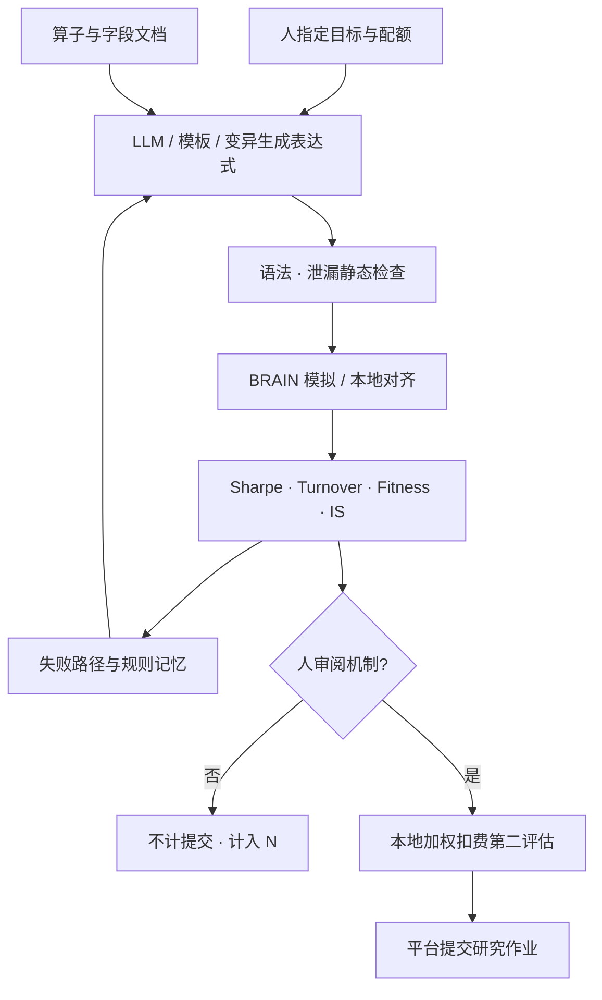

# QuantGPT 与 BRAIN 自动化

    
Fitness 把夏普、收益与换手收成一个可排序的标量：夏普乘以收益绝对值与换手地板之比的平方根；平台用它筛选公式化 alpha，而不是用无成本回测夏普。

    <footer>—— 据 WorldQuant BRAIN 社区公开的 Fitness 口径整理；平台内部实现与数据字段以官方文档为准，公开信息有限</footer>

WorldQuant BRAIN 是公式化 alpha 的研究与模拟平台：表达式语言、股票池、中性化、延迟、以及一套样本内（IS）检查。公开可核对的主要是表达式形态、社区转述的指标口径与竞赛规则；撮合器细节、完整字段字典、提交队列的内部阈值，公开信息有限。QuantGPT 一类开源项目（GitHub 上以 MCP 工具驱动 LLM 做「设计—回测—提交」循环）把 BRAIN 当成评估器来自动化。本篇写可公开讨论的架构：公式语言与 Fitness 在优化什么、自动化循环如何把尝试次数爆炸、以及它与 Alpha-GPT / Hubble / XAlpha 的分工。它不是经纪商、不是实盘下单网关，更不是操纵代理；能自动化的是平台允许的模拟与提交研究作业。评价仍要过 McLean–Pontiff 与 Hou–Xue–Zhang：竞赛或平台 IS 通过，不等于可交易加权后的经济显著。

## 问题

公式化平台把因子收成一行表达式：截面 `rank`/`zscore`、时序 `ts_*`、分组 `group_*`、再加 decay、truncation、中性化一类设置。研究员的手工循环是：想想法、写表达式、等模拟、看 Sharpe / Turnover / Fitness / Returns / Drawdown、改一处算子、再交。瓶颈是模拟队列与人的带宽。自动化的诱惑是：让模型按算子文档生成表达式，批量模拟，按 Fitness 排序，变异后再交。问题立刻变成 Bailey 等人写过的那一类：尝试次数 $N$ 从每天十次变成隔夜数百次，样本内 Fitness 的最大值没有技能含义。BRAIN 的 IS 检查（社区转述包括换手区间、权重集中、子宇宙稳健、自相关等，以当时平台规则为准）是平台侧的多重过滤，不是对你实验室 $N$ 的修正。把「IS 全过」读成「过了多重检验」，分母算错了。

第二问题是目标函数。社区广泛转述的 Fitness 形如

$$
\mathrm{Fitness}=\mathrm{Sharpe}\sqrt{\frac{|\mathrm{Returns}|}{\max(\mathrm{Turnover},\,0.125)}}.
$$

它惩罚高换手、奖励夏普与收益，换手地板避免极低换手把分母做没。这与 Novy-Marx–Velikov 的精神相近：高换手一端必须先过成本。但它仍是平台模拟器里的标量，不是你账户的 $\mu_{\mathrm{net}}(A)$。自动化若只最大化 Fitness，会学会平台的检查函数，而不是学会不可观测的真实边缘。

### 平台模拟器不是市场

延迟设置、股票池（如 TOP3000）、行业中性、衰减窗口，决定你在哪一种合同里优化。公开文档与社区教程对这些旋钮有说明；主机撮合、冲击、借券、涨跌停若与你的实盘不同，sim-to-real 偏差单独存在，见[模拟器偏差](/quant/sim-to-real-trading)。QuantGPT 一类工具若提供「对齐 BRAIN 的 Sharpe/Turnover/Fitness」的本地模拟，那是在拟合平台，有利于少交废模拟，不能替代平台，更不能替代经纪商成交。官方 API 的权限、速率、提交条款以 WorldQuant 当时规则为准，第三方仓库明确写无隶属关系的，应原样保留。

不要把社区 README 里的「已提交 Fitness 1.26」当成同行评审收益。那是平台 IS 口径下的作业记录，样本、费用、容量与实盘实施缺口均未在论文意义上公开。公开信息有限时，只讨论工作流，不讨论可复制的超额。

## 方法

可公开复述的自动化分层如下，具体以各项目文档为准。

**语言与校验。** 算子表、元数、字段注册、前瞻移位检查。Hubble 把这一层做成 AST 三重门；BRAIN 自动化至少需要表达式语法与平台算子对齐，否则模拟全是语法失败。负移位与未来字段属于[未来函数](/quant/no-future-function)，应在送交前静态拒。

**模拟与指标。** 调用平台模拟或本地对齐实现，取出 Sharpe、Returns、Turnover、Fitness、回撤。Fitness 把换手写进目标，自动化应同时记录换手与集中度，而不是只存一个标量。IS 检查失败要分类：低 Fitness、高换手、权重集中、子宇宙、自相关，分别回写给生成器——这与 Hubble 的家族诊断、XAlpha 的 GOOD/BAD 是同一模式。

**搜索。** 模板交叉字段、遗传变异（decay、窗口、中性化、符号翻转）、或 LLM 按假设写表达式。QuantGPT 公开架构把 LLM（经 MCP 工具）与突变/交叉引擎、反过拟合模块、滚动验证、知识库（规则 / 发现 / 失败路径）拼在一起。决策权从「人想因子、工具跑回测」挪到「人定目标、代理在工具箱里做一轮研究、人审阅产出」。人审阅仍应保留：完全无人值守的提交，把平台 IS 当成唯一闸门，等于把多重检验外包给竞赛规则。

**反过拟合。** 社区方案包括 IC 稳定性、子样本（牛熊震荡）、安慰剂、半衰期、walk-forward。这些是最低礼貌，不是 HLZ 的 t>3，也不是 CPCV。自动化必须把每一次模拟计入 $N$，包括失败与未提交。知识库若把样本内高 Fitness 当「已验证规则」跨会话复用，会把过拟合永久化，与 XAlpha 记忆的风险相同。

### 与 Alpha-GPT 家族的分工

Alpha-GPT：人在回路，竞赛（IQC）上展示翻译与搜索增强，评估器是竞赛规则。Hubble：DSL+AST 门，评估器是自建截面管道。XAlpha：研报记忆与假设到代码，评估器是 CSI300 管道。AlphaSchema：语义本体上搜，LLM 当实现器。QuantGPT×BRAIN：评估器是 BRAIN 平台，目标函数是 Fitness 与 IS 检查。共同点是研究作业自动化；不同点是合同。BRAIN 合同带官方延迟与中性化，优点是提交口径统一，缺点是你无法把 Hou–Xue–Zhang 的 NYSE 断点与市值加权原样塞进平台——只能在本地用可交易加权做第二评估。自动化流水线应有两个评分器：平台 Fitness 决定「值不值得交」；本地加权扣费决定「值不值得进自己的库」。只听第一个，库会充满平台特化的表达式。

IQC 与 BRAIN 提交是公开可观察的作业场景，适合讨论架构。WorldQuant 自营生产系统、数据采购、实盘执行，公开信息有限，本文不推测。

## 机制

Fitness 的换手地板把优化推向「足够稳、换手不太高」的公式，decay 与 `trade_when` 一类算子因此被频繁学会。这是目标函数塑造搜索，与是否存在经济溢价无关。LLM 先验来自公开教程与已讨论的母题（VWAP 偏离、价量动量、基本面比率），生成器会优先重访拥挤语义。负例记忆与自相关检查是平台与项目两侧对拥挤的弱防御；真拥挤仍出现在提交之后许多人拿相近表达式过 IS 的时候，见[拥挤 alpha 衰减](/quant/crowded-alpha-decay)。

MCP 工具把模型从「会说表达式」变成「能调用回测、诊断、校验」。能力边界由工具箱决定：没有点-in-time 基本面工具，就挖不出合法的时点基本面；没有成本 MC 工具，就不会对费用分布稳健。架构的荷载在工具与闸门，不在模型商标——这一点与 AlphaSchema 让 LLM 退回实现器是同一教训。

### 自动化放大 $N$，也放大平台过拟合

隔夜网格可以把模板×字段×宇宙×中性化打满。平台回测窗口若短且与所有参赛者共享，极值 Fitness 是共同噪声。Harvey–Liu–Zhu 的尝试次数在这里应从实验室扩到「同一平台上可观察的公开讨论表达式」。本地第二评估、预指定提交配额、以及人类对机制的抽查，是仅有的刹车。停机规则应监听：连续 IS 失败、与已提交因子相关、Fitness 对单一子宇宙敏感。这些是研究闸门，不是交易闸门。

## 边界与工程取舍

公开信息有限：BRAIN 完整字段、内部 IS 实现、官方对第三方自动化的许可范围，以平台条款为准。开源 QuantGPT 是独立工程，零星提交记录不是学术复制。Fitness 公式以你账户当时 UI/文档为准，社区转述可能滞后。不要把平台 Returns 的「相对 book size」直接当成可部署 $\mu$。不要用自动化去绕过平台的速率与提交限制。不要把表达式提交流程接到实盘网关；研究-模拟-实盘隔离在这里就是：BRAIN 是模拟账户，生产账户是另一套权限。

不要把「Agent 自治研究」理解成发现了新的资产定价因子。多数自动产出是对公开算子与字段的重组，期望应按 McLean–Pontiff 预扣，并在可交易加权下按 Hou–Xue–Zhang 再测。经济显著与[实盘漂移](/quant/live-drift-monitor)只适用于你真正交易的那一份冻结表达式，不适用于生成器进程。

出处：WorldQuant BRAIN 的表达式与指标以官方平台文档为准（公开信息有限）。社区 Fitness 口径见公开教程与竞赛材料。Alpha-GPT：Wang et al., arXiv:2308.00016（含 IQC 2024 讨论）。Hubble：Shi et al., arXiv:2604.09601。XAlpha：Liu et al., arXiv:2607.08332。AlphaSchema：Yi et al., arXiv:2607.26642。评价：McLean–Pontiff, *JF*, 2016；Hou–Xue–Zhang, *RFS*, 2020；Harvey–Liu–Zhu, *RFS*, 2016。开源自动化以各仓库自述为准，不代表平台背书。

## 小结

- BRAIN 提供公式语言与以 Fitness/IS 为中心的模拟合同；内部实现公开信息有限，社区口径只能当工作流讨论。
- QuantGPT 一类自动化把 LLM 接到模拟、诊断与提交工具上，决策权前移，但 $N$ 与平台过拟合同时放大。
- Fitness 惩罚换手，不等于 $\mu_{\mathrm{net}}(A)$；应另做本地可交易加权与成本评估。
- 与 Alpha-GPT/Hubble/XAlpha/AlphaSchema 同属研究架构，区别是评估器合同；都没有交易出口。
- IS 通过不是多重检验通过；提交记录不是经济显著。
- 出处：平台官方文档（公开信息有限）；Wang et al. arXiv:2308.00016；Shi et al. arXiv:2604.09601；Liu et al. arXiv:2607.08332；Yi et al. arXiv:2607.26642；McLean–Pontiff；Hou–Xue–Zhang。
