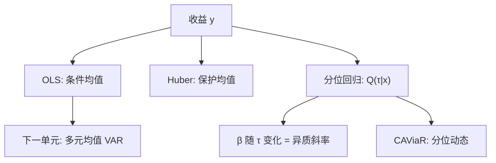

# 分位回归

条件均值被少数极端收益拽着走；改成最小化非对称绝对损失，估的就是条件分布的指定分位，尾部可以有自己的斜率。

<footer>—— Koenker and Bassett, Regression Quantiles, Econometrica, 1978</footer>

[稳健回归](/quant/robust-regression-outliers) 用有界 $\psi$ 保护**均值斜率**不被离群绑架。若问题本身是「跌的时候 $\beta$ 是否更大」「VaR 怎么随因子变」，对象就不是均值。Koenker 与 Bassett 的分位回归最小化 check 函数 $\rho_\tau(u)=u(\tau-1_{u<0})$，得到 $Q_{y|x}(\tau)=x^\top\beta(\tau)$。Engle 与 Manganelli 的 CAViaR 把分位写成动态。本课是「在金融数据上做回归」这一课序的最后一课：均值、稳健均值之后，**把斜率写成 $\tau$ 的函数**。下一单元从截面/单方程转到多元时间序列，第一课 VAR 接的是：分位仍是单方程，共同动态要系统估计。

## 问题

OLS 估 $E[y\mid x]$。收益分布偏斜、峰度高，$E[y\mid x]$ 对风控与「大多数日子」的定价都不必是对的对象。指定 $\tau=0.05$ 估的是条件左尾，$\tau=0.5$ 是条件中位数（对离群比均值稳）。问题是 $\beta(\tau)$ 是否随 $\tau$ 变：若只是截距变、斜率不变，则只是位置族；若高 $\beta$ 股票的左尾更陡，那是杠杆或下行风险，均值回归看不到。

金融应用：特征对收益分位的截面（「小盘的左尾是否更厚」）、对冲比在压力分位、以及 CAViaR 一类 VaR 动态。对象不是再洗一次离群，而是**承认异质斜率**。

### 与 GARCH、分位的分工

GARCH 给条件方差，再乘高斯或 t 分位，得到 VaR——尾部形状绑在创新分布上。分位回归直接估尾部，少一层分布假设，但缺波动方程的结构，样本外可以更噪。Engle–Manganelli 把分位自回归化，介于两者之间。本课先静态（或带少量滞后）的 Koenker 装置；波动动态仍以 [GARCH](/quant/garch) 为默认均值–方差层。

中位数回归是 $\tau=0.5$ 的特例，对对称同方差并不比 OLS 有效，但对污染更稳。它不是「更好的 OLS」，是不同泛函。

## 方法

**估计。** 线性规划解 $\min_\beta\sum_i\rho_\tau(y_i-x_i^\top\beta)$。标准误：Koenker 的核密度估计（需密度在分位处为正）、或配对/野生自助。异方差下斜率随 $\tau$ 变是特征不是 bug。面板可用固定效应分位（有偏、要校正）或对每月截面做分位再看 $\beta_t(\tau)$ 的时间序列——后者更接近 FM 的分位版。

**检验。** $\beta(\tau)$ 在若干 $\tau$ 是否相等（斜率齐性）。拒绝则均值斜率是各分位的混合物。多重 $\tau$ 要管同时推断。

**CAViaR。** $VaR_t=\beta_0+\beta_1 VaR_{t-1}+\beta_2|r_{t-1}|+\cdots$，用命中的命中率与动态分位检验（Engle–Manganelli）评估。它是风控课的桥，本课只点到：分位可以有自己的 GARCH 式记忆。

### 截面资产定价的分位

对 $\tau$ 扫描特征斜率，常见「左尾更陡」。须聚类与 winsor 纪律仍在：分位对顺序统计量敏感，极薄的 $\tau=0.01$ 在 $N=500$、$T=1$ 的某月没有对象。应用 $\tau=0.1/0.9$ 或多年混合，并报告有效样本量。不要把分位斜率叫风险价格 $\lambda$——$\lambda$ 是均值定价的对象，见 FM。

## 机制

check 函数的次梯度在零处不平衡：负残差权重 $\tau-1$，正残差权重 $\tau$，解处正负残差的加权个数平衡。这样 $\tau$ 分位的定义从无条件搬到 $x$ 条件。机制不依赖误差正态，但要求条件密度在该分位附近非零，否则 $\beta(\tau)$ 识别弱（平坦损失）。

与稳健回归：Huber 仍瞄中心趋势（近似均值）；分位瞄指定 $\tau$。把 $\tau=0.5$ 当稳健均值可以；把 $\tau=0.05$ 当「稳健 OLS」则对象错了——你已经在估尾部。

分位回归不是把样本按 $y$ 分成两段再 OLS。那会有选择偏差（$y$ 是结果）。Koenker 的最优化没有按 $y$ 截断样本。

### 到 VAR 的交接

本课仍是单方程 $y$ 对 $x$。若 $x$ 也是内生收益，分位斜率没有结构脉冲含义。下一课 [VAR 与脉冲响应](/quant/var-irf) 把多个序列的条件均值写成系统，识别来自冲击正交化。分位 VAR 存在，但先把均值 VAR 的识别陷阱讲清，再谈尾部系统。

## 边界与工程取舍

交叉分位（$\tau$ 很近）的 $\hat\beta(\tau)$ 强相关，图上看着「平滑变化」可能是同一噪声。极端 $\tau$ 与极值理论是另一套，分位回归不是 EVT。工具变量分位（Chernozhukov–Hansen）在金融几乎比均值 IV 更弱识别，不要默认。

工程：均值 OLS + 中位数 + $\tau=0.1/0.9$ 并列；标准误自助。风控用 CAViaR 或 GARCH 分位，须回测命中。不要用分位回归替代 [Stambaugh](/quant/stambaugh-bias) 修正——持续预测元的偏误在分位里同样可以出现。本单元结束；时间序列续从多元均值动态起。

## 小结

- 分位回归估条件分位斜率，尾部可以与均值不同；中位数是其稳健特例。
- 与 GARCH 分工：一个直接估尾部，一个经方差与创新分布间接得到分位。
- 标准误与齐性检验、有效样本量在极端 $\tau$ 上必须报告。
- 单方程分位没有结构脉冲含义；系统动态交给 VAR。
- 出处：Koenker and Bassett, *Econometrica*, 1978；专著 Koenker, *Quantile Regression*, 2005；CAViaR 见 Engle and Manganelli, *Journal of Business & Economic Statistics*, 2004。
