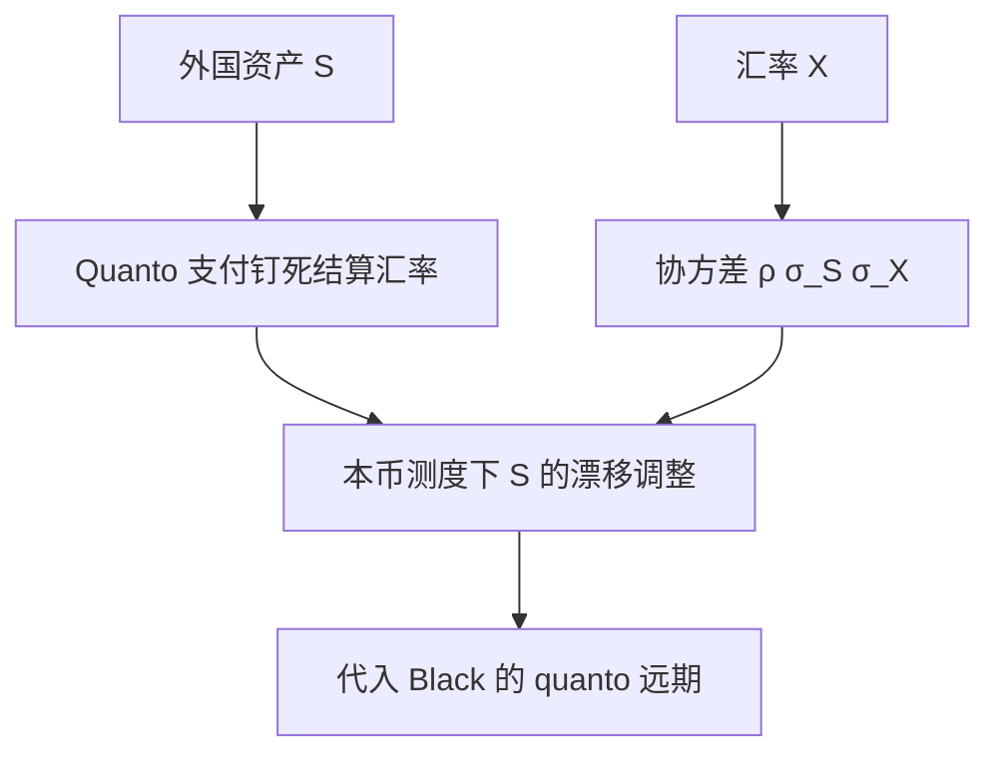

# quanto

Quanto 用外国资产当标的、用本国货币固定数量结算；定价要把外汇与标的的协方差从漂移里减掉，而不是事后用即期汇率折算。

<footer>—— Reiner, Quanto Mechanics, Risk, 1992</footer>

[上一课](/quant/basket-rainbow)的多资产还在同一计价货币里。Quanto 的缺口是**支付货币与标的货币脱钩**：例如日经用美元按固定汇率结算，投资者不承担日元兑美元的兑换，却仍承担日经自己的风险。后课远期起始仍回到单货币；这里先把测度变换里的 quanto 调整写进漂移。

## 问题

普通外国股权期权：在外国测度下用外国利率定价，再把本金用随机 FX 换成本币——投资者同时暴露于股权与 FX。Quanto 把结算汇率钉死（或按预先约定的数量把外国支付换成本币），FX 路径不再进入支付，但**定价核仍依赖 FX**，因为本币测度下外国资产的漂移被协方差修正。漏掉这项，等于用外国 Black 公式再乘固定汇率，对相关的符号完全没暴露。

记外国资产 $S$（外币），汇率 $X$（外币的本币价格），Quanto 看涨支付 $X_0^{\mathrm{fix}}\bigl(S_T-K\bigr)^+$ 本币。风险中性（本币）下 $S$ 的漂移不再是 $r_f-q$，而要减去 $\rho\sigma_S\sigma_X$（约定随 $X$ 定义而变号）。问题是把这条调整当成一等参数，而不是当「FX 台的事」。

### 调整是测度，不是事后乘汇率

支付里没有随机 $X_T$，并不表示 $S$ 的本币贴现价格自动是外国远期。本币计价的可交易资产是 $XS$（外国股票换成的本币价值）。Quanto 合约复制的是「外国期权、但用本币现金结算」，要对 $XS$ 与 $X$ 同时对冲，残差落在 $\mathrm{d}S\,\mathrm{d}X$ 的二次协变。Reiner 的 quanto mechanics 就是把这层协变收进 Black 的远期。

变号来自汇率报价惯例：USDJPY 与 EURUSD 哪个当 $X$，决定 $\rho$ 的经济含义。实现必须把「外币升值」与「$X$ 上升」对齐，不能从彭博票据代码猜。

## 方法

GBM、常数相关：把外国远期换成 quanto 远期 $F^{\mathrm{q}}=S_0 e^{(r_f-q-\rho\sigma_S\sigma_X)T}$，再走 [BSM](/quant/bsm)/Black。波动仍用外国资产自己的 $\sigma_S$（在此模型下），不是本币资产 $XS$ 的波动。有微笑时，外国香草曲面给出 $S$ 的边际，FX 曲面给出 $X$ 的边际，缺失的是 $S$ 与 $X$ 的相关微笑——市场很少直接报，通常用历史相关加压力，或从 quanto 产品自身反推。

对冲：Delta 对 $S$（在外国市场），Delta 对 $X$（quanto 调整项对 FX vol 与相关也敏感），以及外国期权的 Vega。不能只对冲本币指数期货，除非该期货本身就是 quanto。

## 机制

本币现金是计价。外国资产的本币价值 $XS$ 在本币测度下以 $r$ 增长（再扣股息）。Ito 展开 $\mathrm{d}(XS)$ 含 $\rho$ 项。Quanto 支付只含 $S$，相当于把 $X$ 冻在常数上，复制时必须卖掉 $XS$ 里 $X$ 的那部分暴露，剩下 $S$ 的漂移就被 $\rho\sigma_S\sigma_X$ 挪动。相关为正（资产涨时外币升值）时，quanto 看涨相对「外国期权×固定汇率」更便宜或更贵，取决于你如何定义 $X$；经济上是：结算不给你 FX 的顺风，定价核要事先扣掉。

## 边界

常数相关、GBM 是教学闭式。股权微笑、FX 微笑、相关的期限结构都会让 quanto 调整变成一个曲面而不是一个数。分红、借券、外汇远期点差与 [NDF](/quant/ndf) 市场都会进入 $F^{\mathrm{q}}$。境内用人民币结算的境外标的、以及沪深港通下的结算安排，制度不同，不要把 Reiner 公式直接当 A 股 quanto。

本课不重写 [交叉汇率三角](/quant/fx-triangle) 的无套利。Quanto 是衍生支付约定，不是即期交叉盘。

## 小结

- Quanto 结算货币与标的货币脱钩；支付无随机 FX，定价核仍有 $\rho\sigma_S\sigma_X$ 漂移调整。
- 闭式是把 Black 远期换成 quanto 远期；对冲仍要对 $S$ 与 $X$。
- 相关的符号必须与汇率报价惯例对齐。
- 出处：Reiner, *Risk*, 1992。
