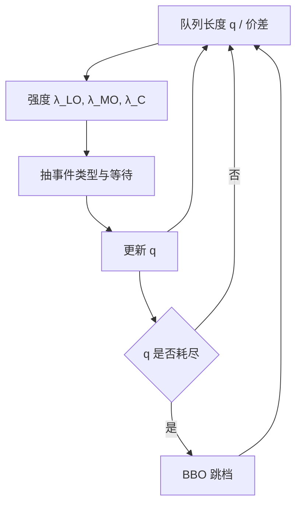

# Queue-reactive 模型

限价到达、市价消耗与撤销的强度不是外生常数，它们会看着当前队列有多长再决定要不要再挂、要不要撤、要不要吃——簿的状态在改写自己的生成速率。

<footer>—— Huang, Lehalle and Rosenbaum, Simulating and analyzing order book data: The queue-reactive model, JASA, 2015；后续校准与仿真见 Huang, Rosenbaum and Saliba</footer>

[排队与成交概率](/quant/fill-probability) 已经指出：成交强度若只写成距离中间价的 $\lambda(\delta)$，会把队列长度平均掉。Queue-reactive（队列反应，QR）模型把这句话做成可估计的马尔可夫动力学：在价格网格上，每一档的增、撤、市价强度是**当前队列大小**（以及是否为最优档、价差状态）的函数。Huang、Lehalle 与 Rosenbaum（2015）用这个结构去拟合与仿真限价簿；Huang、Rosenbaum 与 Saliba 后来把它推进到更完整的重建与现实感检验。本篇写状态如何进入强度、如何与 [Hawkes 订单簿强度](/quant/hawkes-lob) 分工，以及仿真能回答什么、不能代替什么。它描述的是可见簿的统计生成器，不是一份挂单脚本。

## 问题

Cont–Stoikov–Talreja 的生灭簿把各档到达当成泊松，强度可以依赖价差，但常常不依赖「这一档现在堆了多少」。经验上这不够：最优买档已经很厚时，新的买限价会减少、撤销会增加，因为时间优先下再挂只能排到队尾，等待期权变贵；档位被打薄时，补量会涌进来，做市与被动执行都在抢重新出现的队头。强度若与状态脱节，仿真会在几分钟内堆出不真实的深度，或把 BBO 抽成常空。

第二个问题是价格如何走。纯队列模型若不允许价位出生与死亡，中间价不会动。QR 把「某侧最优档耗尽」写成价格跳一档，并把新的最优档初始化为某种深度分布。于是队列长度既决定微观事件速率，也通过耗尽决定中点路径。需要估计的不是一个 $\lambda$，而是一族 $\lambda(q,\text{side},\text{spread},\ldots)$。

### 状态依赖的强度而不是常数泊松

记某侧最优档队列长度为 $q$。三类事件的强度写成 $\lambda^{\mathrm{LO}}(q)$、$\lambda^{\mathrm{MO}}(q)$、$\lambda^{\mathrm{C}}(q)$（限价、市价、撤销）。典型形状是：$q$ 大时限价到达下降、撤销上升；市价强度对 $q$ 可以非单调——太厚则瞬时冲击小、愿意吃，太薄则可能改挂。价差大于一 tick 时，人们更愿意用限价去改善报价，市价强度下降。这些函数用直方图或对数线性模型从 [L2 / L3](/quant/l2-l3-data) 事件里估计，按开盘、午间、收盘分段，因为日历体制会进入基线。

「反应」指强度对状态的即时依赖，不是价格对信息的理性反应。QR 是约化的统计模型：它不区分知情与否，只要求给定当前队列，下一次事件的类型与等待时间可校准。把 $\lambda(q)$ 解释成信念，超出了识别集。

## 方法

估计走两条常见路。非参数：把 $q$ 离散成整数或分箱，数每个箱子里三类事件的发生次数与停留时间，强度就是计数除以暴露时间。参数：$\log\lambda^{(k)}(q)=\alpha_k+\beta_k\log(1+q)+\gamma_k\mathbf{1}_{\{\text{spread}\gt 1\}}+\cdots$，便于跨股票借强度、也便于放进仿真器。必须用事件时间的暴露，而不是每秒采样一次队列——稀疏时段会低估强度。撤单强度应对「该档上的每单位量」定义，否则厚档因为人多而看起来「撤单次数多」，其实人均未必高。

仿真是 QR 的主要用途：从当前 $(q^b,q^a,s)$ 抽等待时间与事件类型，更新队列，必要时移动价格，再抽下一步。诊断看：价差分布、深度分布、中点波动、以及「薄档存活时间」。只匹配平均深度不够，还要看深度的自相关——若仿真的簿过快均值回复，说明撤销与补量的 $\lambda(q)$ 被估得过陡。Huang–Rosenbaum–Saliba 一线工作强调用真实重建簿做这些边际检验，而不是只看似然。

### 与成交概率、做市强度如何对接

给定自己的位置 $x$ 与档内总量 $q$，市价强度 $\lambda^{\mathrm{MO}}(q)$ 决定队头被消耗的速率，前方撤销强度决定 $x$ 意外下降的速率。QR 给的是**市场**的 $\lambda(\cdot)$，自己的限价是其中一分子。把估计好的 $\lambda^{\mathrm{MO}}(q)$ 直接当作「我挂上去的成交强度」会高估：你增加了 $q$，状态已经变了，而且你通常不在队头。正确的用法是：把 $(x,q)$ 当状态，用 QR 的流去推竞争风险下的填成，见成交概率一文。Avellaneda–Stoikov 里的 $\lambda(\delta)$ 可以从 QR 对 $\delta$ 与典型 $q$ 的平均得出，作为粗控制；精细控制应回到队列状态。

## 机制

时间优先把队列长度变成拥挤税。$q$ 大时，边际限价提供者面对更长的等待和不变甚至更高的逆向选择（价格若走到这一档，队头先被捡走，队尾可能来不及）。于是理性或行为上都会减少到达、增加撤销——这就是 $\lambda$ 对 $q$ 的反应。市价方则把 $q$ 读成即时冲击：厚档更值得吃、薄档更该绕开或改用限价。两侧合在一起，深度被拉向一个统计上的「舒适区间」，而不是扩散成无穷或吸到零。这可以在没有知情交易者的世界里发生，只凭排队博弈。

价格变动的机制是耗尽：连续的市价或撤空把 $q$ 打到零，BBO 跳到下一档。QR 因此能产生看起来像随机游走的中点，其波动来自微观事件，而不是外生布朗。这与信息模型不同：中点跳不必对应信念更新，只要流动性暂时撤了。经验上两种机制叠在一起；QR 负责流动性这一层，要把信息放进去需要让 $\lambda$ 再依赖最近的方向或 OFI，那已经是扩展而不是 2015 年的核心设定。

### 状态反应与 Hawkes 自激不是同一件事

Hawkes 让强度依赖**过去事件的时间**；QR 让强度依赖**当前队列**。一笔大市价会同时做两件事：在 Hawkes 里留下核的余震，在 QR 里把 $q$ 打薄从而改变 $\lambda(q)$。短窗里二者难分。识别上：若控制住 $q$ 之后事件仍成串，还有自激；若给定 $q$ 后等待时间接近指数，则 QR 可能已经够。研究上应先估计 QR，再在残差点过程上看 Hawkes，而不是把两种强度线性相加却不讨论共线。互激与核矩阵见 [多元 Hawkes](/quant/multivariate-hawkes)。

隐藏量让可见 $q$ 不是真实可成交量。QR 在可见簿上校准，仿真会低估冰山对市价的吸收、高估打穿概率。这是数据层次问题，不是把 $\lambda(q)$ 改成更陡能补上的。

## 边界

QR 通常是一档或两档的马尔可夫压缩，远处档位要么忽略要么用更粗的状态。大单打穿多档时，真实路径依赖中间档的缺口，模型若只盯 BBO 会低估瞬时冲击。强度函数在涨跌停、拍卖、开盘集合竞价失效，必须按制度切断。估计窗口若跨过公告，会把外生脉冲写进 $\lambda(q)$，使薄档看起来永远危险。

不要把仿真路径直接当回测对手方：真实里你的单会改变 $q$，从而改变别人的 $\lambda$，这是执行的闭环；开环 QR 把市场当背景。也不要把 QR 当成最优挂单：它给出环境的统计，[Cont–Kukanov–Stoikov 最优挂单](/quant/cks-optimal-placement) 才在给定填成与冲击下选价位。参数在股票之间不可随意搬运——tick 与 ADV 不同，$q$ 的尺度就不同，至少应按 tick 与中位深度标准化。

Saliba 等后续工作关心的是：用 QR 生成的簿是否在更高阶统计（自相关、冲击曲线、价差寿命）上像真的。仿真「看起来像」不等于交易「可以当真」。任何策略评估仍要在真实事件回放上做闭环。

## 小结

- Queue-reactive 让限价、市价、撤销强度依赖当前队列与价差，使深度有统计上的均值回复。
- 估计要用事件暴露时间；仿真要检验深度分布、价差与中点波动，而不只是平均 $q$。
- 成交概率应在 $(x,q)$ 上用 QR 的流去推，不能把 $\lambda^{\mathrm{MO}}(q)$ 当成自己的填成强度。
- 状态反应与 Hawkes 自激可同时存在，应在控制 $q$ 之后再谈核。
- 隐藏量、多档打穿、制度时段与开环仿真，构成把 QR 当数据生成器的边界。
- 出处：Huang, Lehalle and Rosenbaum, *JASA*, 2015；Huang, Rosenbaum and Saliba 对队列反应模型的后续校准与仿真。
