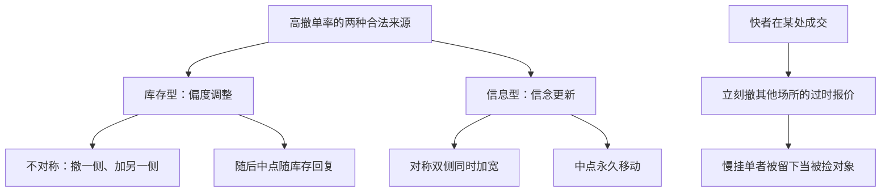

# 报价与撤单博弈

电子簿上大多数限价单不会活到成交。撤单与改价是策略，不是系统故障：它缩短被捡窗口，也制造别人必须应对的闪烁深度。

<footer>—— Hasbrouck and Saar, Technology and liquidity provision: The blurring of traditional definitions, Journal of Financial Markets, 2013</footer>

[隐藏流动性](/quant/hidden-liquidity-theory)改变事前可见量。缺口是时间维：可见的报价可以在成交前被撤走。Hasbrouck 与 Saar 记录低延迟环境下订单寿命变短、传统「挂单=提供流动性」被模糊。Foucault、Kozhan 与 Tham（2017）把有毒套利与过时报价的撤单竞赛写进理论。本课写撤单作为均衡策略，不为后文报价填塞预支操纵定义。

## 问题

Foucault 的限价是一份直到下一期才被捡的期权。若允许连续撤单，期权寿命变成选择变量：寿命短，被捡降、非执行升，且必须付消息与排队重置成本（FIFO 下改价常等于撤旧加新）。问题是最优寿命与最优报价如何联立，以及当许多人高频撤单时，可见深度还有没有 Grossman–Miller 意义上的「在场」。

另一面：你的撤单是别人的状态冲击。虚假的厚深度诱使市价进入，随即撤走，对方打穿。这在后文幌骚课会升级为操纵意图；本课先承认即使没有操纵意图，理性被捡规避也会产生极高撤单率。

### 快相对慢挂单者

van Kervel（2015）等强调多市场：快的人在一处成交后立刻撤其他场所的报价，慢的挂单被留下当被捡对象。撤单博弈因此是速度博弈。Budish 的狙击是同一结构的吃单侧；本课是挂单侧的对称动作——谁先撤过时报价。

统计上撤单率高不等于市场「假」。许多撤单是做市商把库存偏度或信念更新写进报价。要用随后是否重新挂在附近，区分更新与一去不返的撤退。

「被捡」（pick-off）就是你的挂单在消息落地后还没来得及撤，被更快的对手按过时价格成交——例如指数公告利空后，你挂在旧价的买单瞬间被人吃走。撤单博弈的核心动作，就是把这个「被捡窗口」压到最短。

## 方法

把限价寿命 $\tau$ 放进上一课的效用：$\pi(\tau)$、被捡 $E[V\mid\mathrm{fill},\tau]$ 都随 $\tau$ 变。消息强度高时最优 $\tau$ 缩短。技术降低改价成本，均衡寿命下降，成交/消息比下降。Hasbrouck–Saar 称之为流动性供给定义的模糊：大量订单从不意图等到自然成交。

均衡反馈：若所有做市商 $\tau$ 极短，市价单面对的有效深度下降，有效价差上升，又会吸引更短 $\tau$ 的人用速度赚钱。这是军备竞赛的挂单版，频繁批量拍卖课将从设计上切断。

### 与库存偏度的关系

Ho–Stoll 的偏度可以通过撤一侧、加另一侧实现。高频下这表现为一侧闪烁。信息更新同样表现为双侧同时撤再重挂更宽。经验分离：库存型撤单不对称且随后中点随库存回复；信息型撤单对称加宽且中点永久移动。

## 机制

撤单把「在场」从存量改成流量。Grossman–Miller 的 $M$ 个做市商在场，变成 $M$ 个愿意在未来 $\tau$ 毫秒内在场的过程。冲击 $z$ 来时，若 $\tau$ 短于冲击被识别的时间，暂时折让可以变得极大——供给在需要它时消失。这是后文做市义务与闪电崩盘的理论接口。

经验上区分这两类撤单有实操价值：库存型撤单不对称、且中点随后往回走，可以当作报价宽度的暂时性处理；信息型撤单对称加宽、中点不回头，此时继续按旧宽度接单就是在接别人不要的尾部。

对 Hasbrouck VAR：报价新息大量来自无成交的改价，信息含量不全在 $q$ 里。只把成交当信息会低估发现速度。报价过程必须进系统，这正是 1991 年文章把报价与成交放在一起的先见。

## 边界

把所有短寿命单叫做操纵，在法律与经济上都过宽。操纵需要误导意图与虚假供给，见幌骚课。交易所的最小寿命、撤单费率、订单消息比限制，是直接对 $\tau$ 征税，会改变均衡，也有把做市赶出明簿的风险。数据档位若只有快照，会完全看不见撤单博弈。

直觉类比：把限价单想成街边摊位，撤单速度就是收摊的快慢。消息一来（隔壁着火），收摊快的人不接烫手生意，收摊慢的摊主只能按旧价成交。技术越先进、改价成本越低，街上摊位的「平均寿命」就越短——这不是故障，是均衡。

回测若假设「当时挂着就能吃到」，在高撤单市场是最常见的幻觉。可成交性必须用事件流与撮合规则重建，不能用 Level-1 快照。

## 小结

- 撤单缩短被捡窗口，也缩短有效在场时间；高撤单率可以是理性做市，不必先贴操纵标签。
- 寿命 $\tau$ 与报价联立，技术降低改价成本会推高消息/成交比。
- 快者撤跨市场过时报价，慢挂单者承担被捡。
- 出处：Hasbrouck and Saar, *Journal of Financial Markets*, 2013；Foucault, Kozhan and Tham, *Review of Financial Studies*, 2017；van Kervel, *Journal of Financial and Quantitative Analysis*, 2015。
