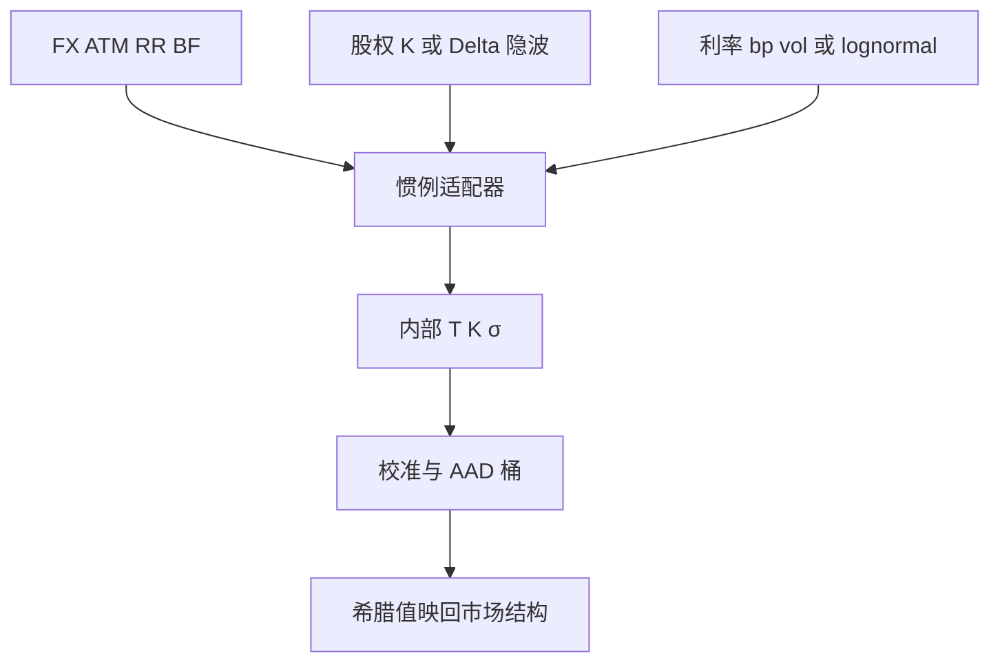

# 报价惯例

同一张曲面，股权按执行价或 Delta 报隐波，外汇按 ATM、风险反转与蝶式报；弄错惯例，校准的是另一个市场。

<footer>—— FX 惯例见 Clark, Foreign Exchange Option Pricing；股权惯例对照 Natenberg 与交易所规则</footer>

[上一课](/quant/calibration-global-opt)把随机波动校准写成非凸：RMSE 接近的谷可以对冲比完全不同，多起点只做粗定位。缺口是校准课默认输入已经是「隐波网格」——网格从哪来。本课把报价惯例钉成坐标：ATM、Delta、年化日历。不重讲差分进化。后课 XVA 与 FX 课序默认已经读完：惯例不是模型，用错 25Δ 会让执行价偏一截。

## 问题

股权指数期权通常报价格或报 Black 隐波，执行价是点数，$T$ 用交易日或日历日因交易所而异。外汇 OTC 报 ATM 波动、25Δ 风险反转、25Δ 蝶式，Delta 还分 pips 与 premium-adjusted、spot 与 forward。把 FX 的 25Δ 当成股权的 25Δ 去取 $K$，执行价能偏一截，校准全部错位。问题是在解析层写清：惯例是**坐标变换**，不是模型。

利率期权还有 lognormal vs normal（bp vol）、年化 365/360、是否用终端互换 Delta。后课负利率会强制 normal/shifted；本课只要求：引擎入口处把所有报价映到内部的 $(T,K,\sigma)$ 或 $(T,\Delta,\sigma)$，并保存原惯例以便对冲单能改回市场语言。

### ATM 有不止一种

ATM spot、ATM forward、ATM Delta-neutral（使跨式 Delta 抵消）在有偏斜与利率时不是同一 $K$。FX 默认常是 Delta-neutral ATM。用错 ATM，RR 与 BF 的分解会把水平成分漏进倾斜。Clark 把这些定义写成公式，实现应以一本惯例手册为准，而不是以交易员口头「ATM 就是平值」。

Premium-adjusted Delta 在高波动、长期限外汇里把 $K$ 往价外推。新兴市场期权忽略这一项，对冲比会系统性偏。

## 方法

内部规范：到期用 year-fraction 的明确日计数；执行价用绝对 $K$；波动用 Black 或 normal 的标签。每个市场写一个 adapter：报价 → 内部，希腊值 → 报价（对 RR/BF 的 Jacobian）。测试：把标准报价换成曲面再换回，应回到价差以内。日历：交易日 vs 营业日、fixing 假期，影响亚式与障碍观察，不只影响 $T$。

对冲单必须用对手的惯例下单：FX 用 RR/BF 结构，不要下三个独立的「25Δ 看涨」。

## 机制

惯例把同一测度下的价格编码成市场喜欢交易的正交组合（水平、倾斜、凸性）。RR/BF 近似 PCA 的第二、第三成分，这就是为什么 FX 校准直接在 ATM/RR/BF 上做更稳。股权若按每个 $K$ 报，正交化要在内部做。弄错惯例等于在错误的主成分上校准，正则化也救不了。

## 边界

交易所规则改 Delta 定义、节假日日历、合约乘数，都会让历史曲面不可比。自动化若缓存「昨天的 25Δ 对应的 $K$」，现货一跳 $K$ 就过期。本课不展开各交易所附录；生产以现行确认书与 ISDA 定义为准。

## 小结

- 报价惯例是坐标，不是模型；ATM 与 Delta 定义必须写死。
- 内部用统一 $(T,K)$，对冲用市场结构的 Jacobian 换回。
- FX 的 RR/BF、利率的 bp vol、股权的 $K$ 网格不可混用。
- 出处：Clark, *Foreign Exchange Option Pricing*；股权惯例见 Natenberg 与各交易所规则。
