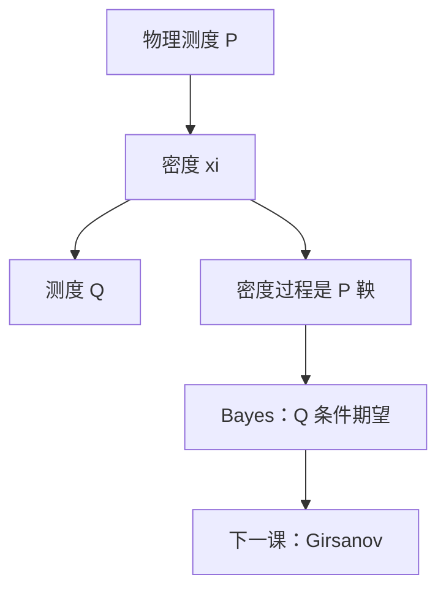

# Radon–Nikodym 导数

若 $Q\ll P$，存在非负可积的 $\mathrm d Q/\mathrm d P$，使 $Q(A)=\mathbb E_P[1_A\,\mathrm d Q/\mathrm d P]$。换测度就是乘上这个密度再归一。

<footer>—— 据 Rudin, Real and Complex Analysis；Karatzas and Shreve, 1991, §3.5；Shreve, Stochastic Calculus for Finance II, 第 5 章整理</footer>

上一课[停时与可选抽样](/quant/stopping-optional-sampling)仍在同一测度 $P$ 下谈公平。缺口是：定价经常要换一个等价测度，使贴现资产变成鞅。换测度的全部信息压缩成一个随机变量 $\xi=\mathrm d Q/\mathrm d P$。本课只定义绝对连续、等价与密度过程，不把漂移怎么改写完——那是下一课 Girsanov。

## 问题

同一可测空间上可以有许多概率。若 $P(A)=0\Rightarrow Q(A)=0$，称 $Q$ 关于 $P$ 绝对连续，记 $Q\ll P$。Radon–Nikodym 定理给出密度 $\xi\ge 0$，$\mathbb E_P[\xi]=1$，且 $\mathbb E_Q[X]=\mathbb E_P[\xi X]$。缺口是把这条定理当成定价运算：期望换测度 = 原测度下乘密度。没有密度，后课「风险中性」只是改写 $\mu$，没有概率对象。

互绝对连续 $Q\sim P$ 要求两边零集相同，从而 $\xi\gt 0$ a.s.，$\mathrm d P/\mathrm d Q=1/\xi$。定价要等价测度，是为了不把 $P$ 下的不可能事件变成 $Q$ 下的正概率套利通道。

### 密度不是似然比的口头禅

统计里的似然比是参数模型下的密度比；这里没有参数，只有两个概率。$\xi$ 可以是路径泛函，例如指数鞅。把它理解成「参数估计的 LR 检验」，Girsanov 的指数会看起来像假设检验，而不是改漂移。

有限样本空间上 $\xi(\omega)=Q(\{\omega\})/P(\{\omega\})$。连续时间只是把这个比换成 $L^1$ 中的极限对象。

## 方法

给定 $Q\ll P$，$\xi=\mathrm d Q/\mathrm d P$。对 $\mathcal F_t$-可测有界 $X$，$\mathbb E_Q[X]=\mathbb E_P[\xi X]$。定义密度过程 $\xi_t=\mathbb E_P[\xi\mid\mathcal F_t]$，则 $\xi_t$ 是 $P$-鞅，且在 $\mathcal F_t$ 上 $\mathrm d Q/\mathrm d P|_{\mathcal F_t}=\xi_t$。Bayes 公式：对 $Q$-可积 $X$，

$$
\mathbb E_Q[X\mid\mathcal F_t]=\frac{\mathbb E_P[\xi_T X\mid\mathcal F_t]}{\xi_t}\qquad(t\le T,\ \xi=\xi_T).
$$

这是后课远期测度、改变计价物时换条件期望的唯一规则。

## 机制

密度过程把「最终换测度」拆到每个 $t$：到 $t$ 为止已经乘上的因子是 $\xi_t$。若 $\xi_t$ 击中零，等价性在中途破坏。指数鞅保持严格为正，所以 Girsanov 常用它。期望恒等式 $\mathbb E_Q[X]=\mathbb E_P[\xi X]$ 把 $Q$ 下的定价改写成 $P$ 下带权模拟——后课蒙特卡洛的测度变换、重要性采样，用的就是同一条。

奇异部分：Lebesgue 分解允许 $Q$ 在 $P$ 的零集上仍有质量，那时没有单一密度能捕捉全部 $Q$。金融主干只用等价测度，奇异换测度不出现。

## 边界

本课不证 RN 定理，不讨论无限维空间上的抽象版本。也不引入状态价格密度与 SDF 的经济学语言——那是资产定价实证课的词，这里只保留概率密度。后课默认：$Q\sim P$ 即存在严格正鞅 $\xi_t$；换期望就是乘 $\xi$。下一课[Girsanov 测度变换](/quant/girsanov-measure)给出布朗运动下 $\xi$ 的具体形状。

## 小结

- $Q\ll P$ 当且仅当存在密度 $\xi=\mathrm d Q/\mathrm d P$。
- 等价要求 $\xi\gt 0$；密度过程 $\xi_t$ 是 $P$-鞅。
- $Q$ 下期望 = $P$ 下乘 $\xi$；条件期望走 Bayes。
- 密度是路径泛函，不是统计检验的口头禅。
- 出处：Karatzas–Shreve §3.5；Shreve SDE II 第 5 章。
