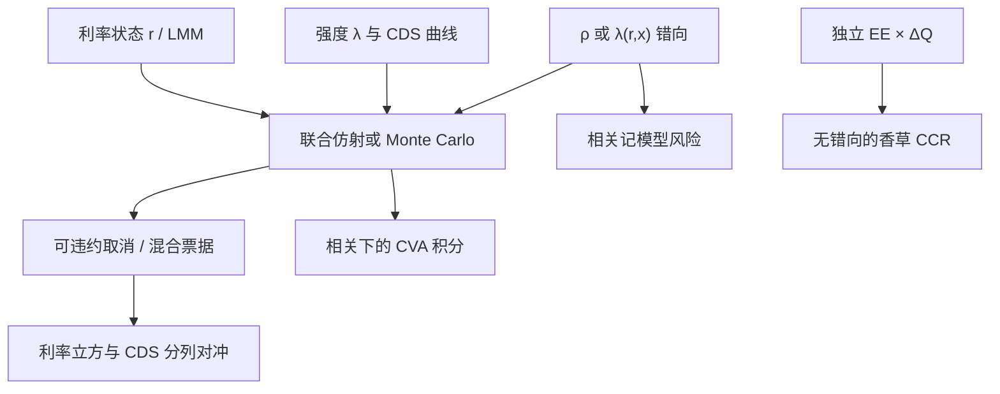

# 利率-信用混合定价

当折现、定盘与违约强度不再可分，互换不再是「无风险利率模型加上一张 CDS 曲线」；必须在同一测度下写出 $r$ 与 $\lambda$ 的联合动态，相关才会进入价格而不是事后加系数。

<footer>—— 对照 Schönbucher 的信用混合论述，以及 Brigo 一脉把短端利率与强度放进同一仿射框架的做法</footer>

[CDS 定价](/quant/cds-pricing) 把保护腿写成生存概率与回收的积分，利率通常以给定的折现曲线出现。[Hull-White](/quant/hull-white) 把曲线动态写成高斯短端，默认没有违约。把两者乘起来——先模拟利率再乘独立的 $Q(\tau>t)$——只在 $r$ 与 $\lambda$ 独立、产品又不是路径依赖的混合结构时成立。可违约互换、带取消的信用联结票据、利率期权嵌信用事件、以及 CVA 的错向，都要求联合动态。本篇写混合模型怎么接、相关出现在哪条期望里，以及它与 [简化形式强度](/quant/reduced-form-intensity)、[两因子短端](/quant/hw-two-factor) 的分工；不重复 CDS 两腿公式，也不把 CVA 字母表再抄一遍。

## 问题

无风险（或 OIS）短端 $r_t$ 决定折现与多数定盘；强度 $\lambda_t$ 决定违约时点 $\tau$。独立时，可违约零息（回收为零）是 $\mathbb{E}[\exp(-\int(r+\lambda))]$，等于把两条仿射曲线卷积。相关一旦非零，不能再把利率期权的价值乘一张生存表。典型产品：（1）对手方可能违约的利率衍生品，暴露 $V_t(r)$ 与 $\lambda$ 共驱动；（2）信用事件截断浮动端或触发本金交换的混合票据；（3）CMS 或取消权与 CDS 挂钩，曲线斜率与信用利差同时进入行权决策。问题不是「再估一个相关系数」，而是选择状态：哪些因子驱动 $r$，哪些驱动 $\lambda$，相关是瞬时布朗相关还是通过共同宏观因子。

第二问题是校准分裂。利率侧有 cap/swaption 立方，信用侧有 CDS 曲线与偶尔的期权。混合相关几乎没有流动性好的香草——CDS 期权对利率的交叉风险报得很少。于是 $\rho_{r\lambda}$ 来自历史、压力或错向备书，而不是来自可对冲的市场价格。把这样一个参数塞进前台，却按可对冲希腊值去解释 PnL，会把模型风险当成市场风险。

### 独立假设在哪些合同上已经作废

普通无抵押固定对浮动互换，若只做单边 CVA 且声明无错向，独立公式仍是市场惯例，见 [CVA 要点](/quant/cva-lite)。一旦对手方是利率敏感行业（房贷、保险公司、杠杆曲线交易对冲基金），或合同本身在信用利差走阔时暴露变大（例如卖出的利率上线、或 CMS 陡峭化在危机里与利差同向），独立假设把联合期望拆成乘积，价格偏低。可赎回公司债更彻底：发行人在利率下降且自身信用尚未崩溃时才取消，行权边界是 $(r,\lambda)$ 平面上的曲线，不能先用 Hull–White 树再乘生存概率。

混合相关的符号要按产品写。对手方 CVA 的错向常常是「利率朝你有利时对方更可能倒」；可赎回债是「利率下行与利差收窄同时发生才取消」。同一个 $\rho_{r\lambda}$ 不能既服务 CVA 又服务债券取消权。

## 方法

**仿射联合。** 令 $r$ 为一因子或 [两因子 Hull-White](/quant/hw-two-factor)，$\lambda$ 为 CIR 或另一高斯短端（位移以保证正强度）。瞬时相关 $\rho$ 打在布朗上。零息与生存债券在仿射下仍有常微分方程：

$$
P(t,T;x)=\exp\bigl(A(t,T)+B(t,T)\cdot x_t\bigr),
$$

$x$ 含利率与信用因子。CDS 用生存与密度的仿射拉普拉斯，按 [CDS 升水](/quant/cds-pricing) 的两腿接到今日曲线：先让确定性平移或时变水平拟合 $P(0,T)$ 与 $Q(0,T)$，再拿波动与 $\rho$ 去贴期权。Schönbucher 强调：强度可以写成利率与其他状态的函数 $\lambda(t,r,x)$，错向被编码在函数形状里，而不只是布朗相关。

**混合产品。** 可违约互换：浮动端在 $\tau$ 之前按合同指数支付，违约时按回收与 close-out 惯例结算；定价是路径上把现金流乘 $\mathbf{1}_{\{\tau>t_i\}}$ 再折现，或用强度补偿把 $\lambda(1-R)$ 加进折现。带取消的混合用二维树（$r$ 一维加 $\lambda$ 一维）或回归 Monte Carlo。CMS 加信用事件：欧式部分仍可用 [CMS 复制](/quant/cms-replication) 得到无信用的调整远期，再在联合模型里乘生存或做首次违约；复制本身不含信用，混合残差必须单列。

**CVA 接口。** 暴露引擎给出 $V_t(r,\ldots)$，强度 $\lambda_t$ 与市场因子相关时，

$$
\mathrm{CVA}=(1-R)\,\mathbb{E}\Bigl[\int e^{-\int r} V_t^+\,\lambda_t e^{-\int\lambda}\,\mathrm{d}t\Bigr],
$$

不能再写成 $\sum \mathrm{EE}(t_i)\Delta Q_i$。这是 [暴露剖面](/quant/cva-exposure-profile) 在相关下的积分形式。实务常做「独立 CVA 加错向乘数/压力 EE」，那是治理选择，不是混合模型已经校准。

### 回收、多曲线与违约时的 close-out

混合价格对回收定义敏感：面值回收、市值回收、ISDA close-out 用无风险还是含 CVA 的替换价格，会改变 $\tau$ 时刻支付，从而改变 $r$ 与 $\lambda$ 的耦合方式，见 [回收率假设](/quant/recovery-assumption)。多曲线下贴现 $r$ 是 OIS，预测是另一条曲线；信用强度通常标定在 CDS 所用的贴现上。把预测曲线的基差再与 $\lambda$ 相关，维度立刻超过可识别范围，常冻结基差、只让 OIS 短端与 $\lambda$ 相关。违约时利率期权的替换价值还依赖当时微笑，混合模型若只有高斯 $r$，会把翼部错向漏掉——这是用 LMM 做暴露、用强度做时钟的动机，而不是用单一 HW1F 扛全部混合。

## 机制

机制是补偿公式与相关定价核。违约是不可料跳时，持有可违约债权的人要求 $r+\lambda(1-R)$ 一类补偿；$\lambda$ 与 $r$ 正相关意味着「折现高的路径上更可能死」，长端可违约债更便宜（利差更宽），利率接收方的 CVA 也可能更大。负相关则相反。结构模型用资产价值同时驱动违约与（若利率进资产漂移）久期，相关内生；简化形式把相关外生放进布朗或因子载荷，换来能拟合整条 CDS 曲线。混合台的日常选择是后者：CDS 必须盯市，资本结构故事留给 [KMV](/quant/kmv-dd) 与 [Merton](/quant/merton-structural)。

行权与取消把相关变成边界形状。利率下降使取消权实值，若同时 $\lambda$ 上升（发行人困境），取消可能被信用截断——持有人收到的是违约回收而不是取消赔付。独立模型会高估取消权、低估信用或有。二维格子上能看见这条边界；一维利率树乘生存表看不见。

风险中性 $\rho_{r\lambda}$ 不是历史利差与互换利率的相关系数。历史相关含风险溢价与流动性。用五年日频相关当定价 $\rho$，再在压力里把 $\rho$ 拨到 1，两套数字必须分列，不能平均进一个「混合相关」。

### 与纯利率、纯信用引擎的边界

纯利率引擎（HW、G2++、LMM）负责香草立方与取消权的利率部分；纯信用引擎负责 CDS 曲线、指数与回收。混合引擎只应在合同真正耦合两者、或错向被交易台承担时启用。把所有无抵押 IRS 都进混合 Monte Carlo，计算成本换不来可对冲的希腊值。相反，信用联结的 CMS、可违约 Bermudan、错向显著的 CCR 净额集，若仍用独立 EE×ΔQ，是把混合风险藏进准备金。

## 边界与工程取舍

不要用债券 z-spread 与互换利率的历史相关直接当 $\rho_{r\lambda}$：z-spread 含 [CDS–债券基差](/quant/cds-bond-basis)。不要在高斯 $\lambda$ 下允许强度为负却继续解释为违约密度。不要把股权结构模型的 $\rho_{V,r}$ 与强度 $\rho_{r\lambda}$ 混用而不转换。校准顺序应为：先锁利率立方与 CDS 生存曲线，再谈相关；用相关去补 CDS 校准残差，会破坏信用对冲。

国内名字往往没有活跃单名 CDS，混合模型的 $\lambda$ 来自映射曲线，相关更不可识别。此时混合 Monte Carlo 的价值在压力情景（利率与利差同向冲击）而不在「精确到基点的混合价格」。报告应给独立价格、相关为零、相关压力三列，而不是一个混合数。

出处是混合定价传统而非单一论文：Schönbucher, *Credit Derivatives Pricing Models*；Bielecki & Rutkowski；Brigo 与 Alfonsi 等把 HW/CIR 与强度仿射联合的工作。利率侧对照 Hull–White（1990）与 Brace–Gątarek–Musiela（1997）；信用曲线对照 Duffie 的 CDS 估值。

## 小结

- 利率-信用混合要在同一测度下联合 $r$ 与 $\lambda$；独立乘积只适用于无错向、无混合行权的合同。
- 仿射联合保留校准 CDS 与零息的能力；相关几乎不可从香草识别，应作模型风险。
- 可赎回信用敏感债、错向 CVA、信用截断的 CMS，行权边界在 $(r,\lambda)$ 平面上，不能先做利率再乘生存。
- 回收与 close-out 惯例会改变耦合；多曲线下优先让贴现短端与 $\lambda$ 相关，基差常冻结。
- 日常引擎应分流：纯利率、纯 CDS、真正混合三套，避免全部合同进联合模拟。
- 出处：Schönbucher；Bielecki–Rutkowski；Brigo 等仿射混合；曲线与 CDS 分别见 Hull–White / BGM 与 Duffie。
