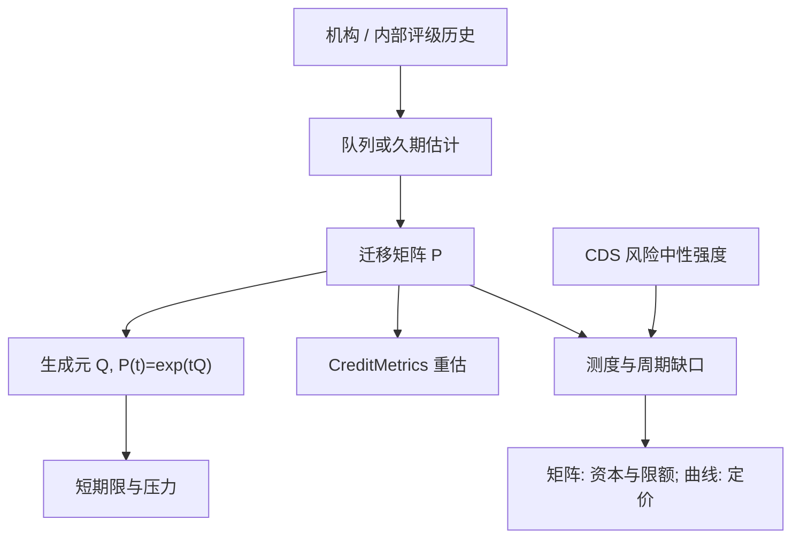

# 评级迁移矩阵

    
信用评级把发行人放进有序状态，迁移矩阵给出这些状态之间的经验频率；它是信用风险的离散地图，不是 CDS 用来贴现保护腿的风险中性强度。

    <footer>—— 对照 J.P. Morgan CreditMetrics, 1997；以及评级机构公布的队列迁移统计</footer>

CreditMetrics 把组合信用风险写成一年后评级状态的分布：升、降、违约，每一格乘以利差重估或 LGD。输入是一张迁移矩阵 $P$，来自穆迪、标普、惠誉的历史队列，或银行内部评级。Duffie 一脉的 CDS 定价用的是连续强度与风险中性测度，见 [CDS 定价](/quant/cds-pricing)。两套对象经常被塞进同一个「信用模型」里：用迁移频率当 $\lambda$，或用 CDS 升水当明年降级概率。本篇写矩阵怎么估、生成元怎么用、周期与惯性会怎样扭曲频率，以及它在定价、资本与限额上各能干什么。

## 问题

设状态为 $\{AAA,\ldots,C,D\}$。一年迁移矩阵 $P_{ij}=\mathbb{P}(S_{t+1}=j\mid S_t=i)$。违约通常是吸收态。问题有三：频率是物理测度上的，含风险溢价的 CDS 不能直接替换 $P$ 的违约列；评级是通过周期（through-the-cycle）的慢变量，危机里违约会远超矩阵的一年违约列；样本稀疏——高等级违约几乎不出现，零频率会被当成「不可能」，生成元与压力必须另做平滑。

队列法（cohort）数年初在 $i$、年末在 $j$ 的比例，简单，但对年内违约再投资、撤出评级（NR）与时间加权不敏感。久期法（duration / hazard）用暴露年数估强度，再转换成矩阵，对稀疏的高等级更合理。Lando 与 Skødeberg 指出评级迁移有惯性与动量：刚降级的名字短期内再降的概率更高，马尔可夫一年矩阵会低估连环降级。

### 通过周期对时点

机构评级刻意平滑周期，以免亲周期地放大融资压力。结果是：$P$ 的违约列在扩张期显得略高、在收缩期远低。时点（point-in-time）内部评级或 CDS 隐含强度会随周期大幅摆动。用 TTC 矩阵做一年交易账簿的 VaR，会在繁荣期偏保守、在转向时不够。用 PIT 矩阵做七年贷款损失，会把当前衰退写成整个期限的均值。资本（IRB）与 IFRS9 对 TTC / PIT 有不同要求，不能共用一张未标注的 $P$。

迁移矩阵的「一年」是日历年或评级观察年，不是风险中性的到期。把 $P$ 的违约列开方到一个月，再拿去给月度 CDS 定价，既错测度也错时间聚合：生成元指数映射不是把违约概率除以 12。

## 方法

**估计。** 队列法给出 $\hat P$。久期法先估生成元 $Q$（行和为零，$Q_{iD}$ 为违约强度），再 $P(t)=\exp(tQ)$。对零计数要做 Bayesian 平滑或指数倾斜，避免高等级「永不到达 D」。撤出评级应有明确处理：排除、按迁移比例分配、或单独一列；不同处理会移动投资级的违约列。

**多期与期限结构。** 一年 $P$ 自乘得到多年，隐含时间齐次。经济周期破坏齐次性，应用宏观条件迁移（Belkin、Wilson 一类 CreditPortfolioView）或把生成元写成宏观因子的函数。与 CDS 曲线结合的正确方式是：迁移给物理测度下的状态分布，定价用风险中性强度；中间的缺口是风险溢价，不是估计误差。

**估值。** CreditMetrics：一年后按新评级对应的远期利差重估债券，违约则按 [回收假设](/quant/recovery-assumption) 抽 LGD。组合层面用信用因子把迁移相关连起来，否则独立迁移会低估共同降级。这个因子结构与高斯 Copula 的系统性因子同族，只是状态是评级而不是连续资产价值。

### 从矩阵到生成元的数值陷阱

由 $P$ 取矩阵对数得到 $Q$，要求 $P$ 可嵌入（embeddable）。经验矩阵常不可嵌入：出现负的非对角生成元，或复数。实务用优化找最近的合法生成元，而不是直接 `logm(P)`。短于一年的迁移必须走 $Q$，不能把 $P$ 的对角开方。长于一年若直接 $P^n$，会把一年里的动量抹平。

## 机制

评级是信息处理的离散化：机构把会计、杠杆、行业与主观判断压成一个符号。迁移矩阵是这个符号的经验动态，不是公司资产的真实过程。市场利差对新闻的反应快于评级，故 CDS 会领先于降级；反过来，评级触发（契约、强制抛售、指数剔除）会在降级日制造额外的价格跳，这是矩阵里「降一级」所不含的市场冲击。主权与公司的迁移统计不宜混用：主权样本更少、重组定义不同，见 [主权 CDS](/quant/sovereign-cds)。

共同迁移来自宏观与行业，也来自机构的方法论周期（一起变严或变松）。把名字写成条件独立、只在评级上相关，会漏掉「同一天被同一份行业观点打到」的厚尾。量化信用组合若用矩阵驱动蒙特卡洛，应在生成元上加系统性冲击，而不是只对每个名字独立抽一行。

内部评级迁移往往比机构评级更 PIT、更频繁。用机构矩阵去验证内部违约频率，或反过来，必须先对齐周期定义与违约定义（技术性逾期对破产）。不对齐会表现为「模型校准失败」，其实是对象不同。

### 与强度模型的正确接口

可以把评级当成强度的协变量：每个状态一个 $\lambda_i$，迁移用 $Q$，违约仍可由状态内强度或直接进入 $D$。这是带协变量的简化形式，不是把 $P_{iD}$ 当成 CDS 的 $\lambda$。校准 CDS 时，仍应用市场升水；矩阵用来做物理测度的情景、评级限额与迁徙资本，而不是替换 [升水曲线](/quant/cds-pricing)。

## 边界与工程取舍

不要用无条件矩阵给高集中度行业做一年违约概率：行业衰退里的条件违约远高于全市场平均。不要忽略 NR 与违约的竞争风险。不要把迁移相关设成股权相关再声称 CreditMetrics 已经「市场化」——股权相关是代理，需与信用因子对账。主权、市政、结构化产品各有各的状态定义，一张「全球 $P$」会把不可比的符号加在一起。

压力测试应移动 $Q$ 的违约列或施加宏观因子，而不是把历史矩阵的 99% 分位当成明年。回测迁移：看分档的实现迁移与矩阵是否校准，而不是只看组合损失——损失还混了利差与回收。工程上矩阵要有版本与生效日，评级行动日与财报日的时点必须与持仓对齐，否则会出现用未来评级解释过去收益的未来函数。

投资级的一年违约列极小，抽样误差可以和估计值同阶。报告「AAA 一年违约 0.00%」是计数不够，不是风险为零。监管与内部限额应对高等级使用置信上界或贝叶斯后验，而不是点估计零。

## 小结

- 迁移矩阵是物理测度上评级状态的经验动态，服务资本、限额与 CreditMetrics 式重估，不是 CDS 的 $\lambda$。
- 队列法与久期法处理稀疏与年内违约的方式不同；生成元用于非一年的期限，直接矩阵对数常不合法。
- TTC 与 PIT、惯性与宏观条件会显著改变违约列；无条件一年矩阵在转折点会失效。
- 与强度模型的接口是协变量或情景，而不是把 $P_{iD}$ 塞进保护腿。
- 出处：J.P. Morgan, *CreditMetrics — Technical Document*, 1997；Lando and Skødeberg 对连续时间迁移与动量的讨论；评级机构定期公布的队列迁移与违约研究；定价侧对照 Duffie and Singleton, *Credit Risk*, 2003。
