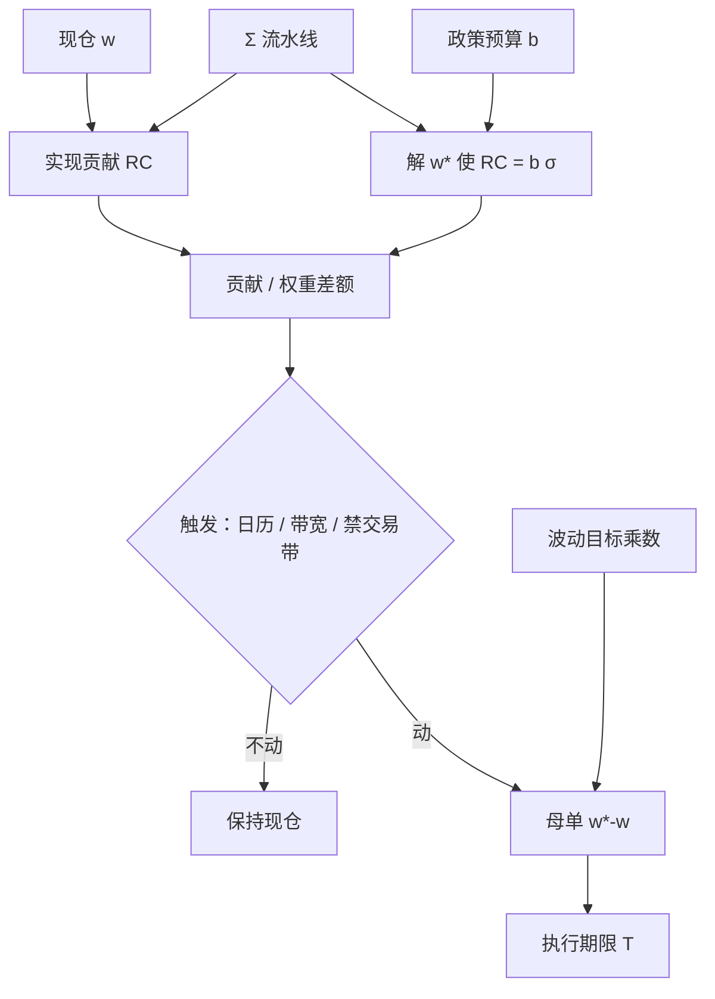

# 风险预算再平衡

    
预算写在欧拉贡献上，而不是写在名义权重上；市场一动，贡献就漂移。再平衡的对象是把已经走偏的风险份额推回去，而不是把市值权重按日历钉回原处。

    <footer>—— 据 Roncalli, Introduction to Risk Parity and Budgeting, 2013；对照 Perold and Sharpe 对再平衡作为动态策略的论述</footer>

[上一课](/quant/bl-views)把观点写成 $P\mu=Q+\varepsilon$：权重目标不是观点，应进约束或参考组合；$Q$ 与 $\Pi$ 必须同一超额与地平。缺口是实施：[风险预算](/quant/risk-budgeting) 给定 $b$ 之后，现仓的欧拉贡献会因价格漂移与 $\Sigma$ 变动而偏离，权重带宽再平衡修的不是贡献空间。本课钉风险预算再平衡：监控什么、何时触发、推回哪一点。不重讲 Idzorek 的 $\Omega$。它不使用 $\mu$，也不保证再平衡本身有正期望。

## 问题

观点表改的是 $\mu$；预算 $b$ 给定之后，贡献仍会被价格与 $\Sigma$ 漂走。记组合波动 $\sigma(w)=\sqrt{w^\top\Sigma w}$，资产 $i$ 的欧拉贡献 $\mathrm{RC}_i=w_i(\Sigma w)_i/\sigma(w)$，政策要求 $\mathrm{RC}_i/\sigma(w)=b_i$。昨日解出的 $w^\star$ 在今日一般不再满足该等式：价格把 $w$ 漂走，$\Sigma$ 的实现也在变。若按市值权重的带宽再平衡，你修的是 $w-w^{\mathrm{policy}}$，而 $w^{\mathrm{policy}}$ 往往只是上一次预算问题的解，不是今天的解。若每天用新 $\Sigma$ 重解预算再全额交易，换手由协方差估计噪声驱动，[价差](/quant/spread-cost)会把「精确的 $b$」变成负的实施缺口。

问题因此有三层。第一层：监控什么——贡献偏离、权重偏离、还是因子暴露偏离。第二层：触发什么——日历、带宽、还是效用增益超过成本的禁交易带，见[再平衡规则](/quant/rebalance-rules)。第三层：推回哪一点——昨日 $w^\star$、今日重解的 $w^\star(\hat\Sigma_t)$、还是只修越界的块。三层选错，投委会看到的「风险预算」与交易台执行的母单会对不上。

### 贡献偏离不是权重偏离的单调函数

单资产波动翻倍、权重不变，该资产的边际贡献上升，预算超支；同时其他资产的相对份额被挤占。两资产相关从 0 升到 0.8，各自权重可仍在带宽内，组合波动上升，块与块之间的「独立风险」消失。反过来，一次大跌把高波动资产的权重打下去，贡献可能暂时回到 $b$ 附近，看起来「不用再平衡」，其实是路径送你回到预算，而不是规则在工作。因此不能用权重的 $5/25$ 带宽代替贡献带宽。贡献带宽必须在 $\mathrm{RC}_i/\sigma$ 或因子贡献上设，并声明 $\Sigma$ 的窗口，否则同一套规则在 EWMA 与月度样本下会给出完全不同的触发频率。

把风险预算再平衡理解成「波动高了就卖」是不完整的。卖的是超支的贡献，买的是欠支的贡献；若超支来自相关而不是来自自身波动，你需要的是降低重叠暴露，而不是对所有高 $\sigma$ 名字一刀切。

## 方法

可审计的流程是：先更新 $\hat\Sigma$（以及因子载荷，若预算建在因子上），再计算现仓 $w$ 的 $\widehat{\mathrm{RC}}$，再决定是否重解 $w^\star$，最后把 $w^\star-w$ 交给执行。重解可以用 Roncalli 的对数障碍型目标 $\tfrac12 w^\top\Sigma w-\sum_i b_i\ln w_i$，或在因子暴露 $x$ 上做预算再映射回个股权重。与等风险贡献的差别只在 $b$ 是否均匀；$b$ 一变，同一套数值器都能用。

触发不要从全样本里搜夏普。日历触发（每周、每月）与报告期对齐，但会在 $\Sigma$ 急变的一周里让贡献长时间超支。贡献带宽 $|\widehat{\mathrm{RC}}_i/\sigma-b_i|\gt \delta_i$ 更贴近政策语言：$\delta$ 应按估计误差校准——窗口短、维度高时 $\widehat{\mathrm{RC}}$ 自己会跳，$\delta$ 太小等于每天在噪声上交易。禁交易带把[交易成本感知](/quant/cost-sensitivity)写进目标：只有预算约束的拉格朗日改善超过往返冲击才动。后一种与 Leland 一类固定成本控制同构，最优集是贡献空间里的一块区域，而不是一个点。

### 交易清单要从贡献空间映回名义空间

设需要把贡献从 $\widehat{\mathrm{RC}}$ 推到 $b\sigma$。一阶上，$\mathrm{d}\,\mathrm{RC}$ 对 $\mathrm{d}w$ 的雅可比依赖 $\Sigma$，不是对角的：交易资产 $j$ 会改变 $i$ 的边际风险。因此「哪一块超支就只卖哪一块」只是对角近似，在高相关块里会超调。更干净的做法是重解带约束的预算问题，得到 $w^\star$，再对 $w^\star-w$ 做换手惩罚或参与率封顶，见[参与率封顶](/quant/participation-cap)。部分推回（只走差额的 $\alpha$ 成）用来抑制 $\hat\Sigma$ 的抖动，等价于对权重做向现仓的收缩；$\alpha$ 应事前锁定，不能在超支扩大之后再加大。

执行层把这份清单看成一组母单：期限 $T$ 由政策节奏决定（日终风险报告前完成，或给到下一再平衡窗），急迫性由贡献超支的幅度与[波动目标](/quant/vol-targeting)是否同时被打穿决定。超支若来自全市场波动跳升，优先缩放总名义（波动目标）而不是大改相对预算；超支若来自某因子拥挤，才在块内调相对权重。两种母单的冲击函数与拥挤状态不同，不应混成一次「调仓」。

## 机制

欧拉贡献是 $w$ 与 $\Sigma$ 的乘积结构。价格运动改变 $w$（相对权重），波动与相关改变 $\Sigma$。风险预算再平衡同时对这两条通道起反应，所以它比恒定混合更「卖波动、买平静」：一块风险变贵时，要减名义才能维持份额。这与风险平价、波动目标的顺周期方向一致——压力里往往在卖，平静里往往在买。Perold–Sharpe 的凹性在这里以风险单位出现：你在高波动时削减暴露，在低波动时加回，震荡市里像在卖保险，趋势性波动扩张时会反复减仓。

估计机制决定你交易的是政策还是噪声。日频 EWMA 让 $\widehat{\mathrm{RC}}$ 跟踪最近几天的平方收益，再平衡频率被短期实现波动绑架；月频样本平滑，但在相关体制切换时反应慢。收缩、因子结构、谱截断都会改变哪些名字被判定为「超支」。没有一份与生产相同的 $\Sigma$ 流水线，回测里的再平衡规则不可复现。

### 与波动目标、权重再平衡如何分工

三个旋钮经常被拧成一个。波动目标管的是 $\sigma(w)$ 的水平，预算管的是 $\mathrm{RC}$ 的份额，权重规则管的是名义构成相对战略配置的偏离。可以只做波动目标、相对权重完全不动（全组合一个乘数）；可以只做预算、总波动随市场走；可以两者都做。工程上应先缩放总杠杆使组合波动回到目标带，再在杠杆调整后的权重上检查块贡献，最后才生成个股母单。次序反了，会在已经要降杠杆的日子里还做大量相对价值买卖，换手叠加，[实施缺口](/quant/implementation-shortfall)双计。

风险预算再平衡的绩效归因必须把「政策块的收益」与「为维持 $b$ 而做的动态交易」分开。后者是一条隐含的卖波动策略，其样本内夏普不能记到价值或动量因子头上。

## 边界与工程取舍

$b$ 含零、允许卖空、贡献可负时，欧拉会计要改：空头预算与多头预算分离，或对 $|w|$ 的暴露预算。尾部风险（CVaR）齐次时也能写预算，但对单次崩盘极度敏感，再平衡会变成对极值样本的拟合，触发比波动预算更剧烈。A 股停牌、涨跌停、T+1 会让 $w^\star-w$ 在当日不可执行，应把不可交易集写成硬约束并允许当日贡献超支，而不是让优化器在剩余名字上硬凑 $b$。

不要用全样本最小化「贡献偏离」来挑选带宽：那是对 $\delta$ 与 $\Sigma$ 窗口的过拟合。应预先按估计方差与容量锁定 $\delta$、$T$、部分推回比例。多账户若共用相似 $b$ 与相似 $\Sigma$，会在波动跳升日同步减同一批高贝塔名字，冲击函数上移，校准于平静日的成本会失效。核对用实现贡献（用事先指定的 $\Sigma$ 定义，不要用事后窗口重估来证明「已经回到预算」）以及再平衡母单的到达价短fall。

$\Sigma$ 必须与风险报告是同一份。研究用日收益、生产用因子模型、再平衡用隐含波动，三套贡献会对三种「超支」，交易台无法审计。

## 小结

- 风险预算再平衡把欧拉贡献推回政策份额 $b$，交易清单由 $w^\star(\Sigma)-w$ 给出，不是市值权重的日历复位。
- 贡献偏离与权重偏离不可互换；相关体制变化可以在权重带宽内造成预算超支。
- 触发应事前锁定：日历、贡献带宽或成本感知禁交易带；部分推回用来抑制 $\hat\Sigma$ 噪声。
- 宜先缩放总杠杆（波动目标），再调相对预算，以免降风险日叠加过多相对价值换手。
- 它本身是卖波动一类的动态策略，归因时不能并进 alpha。
- 停牌、涨跌停与拥挤使当日精确满足 $b$ 不可行，应允许约束松弛并记录超支。
- 出处：Roncalli, *Introduction to Risk Parity and Budgeting*, 2013；Bruder and Roncalli, *Managing Risk Exposures using the Risk Budgeting Approach*, 2012；Perold and Sharpe, *Dynamic Strategies for Asset Allocation*, Financial Analysts Journal, 1988。
