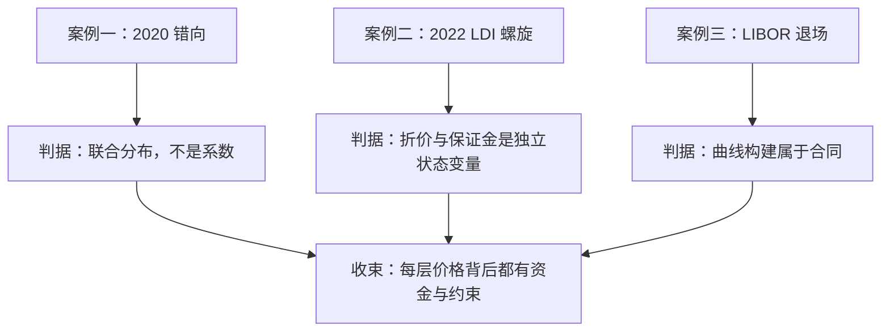
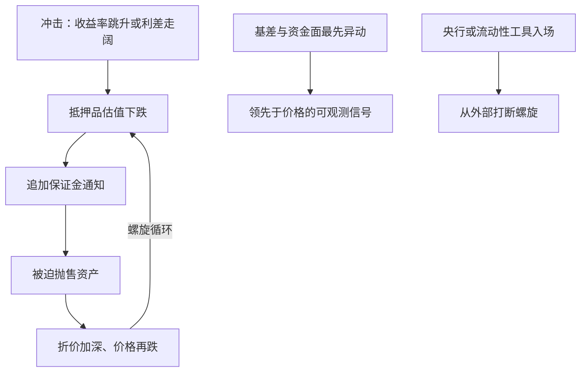

# 利率信用案例与收束

危机是这门课的期末考试：先出题的总是资金与抵押品，及格的标准落在判据上——每个案例都在检验你把价格拆到了哪一层。

<footer>—— 据 BIS Quarterly Review（2020 年 3 月期、2022 年 12 月期）相关评述整理</footer>

[上一课](/quant/rc-regcap-pricing)把监管资本写回了报价，信用与资金单元到此闭环。本课程到此收束：本课用三个案例把利率线（曲线—Swaption—波动）与信用资金线（组合—指数—抵押—XVA—资本）串起来，每个案例停在本课程立过的判据上。

## 问题

案例教学的风险是把故事当知识：听完 2008 与 2022，记住的是情节而不是可复用的检验。本课的问题不是「发生了什么」，而是课程立过的判据能否事前写进引擎与限额。三个案例各考一课：2020 年 3 月考联合分布，2022 年 9 月考抵押品螺旋，LIBOR 退场考曲线的合同地位。判定标准只有一个：判据能否在事前操作化，而不是事后解释。

## 方法

案例一：2020 年 3 月。疫情冲击下利率陡降、信用利差陡升，利率与信用的相关符号翻转。CVA 账簿发现：对手 PD 与暴露同向放大，按独立假设算的 CVA 系统性偏低。检验判据是[利率-信用混合定价](/quant/rates-credit-hybrid)立的：错向进联合分布，不进系数；以及 [CVA 暴露剖面 EPE](/quant/cva-exposure-profile)立的：EE 与 PD 的相关是模拟设定，不是可以事后乘上的折扣。过不了这两条的引擎，2020 年的减值不是黑天鹅，是设定缺陷的兑现。

错向（wrong-way）翻译一下：暴露与对手违约概率同向恶化——市场一动，你手里这份合同更值钱了，可对手偏偏更可能倒，两件坏事叠加，信用损失远比「两者独立」时大。正确做法是把它写进联合分布，而不是事后乘一个折扣系数。

案例二：2022 年 9 月英国。负债驱动投资（LDI）基金用长端 gilt 加回购杠杆匹配养老金负债，收益率上行触发追加保证金，被迫抛售 gilt，收益率再上行——[抵押品与资金链](/quant/rc-collateral-funding)一课的折价—杠杆螺旋在国债市场重演，英格兰银行入场买债。判据有两条：风险上，杠杆的敏感对象是折价与保证金，不只是波动率，[关键期限 DV01](/quant/key-tenor-dv01)的长端桶只回答一半问题；治理上，压力场景必须包含「抵押条款被触发」这条路径——只压收益率曲线、不压折价与追保的压力测试，测不到这次危机。

LDI 螺旋可以想成带杠杆的抢椅子游戏：收益率一升，追加保证金立刻要现金，基金只能在最薄的市场里卖最长的债券，卖压把收益率推得更高，下一轮追保更狠——自我强化的圆圈，直到央行坐进来当最后的买家。

案例三：LIBOR 退场（2014–2023）。无风险利率替代重建了整条曲线体系：贴现与投影分离的多曲线框架（[OIS 与多曲线](/quant/multi-curve-ois)）从权宜变成标准，fallback 利差调整让存续合约平稳迁移，CMS 的凸性调整随构建更换重算（[CMS 凸性调整](/quant/cms-convexity)）。判据是[自举曲线](/quant/curve-bootstrap)立的：曲线构建是合同的一部分——插值坐标、日历与构建集变了，历史时间序列的连续性要人工论证，不能默认。

为什么曲线构建算「合同的一部分」：LIBOR 停报时数万亿美元合约没有自动换锚条款，fallback 利差要逐批谈判。构建集一换，同一天的同名利率会给出不同数值，支付数字随之改变；不加论证就把新旧序列接起来，回测与限额都会悄悄断链。

## 机制

三个案例合起来给出本课程的方法论。其一，价格是分层的：线性形状观点、期权化的分布观点、资金与抵押的成本、资本约束的租金，各层有自己的机制；混层归因会把资金成本记成 alpha（[XVA 的联动](/quant/rc-xva-linkage)）。其二，危机传导走资金链：折价、保证金、基差是最先动的变量，价格是结果不是原因（见[CDS 指数与基差](/quant/rc-cds-index-basis)与抵押课）。其三，判据先于模型：混合定价、暴露剖面、折价敏感度、曲线合同观，每条判据都能在事前写进引擎与限额，事后兑现只是它们的对账。利率线与信用线在最高处汇合：利率波动率的形状由央行日程与均值回复定形，信用组合的尾部由相关与回收定形，而两者最终通过同一条资金链进入同一张报价单——这正是两栏同课的原因。

BIS 对 2020 年 3 月的评述把这轮抛售命名为「dash for cash」：卖出一一切可卖资产以换取现金与保证金；对 2022 年 gilt 事件的评述同样落在杠杆与保证金的结构上。两次的救市工具不同（美元流动性额度与直接买债），病理与判据相同。

## 边界

本课不写危机史：三个案例只取与课程判据相接的截面。归因要防事后偏差：2020 年 CVA 的损失里，错向设定与流动性处置成本要分开记；2022 年 LDI 的规模估计随口径变化很大，引用要带出处与日期。收束之后，波动率交易、结构化产品、金融 ML 与风险体系各有课程，不在此展开。本课程的收束线是一条方法论：把每个价格拆到机制层，再按资金与约束拼回报价单。

## 小结

- 2020：错向是联合分布问题，独立假设的 CVA 在相关翻转时系统性失效。
- 2022：折价与保证金是独立的状态变量，压力测试必须触发抵押条款路径。
- LIBOR 退场：曲线构建是合同的一部分，转换要论证历史连续性。
- 方法论：分层定价、资金链优先、判据先于模型，两线在资金链上汇合。
- 出处：据 BIS Quarterly Review（2020 年 3 月期、2022 年 12 月期）相关评述整理；各条判据出自本课程相应课，见文中链接。
