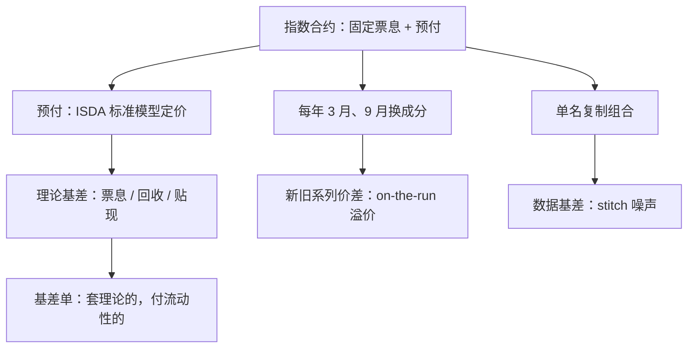
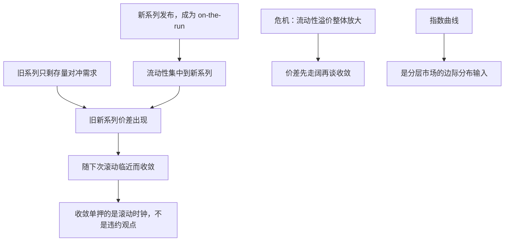

# CDS 指数与基差

指数是一张有自己的票息、生命周期与结算规则的合约，不是一份名单的平均；把「指数利差」当成成员平均来对冲，第一步就把现金流对错了。

<footer>—— 据 ISDA CDS Standard Model 与 Markit 指数规则整理</footer>

[上一课](/quant/rc-credit-portfolio)给出了组合损失分布的语言：一因子 copula、相关与尾部。但损失分布是模型的产出；市场上每天成交的组合信用工具是 CDS 指数——CDX.NA.IG、CDX.NA.HY 与 iTraxx。本课讲指数这台机器的机制：固定票息加预付的报价、半年换成分的生命周期，以及指数与单名、与债券之间各条基差的分解。

## 问题

2009 年「大爆炸」改造后，指数按固定票息成交、差额以预付结清：北美投资级票息 100bp、高收益 500bp、iTraxx 主指数 100bp。报价「指数利差 62bp」的含义不是成员 par spread 的平均，而是使这张固定票息合约的公平预付为零所需的等价利差。缺口由此展开：预付怎么算（用哪个模型、哪条贴现曲线、哪个回收）；每年 3 月与 9 月换成分时，新旧系列为何有价差；指数与成员单名组合之间、指数与债券（见[CDS–债券基差](/quant/cds-bond-basis)）之间的基差各自由什么驱动，哪些可套、哪些是必须付的流动性溢价。

预付翻译一下：票息被固定成 100bp 这种整数，而市场真正要求的是 62bp，这个差不在每年票息里找齐，而是签约当天一次性付清或收清——像标价取整到一百，零头当场找零。预付的正负与大小，就是这张指数合约的全部定价内容。

## 方法

预付与敏感度一律按 ISDA 标准模型算：分段平坦危险率自举（见[CDS 生存曲线自举](/quant/cds-survival-bootstrap)）、固定回收、约定日历——目的不是描述违约物理，而是跨券商对账。机制上，指数现金流等于成员现金流之和，每个成员违约后票息按名义等比扣减；但票息固定、预付一次结清，所以「指数利差」的每一点变动都通过预付结清，久期比同名义的单名组合短，对冲比率要按预付久期折算。基差按来源分账：理论基差来自票息取整、回收加权与贴现曲线的错位，可以算死；流动性基差来自 on-the-run 指数比旧系列与多数单名好卖，是真实溢价的镜子；数据基差来自成员曲线拼接的噪声——不少单名 CDS 几天没有可成交报价，stitch 出来的「平均利差」不可信。可做的基差单：指数对复制组合（吃 on-the-run 溢价）、指数曲线 5s10s、IG 对 HY 的久期中性、旧新系列价差在滚动窗口的收敛。

常见误区：把「指数利差 62bp」当成一百多个成员 par spread 的算术平均去对冲。两者常态相差几个 bp，而且指数因预付一次结清、久期更短；按「成员平均」设对冲比率，每天都会留一块对不上的 PnL，还得靠预付久期重新折算。

## 机制

预付对利差是凸的：利差越宽，预付越接近「面值减回收」。这决定了指数交易的 PnL 结构——carry 是固定票息与等价利差之差按天计提，MTM 是预付对利差的凸函数，归因时两笔必须分开，否则对冲比率系统性偏差。滚动机制是指数独有的时钟：成分按规则换血，旧系列只剩存量对冲需求，on-the-run 溢价常态下是基点量级并随波动状态放大；「新旧系列收敛」交易押的是这个时钟，不是违约观点。分层的定价（[高斯 Copula 与批判](/quant/gaussian-copula-cdo)）挂在这同一张指数曲线上：指数曲线是分层市场的边际分布输入，指数曲线错了，分层账本全错。主权名字是例外（见[主权 CDS](/quant/sovereign-cds)）：回收不确定、重组条款不同，直接套公司基差逻辑会错。

数字实例：常态下 on-the-run 指数比旧系列便宜约 3-5bp，收敛单赚的就是这几 bp；危机里这个溢价可以放大到几十 bp，容量按常态设计的账户会先被逆行打穿。所以基差交易的规模上限，就是流动性基差本身。

CDX 与 iTraxx 各有固定票息（IG 与 iTraxx 主指数 100bp、HY 500bp）与标准到期 3、5、7、10 年，每年 3 月 20 日与 9 月 20 日换成分。成员 par spread 的加权平均与指数等价利差之间常态相差几个基点——这是取整、回收加权与贴现的机械结果，不是套利信号。

## 边界

本课只写指数与单名、与债券的基差，不写指数期权与分层的波动率市场。基差交易的容量上限就是流动性基差本身：收敛的前提是市场机制不变，危机里 on-the-run 溢价会先扩大，谈收敛要等机制恢复。固定回收（IG 40%、HY 20%）与真实回收的偏差在违约高峰期最伤，敏感度要单列。最后，成员名单的规则变化（剔除、兼并处理、流动性排名）会改变指数的历史可比性：时间序列研究要按系列拼接而非按日历，跨系列价差本身就是一个基差，不要当零。

## 小结

- 指数是固定票息加预付的合约，报价利差是预付为零的等价数，不是成员平均。
- 基差按来源分账：理论项可算死，流动性溢价要付，拼接噪声不要交易。
- 滚动时钟创造旧新系列价差，收敛单押的是机制不是违约。
- 指数曲线同时是分层市场的边际输入，主权名字不套公司基差逻辑。
- 出处：据 ISDA CDS Standard Model 与 Markit 指数规则整理；自举与回收见本栏 cds-survival-bootstrap、recovery-assumption 两课。
