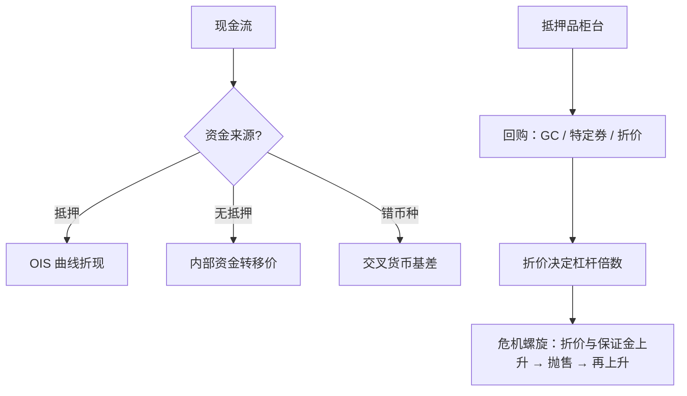
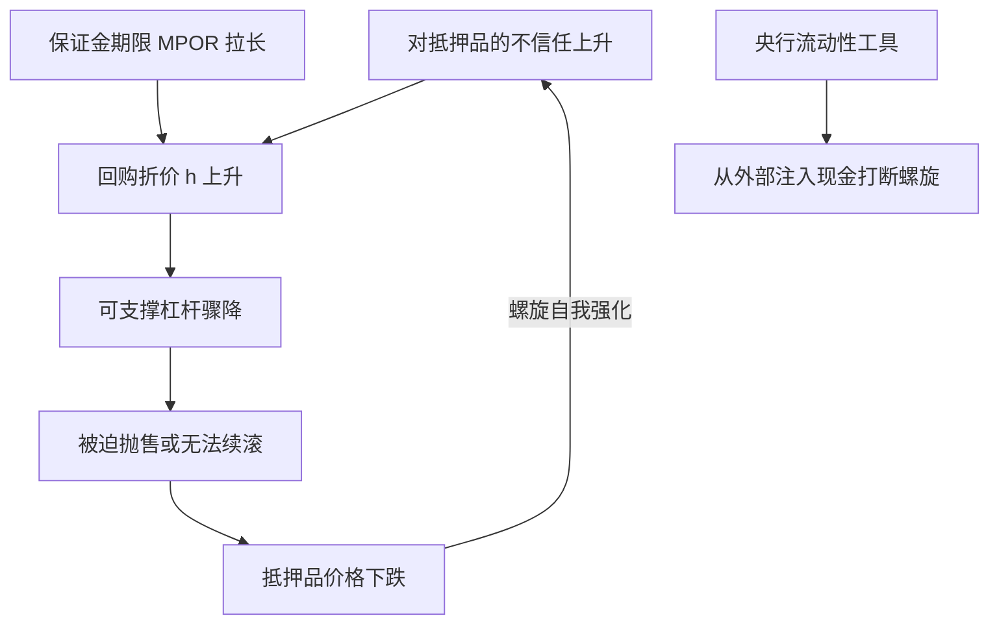

# 抵押品与资金链

影子银行以抵押品为货币：2008 年的挤兑没有走存款窗口，它走的是 haircut 与保证金窗口——折价一升，杠杆一夜蒸发。

<footer>—— 据 Gorton and Metrick, *Journal of Financial Economics*, 2012；Duffie, *Journal of Economic Perspectives*, 2010 整理</footer>

[上一课](/quant/rc-cds-index-basis)把组合信用落到了可交易的指数与基差上。信用侧还差最后一块地基：所有这些合约的资金面。同一笔现金流，在抵押的利率互换、无抵押贷款与交叉货币互换里有三个不同的折现率；同一批国债，在回购市场里今天是现金、明天是保证金。本课讲抵押品如何定价、如何流转、如何在危机里变成传导链，为下一课的 XVA 联动供料。

## 问题

2008 年之前教科书用一条 LIBOR 曲线贴现一切；之后市场分裂：抵押的利率互换贴现到 OIS——因为抵押几乎消除了信用暴露，而抵押品本身生息；无抵押暴露按各自资金成本折现；不同币种、不同抵押品类别之间出现持续不归零的基差，见[OIS 与多曲线](/quant/multi-curve-ois)与[交叉货币基差](/quant/xccy-basis)。缺口是：给定一笔业务，它的资金成本从哪里来——回购利率（GC 与特定券）、折价、保证金期限，如何进入折现与报价；以及危机时这条链如何把价格压力放大成螺旋。

## 方法

定价规则只有一条：每笔现金流按它的真实资金来源折现。抵押衍生品用 OIS 类曲线；无抵押存量用内部资金转移价格；缺合格抵押品时，「抵押品转型」——把低等级资产换成市场接受的抵押——是真实支出，要进报价。回购侧：GC 利率反映整体现金与抵押的松紧，特定券利差反映个券稀缺，[隐含回购利率](/quant/implied-repo)把它与期货定价连起来；折价决定杠杆，$2\%$ 的折价允许约五十倍杠杆，折价升到 $10\%$ 杠杆立减到十一倍——杠杆对折价是一阶敏感。保证金期限（MPOR）决定追保通知与处置之间的时间，直接进入 [MVA 初始保证金调整](/quant/mva-initial-margin)与 SA-CCR 的公式。机构内部要分清三个账户：交易台的资金、司库的存量与抵押品柜台的可动用券，三者价格与期限都不同，混账会让每笔报价的资金成本都对不上。

折价（haircut）翻译一下：借 100 万，债主要你押 102 万的券，那 2 万差额就是折价——市场对「这券明天可能卖不出好价」收的保险费。折价越高，同一批券能借到的现金越少，能撑的杠杆随之缩水。

资金转移价格（FTP）翻译一下：司库像一家「内部银行」，交易台要用无抵押资金，就得按司库公布的内部利率付租。这笔租不写进报价，前台就在免费占用昂贵的资金，报价系统性偏低——很多「赚钱」的盘子和司库一结算就变亏。

## 机制

Gorton 与 Metrick 对 2007 到 2008 年回购市场的测量显示，资产支持证券的回购折价从接近零升到约 $45\%$：违约率没有翻几十倍，跳变的是「对抵押品的不信任」这个状态变量——折价与保证金同时上升，杠杆被动收缩，抛售压低抵押品价格，再推高折价。这就是「对回购的挤兑」，也是 2020 年 3 月现金冲刺与 2022 年英国 LDI 事件的同一骨架，本课程最后一课会回放这两个案例。交叉货币基差是这条链的全局价格：美元稀缺时基差走阔，它把全球资金松紧写进每一个远期外汇与债券组合的报价。抵押品条款本身有信用内容：评级下调触发追加抵押的条款，恰在对手方临近困境时吃紧——这是错向风险的抵押版，留给 XVA 课展开。

交叉货币基差可以想成全球美元的「黑市汇率」：在官方利率之外，大家真金白银换美元时还要额外贴多少。美元一紧张这个贴水立刻走阔，往往比任何官方报告都更早告诉你这个体系里谁缺钱。

折价的杠杆公式：名义除以 $(1-h)$。$h=2\%$ 时约 51 倍，$h=10\%$ 时 11 倍，$h=45\%$ 时不足 2 倍——折价从 2% 移到 10%，等于无声地撤掉八成杠杆，不需要任何违约发生。

## 边界

本课讲双边与回购的链，不展开中央对手方的瀑布结构（见[CCP 违约瀑布](/quant/ccp-default-waterfall)）与清算会员的连带责任。内部资金转移定价的治理——哪个部门承担流动性成本、存款是否补贴贷款——是银行管理会计，不进本课。流动性监管（覆盖率与稳定资金比例）持续抬高优质抵押的需求与基差，属监管资本课的相邻主题，这里只承认其存在。「抵押品中性」的假设在流动性分层的市场里不成立：国债、机构债、公司债、股票作为抵押的能力不同，账面上同为现金等价物的资产，在压力时刻的价格并不同。

## 小结

- 折现曲线跟着资金来源走：抵押用 OIS，无抵押用 FTP，错币种吃基差；一条曲线贴一切的时代结束了。
- 回购折价决定杠杆倍数，折价上升是被动的无声去杠杆。
- 基差是资金稀缺的价格：交叉货币基差把全球美元松紧写进所有报价。
- 折价与保证金的顺周期上升构成挤兑螺旋，是 2008、2020、2022 三次危机的共同机制。
- 出处：Gorton and Metrick, *Journal of Financial Economics*, 2012；Duffie, *Journal of Economic Perspectives*, 2010；多曲线与 MVA 见本栏相应课程。
