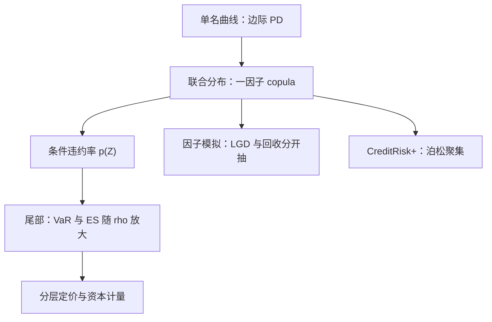

# 信用组合模型

分散化在信用组合的尾部会失灵：当共同因子落下来的时候，所有名字一起倒下；平均损失几乎不动，极端损失却成倍放大。

<footer>—— 据 Vasicek, *The Distribution of Loan Portfolio Value*, Risk, 2002；Li, *Journal of Fixed Income*, 2000 整理</footer>

[上一课](/quant/rc-rate-vol)以利率波动率曲面收束了利率侧三课，本课程从此转入信用与资金单元。单名 CDS 的生存曲线自举（见[CDS 生存曲线自举](/quant/cds-survival-bootstrap)）给每个名字各自的边际违约概率，但组合的问题不在边际而在联合：违约如何相关、损失分布的尾部多厚、把名字换成分层之后价格怎么变。本课讲信用组合模型——从一因子 copula 到因子模拟与精算模型——为下一课的 CDS 指数与基差备好损失分布的语言。

## 问题

组合损失是 $\mathrm{Loss}=\sum_i w_i\,\mathrm{LGD}_i\,\mathbf{1}_{\tau_i\le T}$。边际违约概率由单名曲线给死，缺口全在联合分布：贷款簿要算 $99.9\%$ 分位的资本，CDO 分层要算每层的期望损失，指数期权要算远期分布。独立假设直接错：一百个违约率各 $1\%$ 的名字若相互独立，齐损概率小到天文数字之外；相关一旦上来，尾部齐跌。所以缺口是：如何用少量参数给联合分布定形，并知道每个参数控制的是分布的哪一段。

## 方法

市场标准是一因子高斯 copula（机制与批判见[高斯 Copula 与批判](/quant/gaussian-copula-cdo)）：每个名字一个潜在变量 $X_i=\sqrt{\rho}\,Z+\sqrt{1-\rho}\,\varepsilon_i$，$X_i$ 落到阈值 $\Phi^{-1}(p_i)$ 之下即违约，$Z$ 是共同因子。给定 $Z$，条件违约率
$$p(Z)=\Phi\!\left(\frac{\Phi^{-1}(p)-\sqrt{\rho}\,Z}{\sqrt{1-\rho}}\right),$$
大组合近似下损失分布的分位数有闭式：
$$\mathrm{VaR}_{q}=\Phi\!\left(\frac{\Phi^{-1}(p)+\sqrt{\rho}\,\Phi^{-1}(q)}{\sqrt{1-\rho}}\right).$$
这一个公式同时是 Basel 内评法的资本骨架，监管资本课会回到它。名字有限或要分层的细节时用因子模拟：抽 $Z$ 与 $\varepsilon$，重演整条损失分布，回收率与 LGD 各自抽分布。保险精算一路是 CreditRisk+：违约计数服从泊松、行业因子造成聚集，不建潜在变量。自上而下一路用组合强度过程直接跳过名字。相关的两套来源要分清：从股票或基本面估计的「真实相关」，与从分层价格反推的基相关——后者是报价坐标，不是资产相关的估计。

## 机制

$\rho$ 是尾部的总开关：$\rho=0$ 退回独立，分散化完全有效；$\rho\to 1$ 组合退化为单一赌注，$\mathrm{VaR}_q$ 趋向名义全额。闭式还暴露一个常被忽略的事实：分位点 $q$ 从 $99\%$ 提到 $99.9\%$，要求的资本可以翻倍以上，因为增幅全被 $\sqrt{\rho}$ 放大——「平均违约率很低」与「资本很充足」是两句话。集中度是第二条放大通道：单名或单一行业权重上升时大组合近似失效，要用集中度修正或退回全模拟。回收假设的系统性偏差（[回收假设](/quant/recovery-assumption)一课）在组合层面被再放大一次：违约相关高的时期，回收往往也系统性偏低，PD 与 LGD 独立的假设恰在尾部最不成立。

Basel 内评法把分位点钉在 $99.9\%$，并给资产相关性设定监管值：公司贷款按 PD 在约 12% 到 24% 之间、住房抵押约 15%。监管没有假装知道每家银行的真实 $\rho$，而是用保守分位加统一定标，把不同银行的资本博弈压到同一张表上。

## 边界

高斯 copula 是静态且薄尾的：它给「到某日为止」的联合违约定形，不描述违约的时间到达与传染；把静态惯例外推成损失生成过程，正是 2008 年教训的核心（同上引课的批判）。动态模型——自上而下强度、马尔可夫链式传染——是另一条路线，本课程不展开。基相关只在分层市场活跃时可得，流动性消失时它是没有任何成交支撑的记账。本课不写指数与基差的市场机制，那是下一课；也不写巴塞尔公式的计提细节，留给监管资本课。最后，模型输出是分布不是价格：把 $\mathrm{VaR}_{99.9}$ 直接当转移价格用，混淆了资本计量与定价两个用途，它怎么进报价在监管资本课再谈。

## 小结

- 信用组合的缺口在联合分布：边际 PD 由单名曲线给死，相关决定尾部。
- 一因子高斯 copula 用一个 $\rho$ 控尾部，大组合分位数闭式可写，也是 Basel IRB 的骨架。
- 相关的两套坐标要分清：真实相关是估计，基相关是报价。
- 集中度与 PD–LGD 相关在尾部二次放大风险，独立假设最不成立的地方恰是资本所在。
- 出处：Vasicek, *Risk*, 2002；Li, *Journal of Fixed Income*, 2000；copula 批判与回收见本栏 gaussian-copula-cdo、recovery-assumption 两课。
