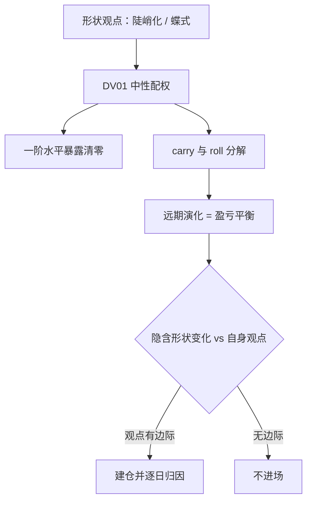

# 曲线策略的深化

曲线交易赌的从来不是收益率水平的方向，而是远期形状不会如期演化；把水平暴露留给对冲，剩下的部分才是你对形状的真实观点。

<footer>—— 据 Litterman and Scheinkman, *Journal of Fixed Income*, 1991；Diebold and Li, *Journal of Econometrics*, 2006 整理</footer>

[上一课](/quant/vt-exotic-risk-map)把波动率交易深化收束在一张奇异风险地图上：翼部、边界与对冲失配逐项入账，波动率一条线到此走完。本课开启「利率与信用深化」课程：先在利率侧走三课——曲线策略、Swaption、利率期权的波动——再转入信用与资金单元。曲线怎么建、风险怎么计量，已由[自举曲线](/quant/curve-bootstrap)、[Nelson-Siegel](/quant/nelson-siegel)与[关键期限 DV01](/quant/key-tenor-dv01)讲清，本课默认你会；这里只问一件事：对形状的观点，怎么变成一笔 PnL 可归因、边界可控的持仓。

## 问题

「五年内会陡」「二年十年会平」「五年点相对便宜」都是形状观点，但执行时你同时在承担两个暴露：水平的与形状的。若两条腿按名义金额而非 DV01 配权，平行上移会让「陡峭化」交易亏成一笔变相的空头久期；若蝶式三腿照抄 1-2-1 的名义权重，中点 DV01 与两翼之和并不相等，你买的其实是一笔斜率加水平的混合仓位。缺口因此不在观点，而在三件事：把观点从水平暴露里剥离的加权方式、把持有收益与形状变化分开的 carry-roll 分解、以及由此得到的进出场判据。

## 方法

第一规则是风险中性而非金额中性：两腿 DV01 相等，$D_1 N_1 = D_2 N_2$，名义比随久期自动倒挂。表达陡峭化时先决定按收益率差还是按远期差报价——后者把滚动收益也押进观点里。蝶式让中腿 DV01 等于两翼之和；1-2-1 只在两翼 DV01 恰好相等的期限组合里近似成立，通常要用 DV01 回归或[曲线主成分](/quant/curve-pca)的残差来定权，[曲线蝶式交易](/quant/curve-butterfly)一课给过基础版，本课强调的是权重选择本身就是观点：DV01 权重押「局部曲率」，PCA 残差权重押「相对因子模型的便宜」。进出场判据来自 carry-roll 分解：若曲线按远期演化，任何 DV01 中性的形状仓位一阶不亏不赚——远期就是盈亏平衡线。所以建仓的正当理由是「市场隐含的形状变化比我的观点保守」，而不是「这形态看起来歪」。

## 机制

carry-roll 能精确分解，是因为[自举](/quant/curve-bootstrap)给出的远期已经把「持有到远期日」的路径写死：持有收益等于票息利差加上沿曲线下滑的 roll，两者由同一组远期决定，不是两笔独立押注。蝶式的 PnL 对水平冲击一阶为零，剩下二阶凸性与曲率变化；这解释了蝶式为什么天然是「凸性加曲率」的组合，也解释了它为什么对折缝敏感——[关键期限 DV01](/quant/key-tenor-dv01)的分桶在这里比平行 01 有用得多。归因时还要把[互换利差](/quant/swap-spread)单独列账：国债蝶式与互换蝶式在危机里方向相反，混在一起归因，会把信用因素误记成利率观点的盈亏。

同一个「五年点便宜」，用 2s5s10s 与 5s10s30s 表达是两笔不同的交易：前者押短中段的折缝，后者押中长段的隆起。两翼 DV01 相等时 1-2-1 名义权重大致成立，但三十年腿久期长，等 DV01 之下名义比常常远离 1:2:1，照抄教科书权重会留下一阶水平暴露。

## 边界

本课不写融资细节：回购成本与互换利差的资金面驱动留给抵押品一课，这里只要求把融资利差从形状观点的盈亏里剔出去。模型上的 rich/cheap 相对 [Nelson-Siegel](/quant/nelson-siegel) 这类参数族而言：参数族表达不了的形状（双隆起、深折缝）会被误判成便宜，要补 Svensson 项或改用分段判据。抵押支持债券对冲盘对中段的持续扭曲是供给不是错价，拿均值回复去赌它会反复止损。最后，DV01 中性只在进场瞬间成立：权重随曲线移动漂移，再平衡的频率是交易成本与形状暴露之间的取舍，没有一劳永逸的中性。

## 小结

- 形状观点必须配 DV01 中性权重，名义权重会把陡峭化变成变相的水平赌注。
- 蝶式权重是观点的一部分：DV01 权重、回归权重与 PCA 残差权重押的是不同对象。
- 远期是形状交易的盈亏平衡线，carry-roll 分解给出进出场判据，不是事后解释。
- 归因要把互换利差、折缝桶与融资成本分开，否则信用与供给会被记成利率观点。
- 出处：Litterman and Scheinkman, *Journal of Fixed Income*, 1991；Diebold and Li, *Journal of Econometrics*, 2006；曲线构建与计量见本栏自举、Nelson-Siegel、关键期限 DV01 三课。
