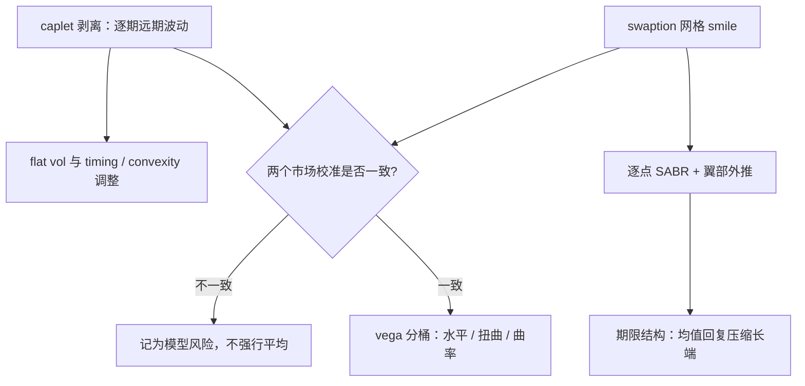

# 利率期权的波动

利率波动率的期限结构是均值回复投在市场里的影子：回复越强、到期越长，利率能到达的范围越窄，长端波动率就被压得越低。

<footer>—— 据 Andersen and Piterbarg, *Interest Rate Modeling*, 2010；Hull and White, *Review of Financial Studies*, 1990 整理</footer>

[上一课](/quant/rc-swaption-deep)解剖了网格上的单点 Swaption：年金计价物、移位报价与日历价差。本课把视角拉远，看整张利率波动率曲面的结构与协同运动：cap 与 floor 的逐期波动、平值波动与远期波动的关系、期限结构的均值回复解释，以及曲面风险怎么映射进交易台的 vega 账本。

## 问题

cap 是一串 caplet 的和：每个计息期有自己的远期利率 $f_i$ 与自己的波动率，整只期权的价值是各期 $\tau_i N (f_i - K)^+$ 的期权值折现求和。市场却常报「flat vol」——整只 cap 一个数——而逐期对冲需要的是每期的 forward vol：用 flat vol 去对冲单期，vega 分布全错。更深的缺口在两个市场之间：caplet 剥离与 Swaption 校准给出的波动率历史上对不上，用一边校准的模型给另一边报价会产生系统性偏差；负利率时代正态坐标成为主流后，smile 的形状习惯也要重看。本课要回答：两层波动率为什么不一致、怎么处理，以及长端波动率为什么被均值回复压低。

## 方法

先分清三层「波动率」：caplet 层的逐期波动、cap 层的 flat 波动、Swaption 层的联合波动。三者之间没有恒等式：caplet 的标的是单个远期利率，Swaption 的标的是互换利率的加权平均，经典处理是 timing 与 convexity 调整，基础见 [caps / floors / swaptions](/quant/caps-floors-swaptions)。曲面建模按切片走：每个「到期 × 期限」点用 SABR 描述 smile（校准细节见[SABR 校准](/quant/sabr-calib)），翼部用受控外推防止负密度，见[SABR 翼部外推](/quant/sabr-wing-extrap)。期限结构交给均值回复：Hull–White 类模型里 $r(T)$ 的方差是 $\frac{\sigma^2}{2\kappa}\left(1-e^{-2\kappa T}\right)$，$\kappa\gt 0$ 时方差有界，长到期波动率因此饱和而非线性增长；校准出的 $\kappa$ 同时控制百慕大行权价值与长端 vega，动它就是动两本账。风险管理上把曲面运动降维：水平、扭曲（短端到期对长端到期）、曲率三个 vega 桶，比逐点 vega 稳定，与[波动率曲面](/quant/vol-surface)一课的分层同构。

## 机制

均值回复压低长端波动不是比喻而是公式：$\kappa\gt 0$ 时 $r(T)$ 的积分方差收敛到 $\frac{\sigma^2}{2\kappa}$，波动率期限结构因此随到期平坦化下行。这个约束反过来限制了能校准出的曲面形状：若市场长端 Swaption 波动显著高于单因子模型允许的范围，说明单因子描述不足，要上双因子或局部-随机混合结构，参考[局部-随机混合模型](/quant/local-stoch-vol)与 [Bergomi](/quant/bergomi) 类多因子框架。caplet 与 Swaption 市场的系统性偏差是结构性的而非噪声：两个市场的参与者与对冲流不同，逐期 strips 的供需、抵押债权的期权化需求各自定价，把两边强行平均会同时错两本账。正态坐标下 smile 变得对称甚至反斜，移位对数正态是过渡期的折中——机制在上一课，这里是它在曲面上的投影。

Joshi and Rebonato（2003，*Quantitative Finance*）的移位扩散随机波动扩展与 Andersen–Andreasen 对 LMM 的移位扩展指向同一件事：负利率下正态坐标不是权宜，而是利率期权 smile 的自然坐标；对数正态 SABR 的 $\beta=1$ 在这里没有解释力。

## 边界

本课讲结构与协同，不讲波动率交易策略与央行日程的博弈——那是波动率交易课程的范围。股票市场的 smile 工具不能整套搬来：[SVI 与 SSVI](/quant/svi-ssvi) 在利率市场的适用性受正态坐标与负利率限制，参数约束要重推。曲面因子降维丢掉局部细节：央行会议日前短端到期的孤立凸起要单独列账，不能摊进三因子。最后，逐点完美拟合会造出不可对冲的 vega 抖动，光滑约束与拟合误差的取舍属于校准正则化问题，[校准正则化](/quant/calibration-regularization)一课有专门处理。

## 小结

- cap 是 caplet 的和：flat vol 与 forward vol 是两层账，对冲单期必须用逐期波动。
- caplet 与 Swaption 波动率来自两个市场，一致性要检验而非假设，不一致就是模型风险。
- 均值回复把长端波动率压向饱和值，期限结构的形状是 $\kappa$ 的影子。
- 曲面风险按水平、扭曲、曲率分桶管理，事件日的孤立凸起单独列账。
- 出处：Andersen and Piterbarg, *Interest Rate Modeling*, 2010；Hull and White, 1990；SABR 系列与校准正则化见本栏相应课程。
