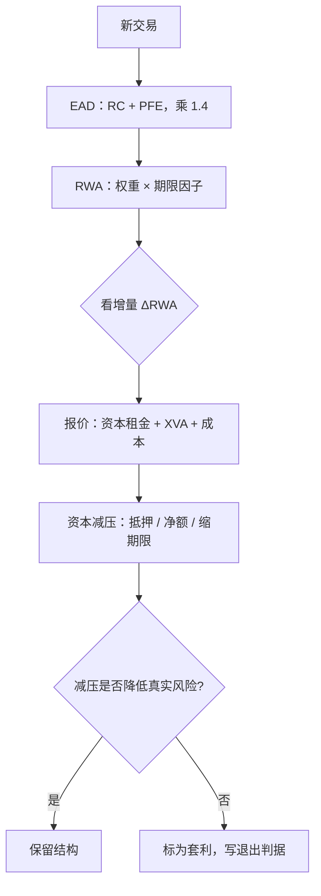

# 监管资本下的定价

监管资本是按公式计提的忧患：你在风险中性世界里算出的正价差，必须在资本约束下再算一遍——回报按占用付租，报价为此让路。

<footer>—— 据 Basel Committee, *The standardised approach for measuring counterparty credit risk exposures*, 2014（SA-CCR）与银行内部资金定价实践整理</footer>

[上一课](/quant/rc-xva-linkage)把 KVA 列为 XVA 家族里最依赖口径的一项：它把资本占用的成本折进价格。本课补齐它的供给侧：监管资本如何按公式产生，产生之后如何写回每笔业务的报价。EAD 与 SA-CCR 的机制已在 [SA-CCR 的 EAD](/quant/sa-ccr-ead) 讲清，本课默认那套记号，只谈定价闭环。

## 问题

一笔衍生品的监管资本等于 $12.5\times\mathrm{RWA}$，RWA 由 EAD、期限与对手权重生成。资本不是免费的：股东要求回报率 $r_e$，充足率 $8\%$ 意味着每元 RWA 每年要付约 $r_e\times 8\%$ 的「资本租金」。缺口是双重的。公式侧：SA-CCR 的乘数、期限因子与对冲识别，如何让同一笔风险在不同组合结构下资本不同。定价侧：边际资本怎么算、摊给谁——摊错的银行会出现「单笔都亏、总体却盈利」或反过来的错觉，前一种误杀好业务，后一种用总盘子掩盖坏业务。

## 方法

公式侧要点：$\mathrm{EAD}=\alpha\,(\mathrm{RC}+\mathrm{PFE})$，$\alpha=1.4$；PFE 加总带一个乘数，净额结算与抵押同时压低 RC 与加总项；保证金式交易的期限因子随保证金期走，未保证金交易随剩余期限走——同一笔五年互换，抵押与否资本差数倍，这是抵押条款的资本价值。CVA 风险资本是第二层：对 CVA 自身的利差风险再计提（基本法、标准法与内部模型三档），与交易账户的市场资本分开记账。定价侧的机制是增量资本分配：新业务对总资本的增量 $\Delta\mathrm{RWA}$ 才是它的真实占用，按名义或按平均权重摊都是错账。要求的价差近似为
$$s \approx \frac{r_e \times 8\% \times \Delta\mathrm{RWA}}{\mathrm{EAD}},$$
再叠加 XVA 与运营成本。资本减压是反向操作：压缩净额集、缩短期限、增加抵押、用指数对冲 CVA 资本；每项都有公式上可验证的减压量与真实风险变化之差——这个差就是监管套利的空间，也是监管修补的时间表。

## 机制

资本定价闭环的机制在反馈：报价影响库存，库存影响资本，资本影响报价。没有增量分配的银行会系统性堆积「资本便宜、账面赚钱」的业务，直到总资本约束爆掉。SA-CCR 取代旧的重置成本法，机制动因正是旧公式对对冲不敏感：两笔反向交易的净风险为零而旧法资本不为零，压缩交易因此成为行业性操作。期限因子把保证金期写进资本：追保频率越低资本越高，这是监管对流动性风险的定价。KVA 与监管资本的分野在上一课已立——定价用哪个，取决于约束是监管硬约束还是管理目标；监管约束下 SA-CCR 的公式值就是硬约束，公式与经济风险之差既是套利，也是未来修补的坐标（XVA 侧的衔接见[到 XVA 的桥](/quant/xva-bridge)）。

量级感：股东回报要求 15% 时，每元 RWA 的年资本租金约 1.2%。租金摊到名义上是多少，取决于 EAD 密度——抵押的五年利率互换 EAD 常只有名义的百分之一二，摊下来不到一个基点；无抵押、长期限的信用衍生品 EAD 密度可达名义的百分之几十，摊下来是几十上百个基点。报价前先算 EAD 密度，再谈基点。

## 边界

本课只走对手信用与 CVA 资本这一条线，不覆盖市场风险 FRTB 与信用、操作风险的完整版图。会计减值（IFRS 9 的预期信用损失）与监管资本是两本账：前者按账面计提影响利润表，后者按公式占用影响资本回报，「拨备充足」与「资本充足」不能互相冒充。辖区差异（欧盟 CRR、美国的过渡安排）只承认存在，不展开。最后，公式优化有边界：监管修补的历史——从重置成本法到 SA-CCR、从 CVA 基本法到标准法——说明套利空间的半衰期以年计，把商业模式建在套利上，要预先写好退出判据。

## 小结

- 资本租金等于回报要求乘充足率，摊到名义上取决于 EAD 密度：先算密度，再谈基点。
- 定价用增量资本；按名义或平均权重摊都是错账。
- SA-CCR 的期限与保证金因子给抵押与压缩交易创造了可验证的减压量。
- 公式与经济风险之差既是套利也是监管修补的时间表，商业模式要写退出判据。
- 出处：据 BCBS SA-CCR（2014、2019 修订）与银行内部资金定价实践整理；XVA 侧见上一课与本栏 xva-bridge 一课。
