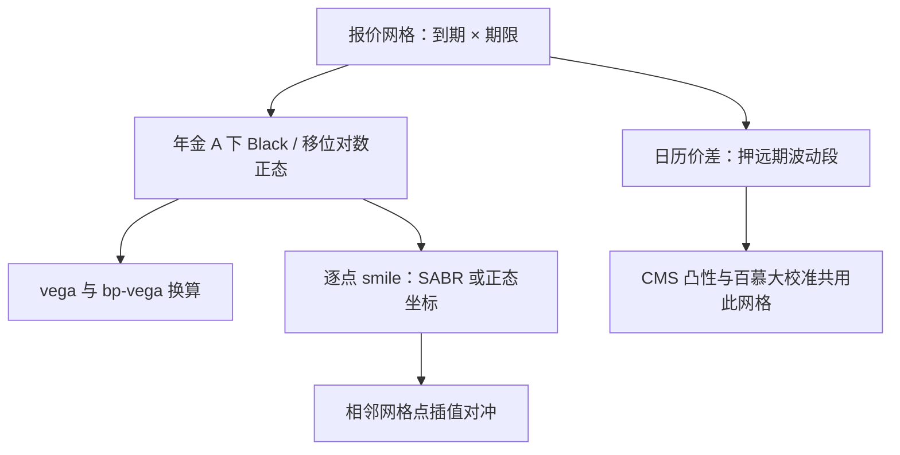

# Swaption 的深化

Swaption 的标的不是债券而是远期起息的互换，其价格是年金计价物下互换利率分布的尾部；把债券期权波动率直接搬来用，第一步就把计价物弄错了。

<footer>—— 据 Rebonato, *Volatility and Correlation*, 2004；Brigo and Mercurio, *Interest Rate Models*, 2006 整理</footer>

[上一课](/quant/rc-curve-strategies-deep)把形状观点做成了 DV01 中性的线性持仓，但线性仓表达不了「未来某时点波动放大」或「利率跌破某水平我才受损」这类凸性观点。本课解剖利率期权的标准件 Swaption：把期权化形状观点的定价、报价与对冲一次讲清，为下一课整张利率波动率曲面铺路。

## 问题

一笔 $T$ 年后进入、期限为 $\tau$ 的互换期权，在年金计价物下写成
$$V_0 = A_0\,\mathbb{E}^{A}\big[(\,\omega (S_T - K)\,)^+\big],$$
其中 $A$ 是标的互换的年金，$S_T$ 是行权日互换利率，$\omega=\pm 1$ 区分支付者与收取者。缺口有三个：市场按「期权到期 × 互换期限」网格报隐含波动率，负利率出现后对数正态坐标失效怎么办；交易台的 vega 与 bp-vega 怎么换算、对冲用什么工具；以及「远期 Swaption 波动率」这类观点如何用日历价差表达。三件事都挂在同一步上——先选定计价物，公式才有落点。

## 方法

报价侧：网格上每个「到期 × 期限」点是一个独立资产，平值与否、支付者与收取者由 smile 给出不对称的价。负利率用移位对数正态处理：$S+b$ 服从对数正态，$b$ 是随币种与时期约定的移位；同一点也可报正态波动率，两种坐标的换算是近似，成交记录必须写清用哪一种。vega 是价格对波动率的导数，bp-vega 是价格对波动率移动 1bp 的导数，两者差一个年金 $A$ 与行权点密度的因子；对冲用相邻网格点插值，网格上不存在的点不是可交易工具。远期波动观点用日历价差表达：认为一年后五年段的波动会涨，就卖 1y5y、买 2y5y，组合暴露的正是 $(1,5)$ 到 $(2,5)$ 之间的远期段。[CMS 凸性](/quant/cms-convexity)正是用这些香草 Swaption 静态复制出来的，所以这张网格同时是互换期权市场、CMS 与可赎回债的共同基础设施。百慕大 Swaption 的多时点行权让定价吃模型：[Hull–White](/quant/hull-white) 或 [LMM](/quant/lmm) 校准到哪些点，价格就偏哪些点，机制见[百慕大互换期权](/quant/bermudan-swaption)。

## 机制

年金计价物是全部机制的枢纽：以 $A$ 为分母，远期互换利率 $S_t$ 才是鞅，Black 公式的分布假设才有意义；换成终端测度，$S_T$ 的期望要加凸性调整——这就是为什么「同一个波动率」在不同测度下不是同一个数。smile 的动力学由到期轴与期限轴共同决定：短到期对央行日程敏感，长期限受均值回复压扁，两轴并不独立。逐点 SABR 校准（[SABR](/quant/sabr)，翼部见[SABR 翼部外推](/quant/sabr-wing-extrap)）给出的是切片描述，不自动给出两轴的联合演化；把切片当成动态模型，是百慕大定价最常见的模型风险来源之一，两轴联合正是 [SABR 对 LMM 校准](/quant/sabr-lmm-calib)一课处理的问题。

「1y5y10y」三个数指一件东西：一年后进入的十年互换期权。vega 与 bp-vega 混报会差出一个年金量级——十年期互换的年金约是名义的八倍，混淆之后对冲名义会放大近一个数量级，而且是单向的：bp-vega 台按 vega 名义下单，就多对冲了八倍。

## 边界

本课不处理 caps 与 floors 的逐期结构，那是下一课；也不重讲曲线构建。移位 $b$ 的选择在深度负利率区不是纯技术：同一个 smile 换移位后翼部形状不同，跨移位比较波动率要先统一坐标。百慕大价格对行权边界的数值处理敏感，树、PDE 与最小二乘蒙特卡洛是同一问题的不同近似，报告要写引擎。最后，香草网格的流动性集中在前几个到期与期限，长尾点报价宽，插值出来的「价格」没有交易对手时只是内部记账，不能当对冲工具写进风险表。

## 小结

- Swaption 在年金计价物下是互换利率的期权；测度与计价物先于公式，拿债券波动率套用必错。
- 负利率时代用移位对数正态或正态报价，坐标与移位必须写进成交与风险记录。
- 远期波动观点用同期限不同到期的日历价差表达；vega 与 bp-vega 差一个年金因子。
- 香草网格是 CMS 凸性与百慕大校准的公共输入；切片 smile 不是动态模型。
- 出处：Rebonato, *Volatility and Correlation*, 2004；Brigo and Mercurio, *Interest Rate Models*, 2006；CMS 与百慕大见本栏 cms-convexity、bermudan-swaption 两课。
