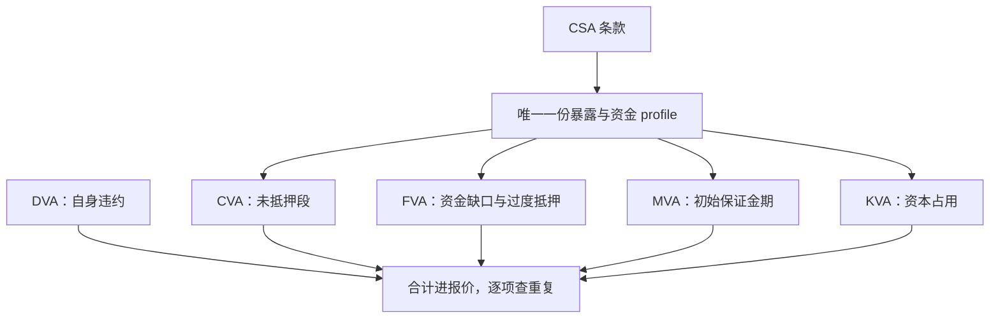

# XVA 的联动

XVA 不是一个价，而是同一份合同在信用、资金与资本约束下的一组影子价格；五个部门各算各的账，重复计算就从合同的缝隙里长出来。

<footer>—— 据 Gregory, *The xVA Challenge*, Wiley, 2015 整理</footer>

[上一课](/quant/rc-collateral-funding)把抵押品与资金链接进了折现曲线。本课把这些成本按科目归位：CVA 对手信用、DVA 自身信用、FVA 资金、MVA 初始保证金、KVA 资本，并回答真正难的问题——它们如何联动、哪些组合是重复计算、哪些争议只是定义之争。暴露剖面的构造已在 [CVA 暴露剖面 EPE](/quant/cva-exposure-profile) 与[到 XVA 的桥](/quant/xva-bridge)讲过，本课默认你持有那套工具，只谈联动。

## 问题

一笔无抵押互换的公允价值不再等于风险中性现值。对手违约的期望损失
$$\mathrm{CVA}=\mathrm{LGD}\int_0^T \mathrm{EE}(t)\,d\mathrm{PD}(t)$$
取自暴露剖面；自身违约给出对称的 DVA（见[DVA 与自身信用](/quant/dva-own-credit)）；未抵押 profile 占用的资金给 FVA（见[FVA 与资金成本](/quant/fva-funding)）；初始保证金在保证金期内给 MVA；监管资本占用的成本是 KVA。缺口不在五个公式各自的存在性，而在它们的和：同一份 profile 被几个科目同时引用，谁减谁、谁重复，直接决定报价里加多少、对冲几份。

## 方法

联动从合同条款开始：CSA 决定抵押门槛、独立金额与触发器，从而决定 profile 里「已抵押、未抵押、过度抵押」三段的划分。CVA 只对未抵押段收；过度抵押段是负债，进 FVA 的收益侧；初始保证金押出的部分不受净额结算保护，单独进 MVA。一套联合模拟同时产出 EE、PFE 与资金 profile，各科目从中各取所需——这是避免重复计算的机制基础：科目可以多，profile 只有一份。错向风险改的是联合分布而不是系数：暴露大的时候对手 PD 也大的合同（例如卖信用保护给高杠杆对手），用独立的 PD 与市场因子模拟会系统性低估 CVA，处理见[利率-信用混合定价](/quant/rates-credit-hybrid)。对冲侧：CVA 台用指数 CDS 对冲利差 beta，残差的单名 gamma 与基差是新账本——对冲不消灭风险，只改写风险的形式。

## 机制

重复计算最爱长在两处。其一：抵押品已经在 EE 里降低了暴露，若资金成本再对同一笔抵押品全额计一次 FVA，同一块钱被算两次——正确口径是只对净暴露的资金缺口计。其二：DVA 与 FVA 的争论是定义之争的两半：DVA 把自身违约当成对方的收益，会计上确认，经济上能否实现取决于自己能否活到那一天；FVA 若按对称的资金成本计，已隐含自身信用的一部分，两笔全额相加就会重叠。KVA 与下一课的监管资本衔接：$\mathrm{KVA}=\int \kappa\,\mathrm{EC}(t)\,dt$，经济资本与监管资本在这里分家——定价用哪个，取决于股东最终按哪个拿回报。XVA 的数是一组模型输出的差：profile 的网格、保证金期的假设、错向的设定各动一格，五个科目一起动。

Gregory 的分类至今是行业标准词汇：CVA、DVA、FVA、MVA、KVA 各有明确的合同来源；行业争论从来不在「要不要算」，而在「哪两对不能同时全额算」——CVA 与 DVA、FVA 与 DVA 是最常打架的两对，报价单上必须写口径。

## 边界

本课不谈会计口径（IFRS 13 的公允价值层级、自用与交易性持仓的 DVA 处理）与对冲会计。XVA 的模型治理必须按联动设计：单独验证每个科目，会漏掉它们共享的假设——这正是「联动」作为一课的理由。报价上，XVA 不是价外的运输成本，它改变对哪些客户、哪些合同做生意的边际，穿透到限额与资本配置，即下一课。最后，KVA 是否属于「价格」仍有学派分歧：把不可对冲的资本成本计入报价是管理决策，不是无套利推论——写清楚口径，比选边更重要。

## 小结

- 五个 XVA 共享一份由 CSA 决定的 profile，重复计算的检查点是「同一笔钱别算两次」。
- CVA 与 DVA、FVA 与 DVA 的重叠是定义之争，报价口径必须写明。
- 错向风险进联合分布，不进系数。
- XVA 的治理按联动设计，不能分科目单独验证；KVA 进不进价格是管理决策，写明口径。
- 出处：Gregory, *The xVA Challenge*, 2015；暴露剖面与混合定价见本栏 cva-exposure-profile、rates-credit-hybrid 两课。
