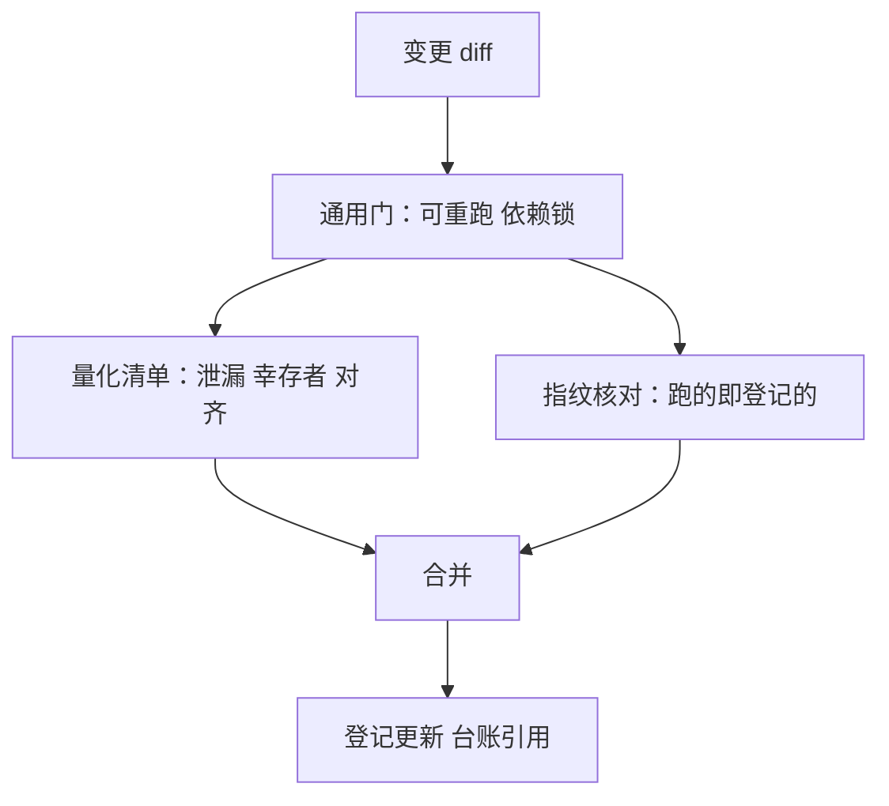
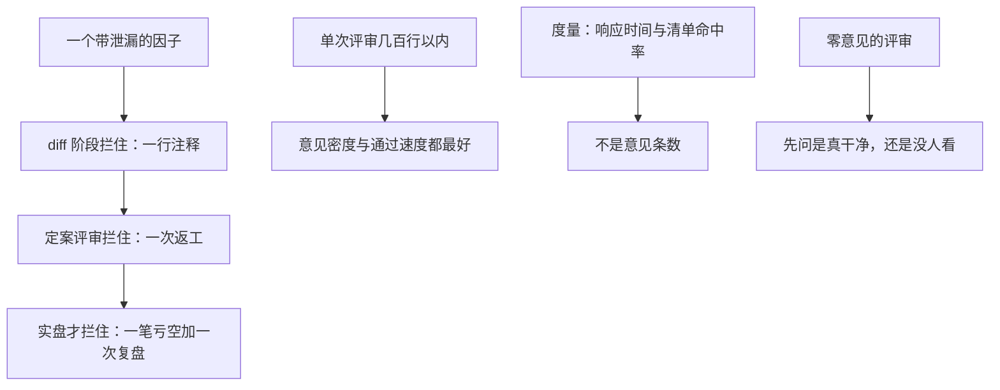

# 代码评审

评审的产出不是挑错的数量，是团队里有多少人从此懂了这段代码为什么这样写。

<footer>—— 据 Sadowski et al., Modern Code Review: A Case Study at Google, 2018；Bacchelli and Bird, Expectations, Outcomes, and Challenges of Modern Code Review, ICSE, 2013 整理</footer>

[上一课](/quant/rc2-repro-package-standard)让陌生人能盲跑你的研究。团队里其实没有陌生人，只有分工——而分工制造盲区：写信号的不清洗数据，清洗数据的不看执行，每人守着自己那一段的正确性，接缝处没人负责。评审是把接缝摊开的机制，也是「协作」单元的第一课。本课写研究代码的评审怎么评：换掉清单，不拆门槛。

## 问题

研究评审有两个对称错误。一个是「研究代码不用评审」：代码短命、跑完就扔，评了浪费——代价是泄漏与幸存者偏差畅通无阻地流向结论，因为错误的收益率从来不体现在代码寿命上，体现在决策上。另一个是对称的：用生产清单评审研究代码——问测试覆盖率、问抽象层级、问命名规范——把探索速度拖死，研究变成写工程文档。两个错误共享同一个误判：以为评审的内容是「代码质量」。评审真正要接住的是**量化专属的错误类**，它们在普通工程清单里根本不存在。

## 方法

### 量化评审清单

四条清单比风格清单值钱。**泄漏**：归一化是否用了全样本统计量、标签是否用收盘价对齐到当天、特征时点是否早于决策时点——未来信息的入口全是接缝。**幸存者**：universe 是否用今天的成分表回过去，退市与停牌是否进样本。**对齐**：as-of 取数、时区、复权口径与数据版本引用是否一致——[数据版本化](/quant/de-data-versioning)的修正静默，对齐错了不报错。**配置漂移**：跑的参数与[实验管理](/quant/rc2-experiment-management)登记的指纹是否同一次运行——改参不换指纹，台账立刻失真。

幸存者偏差翻译一下：只用「今天还活着」的成分股回测过去，等于只统计赢家——退市、被并购、长期停牌的名字被悄悄删掉，收益率系统性偏高。它不报任何错，所以只能靠评审清单专门问一句「退市的进样本了吗」。

直觉类比：泄漏就是考试前偷看了标准答案——回测分数漂亮得不像话，实盘立刻打回原形。最常见的一处是用当天收盘价造特征、又用当天收盘价算收益，等于用「已知的未来」去预测「同一个未来」。

## 机制

评审在研究里仍然划算，算的不是 defect 率，是**拦截位置的成本**。一个带泄漏的因子，在 diff 阶段拦住的成本是一行注释；在定案评审拦住是一次返工；在实盘拦住是一笔亏空加一次复盘。实证研究也支持同样的重心：Bacchelli 和 Bird 对开发者的调查发现，评审实际收益里缺陷发现占比有限，代码改进与知识传递占大头；Google 的案例把评审当成知识扩散的主要渠道，结论是小步高频——单次几百行以内，意见密度与通过速度都最好。落到研究团队：评审单位小，意味着「一次只评一个假设的一次改动」，不是月末集中评一千行。

选评审人的口径：优先让懂数据接缝的人评，而不是职位最近的同事。量化错误的重心在数据侧——同样的 diff，做过清洗的人一眼看出 as-of 方向反了，没做过的人只会把变量名改得更长。

### 节奏与归属

节奏上，评审嵌入[规范](/quant/rc2-code-standards)的显式性约束：diff 里出现硬编码路径、改参不动配置，就是清单项，不需要评审人额外动用判断。归属上，评审不替代台账与判据：$N$ 完整与否是[实验管理](/quant/rc2-experiment-management)的事，假设是否值得做是提案评审（后课委员会）的事；代码评审只答一个问题——**这次改动记录的实验，是不是它声称的那个实验**。品味之争不在代码评审里裁，裁不动也没必要：让它留在文档与提案层。

## 边界

评审不能验证结果的正确性：跑一遍对不上基准是复现的事（上一课），对得上基准不代表没有泄漏——评审人是在读逻辑，不是在证明。评审也不是门禁的替代：候选升格的独立复跑与台账核对属于定案流程，评审通过不等于可以上线。最后，评审有自己的失效模式：走过场式的「LGTM 接力」与拖延式的「压两周不回」同样致命——前者让清单形同虚设，后者把研究节奏拖垮；度量的是响应时间与清单命中率，不是意见条数。

常见误区：把「LGTM 接力」当成评审通过。人人点头、无人负责时，清单形同虚设，泄漏照样流向结论。零意见的评审往往不是「代码很干净」，而是「没人真看」——所以度量评审要看响应时间与清单命中率，不看意见条数。

## 小结

- 两个对称错误：不评（泄漏流向决策）与生产式评（探索速度拖死）；要换清单，不要拆门槛。
- 量化清单四条：泄漏、幸存者、对齐、配置漂移；重心全在数据与配置的接缝上。
- 评审的收益大头是知识传递与改进，不只是挑错；小步高频，单次几百行以内。
- 选人看数据经验；代码评审只答「记录的实验是不是声称的那个实验」，品味上交提案层。
- 出处：Bacchelli and Bird, *ICSE*, 2013；Sadowski et al., 2018；站内[实验管理](/quant/rc2-experiment-management)、[数据版本化](/quant/de-data-versioning)各课。
