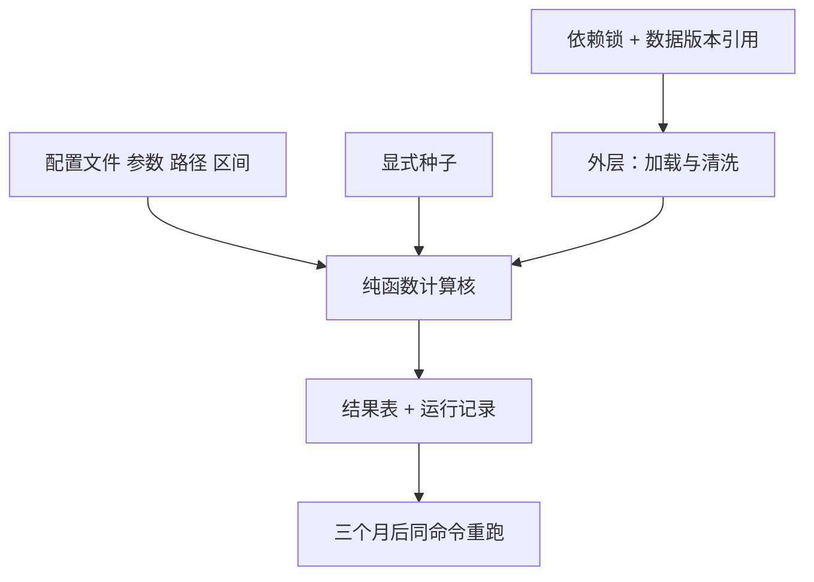
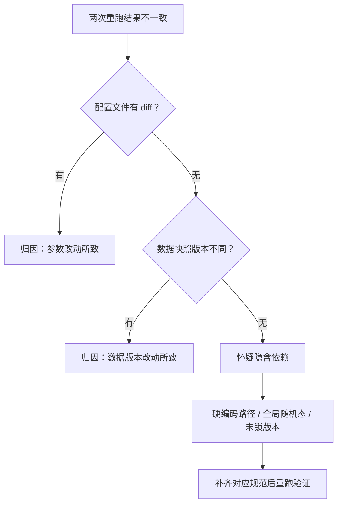

# 研究代码的规范

研究代码的第一位用户不是同事，是三个月后的自己；规范的全部内容，是让那时的他还能重跑今天这一行。

<footer>—— 据 Wilson et al., Best Practices for Scientific Computing, 2014；Sandve et al., Ten Simple Rules for Reproducible Computational Research, PLoS Computational Biology, 2013 整理</footer>

[上一课](/quant/bf-opensource-map)按七个器官对照四个开源谱系，把「自建还是采用」分了账，回测框架设计课程收束——框架把回测语义做成可维护、可审计、可重放的软件。可重放的引擎只是复现的一半；另一半住在写策略的人手里：同一台引擎，喂进两段写得随意的策略代码，结果照样对不上。本课程写研究协作与复现，先从个人层的代码规范起步。本单元四课依次是规范、notebook、实验管理与复现包；组织层的评审、文档、知识库、委员会与跨团队契约都在它们之后。后课默认已经按本课的方式写代码。

## 问题

研究代码的目标函数与生产代码不同。生产代码追求长期演化的可维护；研究代码要两件相反的事同时成立——今天改得快，三个月后跑得同。只顾前者，第三天就出现「当时是哪组参数跑出了这张图」的考古现场；只顾后者，事事按生产标准上抽象上框架，探索速度被拖死，研究退化成工程。缺口不是一套风格指南，而是一条最小约束：**重跑所需的每样东西都必须显式**。凡是隐含的——路径、种子、依赖版本、当日手动改过的区间——都会在重跑时变成一次静默的改题。

## 方法

### 五条最小规范

**配置与代码分离**：会变的数——参数、路径、日期区间、universe 定义——进一份配置文件，代码只读不写。改参即改配置，代码不 diff；[参数扫描的架构](/quant/bf-param-sweep-arch)的落库口径照用。**计算核与 IO 边界分离**：加载与清洗在外层，计算核写成纯函数，输入矩阵与配置、输出结果，不读文件、不读墙钟。**显式种子**：随机源统一从配置取种子，每次运行一个生成器，不用全局默认态。**依赖锁定**：环境清单钉死版本，与代码同库提交。**单一入口**：一条命令从数据快照跑到结果表，中间没有「先手动跑一下」。

Sandve 等十条规则的第一条：除非把结果的全部依赖记录下来，否则不要宣称任何一个结果。五条规范是这条规则的最小实现——缺任何一条，就有一项依赖仍处在隐含状态，等着在重跑时改题。

数字实例看「显式种子」：同一策略含随机入场，今天跑年化 12.3%，明天同一份代码跑出 14.1%——因为 numpy 用了全局默认随机态，每次开进程抽到的序列都不同。把种子写进配置（如 seed=42）后，每次运行生成同一串随机数，两次重跑的差异就只剩你真正改过的那几行。

## 机制

这五条把一次实验从「动作」变成可复述的函数：$f(\text{配置}, \text{数据快照}) \to \text{结果}$。可复述才可归因：两次结果的差异要么来自配置 diff，要么来自数据版本 diff，不会来自「我记得那天顺手改了点什么」。归因不清，横比就失效：台账横向比较的可行性，正建立在每次运行的输入都被钉住之上。

术语翻译：「纯函数」就是不偷看墙钟、不偷改文件的函数——同样的输入永远给出同样的输出，像计算器而不是温度计。计算核写成纯函数后，「结果为什么变了」只剩两个可能的来源：配置或数据，排查从考古变成做一次 diff。

不这么做错在哪，各有一条典型死法。硬编码的绝对路径把实验绑在某台机器上，换机即哑；未声明的随机源让两次「同一实验」的年化收益在小数点后第二位分叉，你会开始把噪声读成信号；依赖不锁，同事装出的环境里某个库升了一版，结果差异比策略改进还大。代码钉住依赖，数据侧的对应物是[数据版本化](/quant/de-data-versioning)的版本引用：实验钉三要素——定义、数据版本、清洗规则——与特征存储同构。

## 边界

这套规范不解决正确性：写得再规范，仍可能有未来函数与幸存者偏差，那是协作单元评审清单的事。它也不要求测试覆盖率与抽象层级——研究代码允许丑，不允许不可重跑；为三个月寿命的脚本上工厂级的分层，是把规范读成了教条。探索期的草稿可以不达标，但草稿一旦被引用——进了文档、进了汇报、进了台账——就必须先补齐五条：被引用的结果没有豁免权。notebook 不是豁免区，只是另一套执行环境，下一课写它的纪律。

常见误区：初学者容易以为规范是为了「代码好看」，于是能省则省。实际上它买的是归因能力——依赖锁定就像做菜把「盐少许」改成「盐 3 克」：不写死，三个月后没有人（包括你自己）能复刻出同一锅汤。省下的三十秒，会在第一次「结果对不上」时连本带利还回去。

## 小结

- 研究代码的目标是「今天改得快、三个月后跑得同」，规范只约束重跑所需之物的显式性。
- 五条最小规范：配置分离、计算核与 IO 边界分离、显式种子、依赖锁定、单一入口。
- 规范把实验变成 $f(\text{配置}, \text{快照}) \to \text{结果}$，差异可归因于配置或数据版本的 diff。
- 被引用的草稿没有豁免权：进了文档、台账或汇报，先补齐五条。
- 出处：Wilson et al., *Best Practices for Scientific Computing*, 2014；Sandve et al., *PLoS Comput Biol*, 2013；站内[参数扫描的架构](/quant/bf-param-sweep-arch)、[数据版本化](/quant/de-data-versioning)各课。
